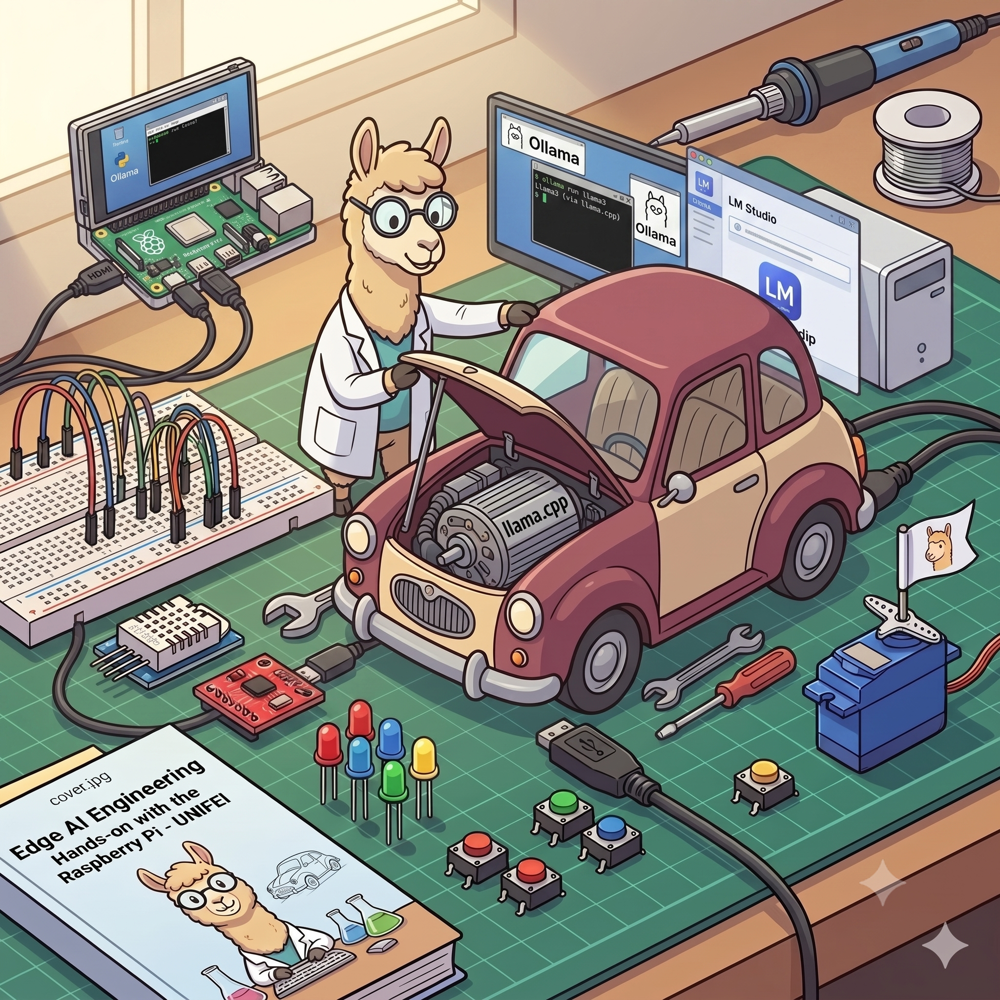
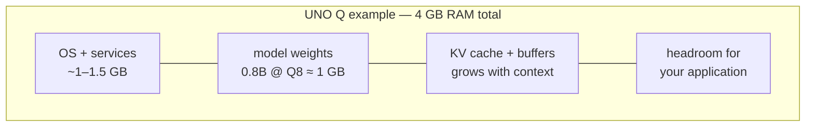
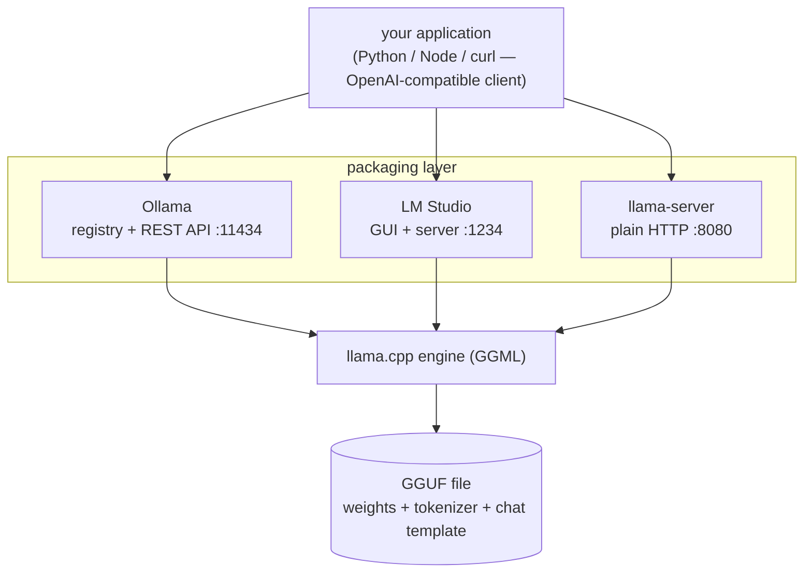
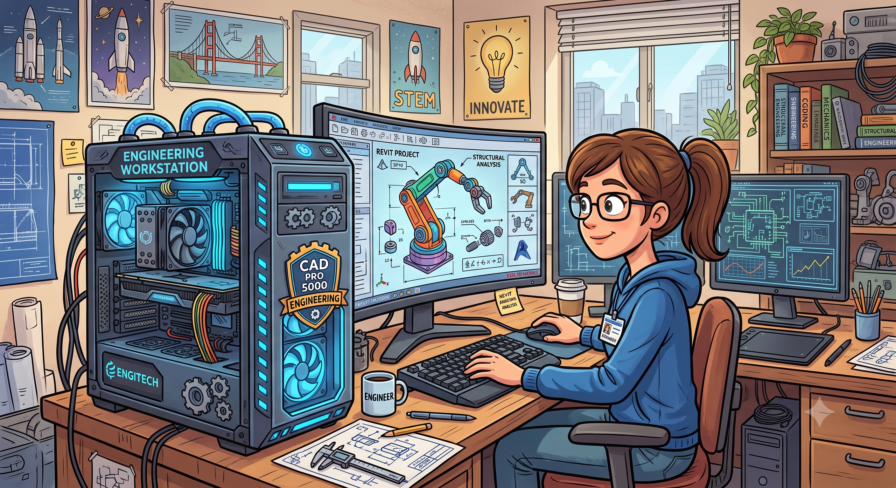
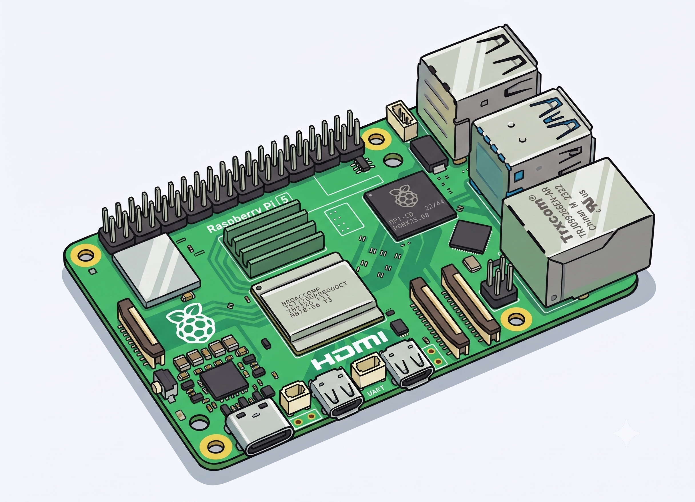
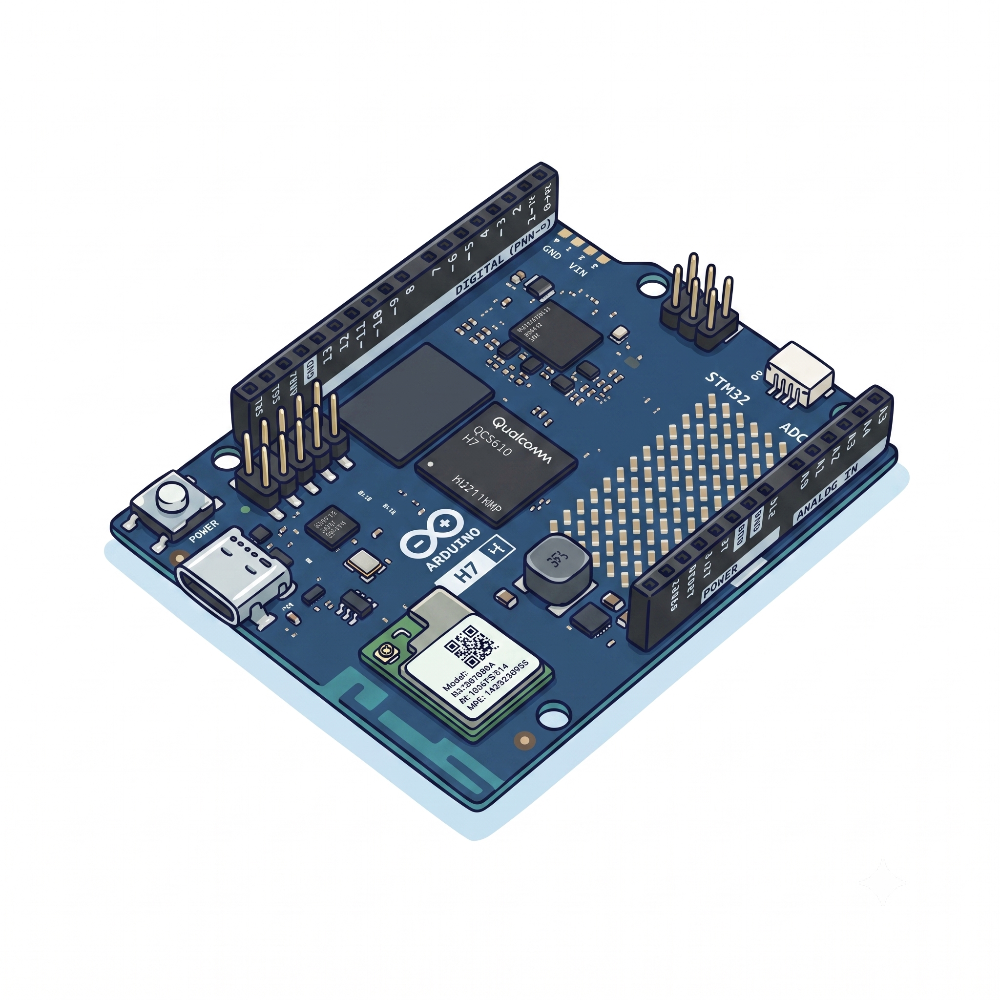
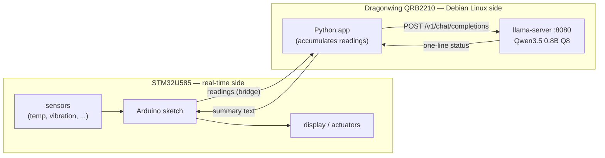
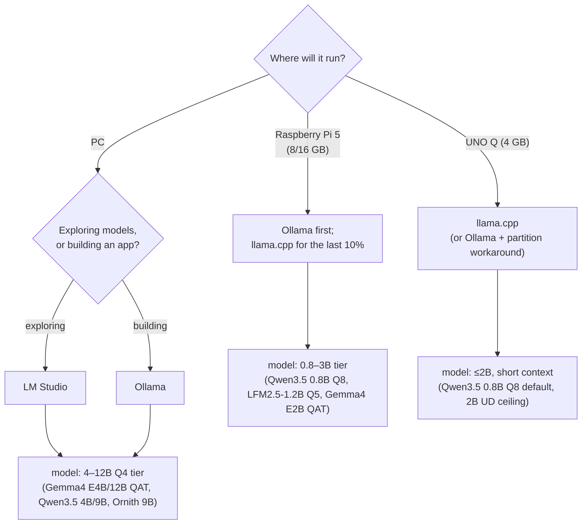

# SLMs at the Edge: 

#### A Guide to Local Inference on PC, Raspberry Pi, and Arduino UNO Q



*A hands-on tutorial for makers and students. Covers the principles (quantization, GGUF, memory budgeting), the three main tools (llama.cpp, Ollama, LM Studio), and step-by-step setup on three very different machines: a desktop PC, a Raspberry Pi 5, and the Arduino UNO Q with 4 GB of RAM.*

---

## 1. Why run a language model locally?

Everything you type into ChatGPT travels to a data center, gets processed on a rack of GPUs, and comes back. That works, but it has costs: your data leaves the device, you pay per token or per month, you need a network connection, and latency depends on someone else's infrastructure.

Running the model on your own hardware flips all four. Your prompts never leave the machine. Inference is free after the hardware purchase. It works on a bench in a basement with no Wi-Fi. And for embedded projects, it means a robot or a sensor node can "understand" language without phoning home.

The catch is size. GPT-class models have hundreds of billions of parameters and won't fit on anything you own. What fits are Small Language Models (SLMs), roughly 100 million to 9 billion parameters, usually compressed with quantization. The last two years have been good to this category: a 1B model in 2026 is noticeably more capable than a 7B model was in 2023, mostly thanks to better training data and distillation from larger teachers.

**Important:** a 1B model will not reason like a frontier model. It will summarize text, classify intents, answer questions about a narrow domain, extract structure from messy input, and hold a basic conversation. Scope your expectations (and your project) accordingly. On the edge, the interesting question isn't "how big a model can I force onto this board" but "how small a model still does the job."

## 2. The theory you actually need

You can skip this section and go straight to the commands, but ten minutes here will save you hours of "why is it swapping?" later.

### 2.1 Parameters, precision, and disk size

A model is a big pile of numbers (weights). Training produces them in 16-bit or 32-bit floating point. At 16 bits (2 bytes) per weight, sizes look like this:

| Model                    | Parameters | FP16 size | Q4 size (approx.) |
| ------------------------ | ---------- | --------- | ----------------- |
| SmolLM2-135M             | 135 M      | ~270 MB   | ~100 MB           |
| Qwen3.5 0.8B             | 0.8 B      | ~1.6 GB   | ~0.56 GB          |
| Llama 3.2 1B             | 1.2 B      | ~2.5 GB   | ~0.7 GB           |
| Qwen3.5 2B               | 2 B        | ~4 GB     | ~1.3 GB           |
| Phi-4-mini               | 3.8 B      | ~7.6 GB   | ~2.4 GB           |
| Llama 3.1 8B / Ornith 9B | 8–9 B      | ~16–19 GB | ~4.7–5.5 GB       |

The FP16 column is why you can't run an 8B model on a Raspberry Pi with 8 GB of RAM at full precision. The Q4 column is why you can.

### 2.2 Quantization

Quantization stores each weight with fewer bits. Instead of 16-bit floats, you use 8-, 5-, or 4-bit integers, plus some scaling metadata. A 4-bit quantized model is roughly a quarter the size of the FP16 original, and on CPUs it's also faster, because inference on these machines is limited by memory bandwidth: fewer bytes to move per token means more tokens per second.

You'll see names like `Q4_K_M`, `Q5_K_M`, `Q8_0` on model files. Decoding the name: the number after Q is the number of bits per weight, K denotes the "k-quant" scheme (weights grouped into blocks, each block with its own scale), and S/M/L denotes a small/medium/large variant that keeps certain sensitive layers at higher precision.

Practical guidance, learned the usual way:

- `Q4_K_M` is the default choice. Best size/quality balance: what Ollama serves when you don't specify a tag.
- `Q8_0` is nearly lossless but twice the size of Q4. Use it when RAM allows and the model is small — sub-1B models suffer the most from aggressive quantization, so running a 0.8B at Q8_0 is often the right trade.
- `Q5_K_M` is the middle ground worth remembering for the ~1B tier. One documented field test of LFM2.5-1.2B on a Pi 5 (section 5.3) found Q5_K_M clearly better than Q4 at instruction following and structured output like tool-call formats, for only ~130 MB extra.
- Below 4 bits (`Q3`, `Q2`), quality degrades fast on standard quants. A 1B model at Q2 is usually worse than a 360M model at Q8.

> On small models (≤1B), use Q8. Around 1B, Q5_K_M is a strong compromise. From 2B up, use Q4 variants.

Two newer variants deserve their own paragraph, because they change the defaults above.

**Unsloth Dynamic quants** (files tagged `UD-Q4_K_XL`, `UD-Q2_K_XL`, ...) don't quantize uniformly: sensitive layers are upcast to 8 or 16 bits, while the rest are dropped to 4 (or lower), and in practice, a UD-Q4 file behaves closer to Q5/Q6 at nearly Q4 size. When a model repo offers a UD variant, prefer it over the plain quant. A concrete data point: Qwen3.5-2B-UD-Q4_K_XL runs well on 4 GB-class boards where a 3B standard Q4 would be marginal.

**QAT (quantization-aware training)** checkpoints, like Google's Gemma 4 QAT releases (June 2026), are trained with quantization simulated in the loop, so the Q4_0 file loses far less quality than post-hoc quantization of the same weights — Google reports roughly 3× memory reduction at near-original quality, putting Gemma 4 E2B in ~3 GB of RAM, E4B in ~5 GB, and 12B in ~7 GB. Same GGUF format, same tools; you just pick the `-qat` file.

### 2.3 GGUF: the file format everyone converged on

GGUF is the model file format used by llama.cpp, and since Ollama and LM Studio are both built on llama.cpp's inference code, it is effectively the standard for local inference. A single `.gguf` file contains the weights (already quantized), the tokenizer, and metadata like the chat template. Hugging Face hosts thousands of them; search for any model name plus "GGUF," and you'll typically find both official and community conversions (the `unsloth`, `bartowski`, and `ggml-org` accounts are reliable sources, and Google publishes its own QAT GGUFs).

### 2.4 The RAM budget: weights + KV cache + everything else

Disk size is not RAM usage. At runtime, you need:

1. The model weights are loaded (or memory-mapped) into RAM.
2. The KV cache: transformers store a key/value pair for every token in the context, for every layer. It grows linearly with context length. For a 1B model with a 4K context, this is a few hundred MB; with a 32K context, it can exceed the weights themselves. (Recent models advertise 256K contexts — on an edge board, treat that as a spec-sheet number, not a plan.)
3. The runtime, OS, and your application.

How a fixed RAM budget gets divided, using the smallest target as the example:



A worked example for the Arduino UNO Q (4 GB): Debian plus desktop services eat 1–1.5 GB. A Qwen3.5 2B at UD-Q4_K_XL needs ~1.3 GB for weights plus a few hundred MB of cache and buffers at modest context. Total under 2 GB for inference — tight but workable. A standard 3B at Q4 needs 2+ GB for weights alone, and now you're one browser tab away from the OOM (Out-Of-Memory) killer. This is why the model tables later in this tutorial look the way they do.

> Rule of thumb: **usable model size ≈ (total RAM − OS and apps) × 0.7**, with the remainder going to the KV cache and buffers.
>

### 2.5 Distillation, or why small models got good

Most competitive SLMs today are distilled: a small "student" model is trained to imitate a large "teacher." The student never matches the teacher's breadth, but it keeps a surprising fraction of its competence on focused tasks. This is why Llama 3.2 1B (distilled from the 8B/70B family), the Qwen small series, and SmolLM punch above their parameter count, and why the "smaller model, better data" trend keeps paying off at the edge.

### 2.6 Tokens per second: what's usable?

Reading speed is roughly 5–7 words per second, or 8–10 tokens per second. Above that, interactive chat feels fine. For non-interactive jobs (summarize a log file, classify a message), even 2 tokens/s may be acceptable, since nobody is watching the cursor blink. One more wrinkle: reasoning models (Qwen3.5 in thinking mode, Ornith) generate a `<think>` block before the answer, so the *felt* latency is much higher than the tokens/s suggests. On slow hardware, disable thinking mode or pick a non-reasoning model.

## 3. The three tools

All three tools in this tutorial run the same GGUF models and, underneath, share the same inference engine. They differ in packaging:



### llama.cpp — the engine


The C/C++ project by Georgi Gerganov that started local inference on consumer hardware. Everything else here builds on it. You compile it (or download a release), and you get command-line programs: `llama-cli` for direct prompting, `llama-server` for an OpenAI-compatible HTTP server, `llama-bench` for benchmarking. No background service, no model manager: you download GGUF files yourself and point the binary at them.

Choose it when you want maximum control and minimum overhead, when you're on a constrained or unusual platform, or when you want to embed inference inside your own C/C++/Python/Go application.

> Run fine on PC, Raspberry Pi, and UNO-Q

### Ollama — the package manager


Ollama wraps llama.cpp's engine in a Go service with a model registry. `ollama run llama3.2:1b` downloads, configures, and runs the model with one command, the way `docker run` does for containers. It exposes a REST API on port 11434, keeps models loaded between requests, and unloads them after an idle timeout. Runs on Linux, macOS, and Windows, including ARM, making it a comfortable option for starting on a Raspberry Pi. It can also pull GGUFs straight from Hugging Face (`ollama run hf.co/<org>/<repo>`), which matters when you want a specific UD or QAT file rather than the registry default.

Choose it when you want the shortest path from zero to a working model, or a clean API for your Python/Node application.

> Run fine on PC and Raspberry Pi

### LM Studio — the desktop app


A GUI application for browsing, downloading, and chatting with models, with sliders for every inference parameter and a built-in OpenAI-compatible server. It uses llama.cpp as one backend and Apple MLX as another (faster on M-series Macs). Since v0.4, it also has a headless daemon (`llmster`) and a CLI (`lms`), so it's no longer GUI-only, and ARM Linux builds exist as of 2026 (introduced alongside NVIDIA's DGX Spark). In practice, though, it targets desktops with a screen: for a Pi or an UNO Q, llama.cpp and Ollama are the practical choices.

Choose it when you want to *explore* — compare models side by side, tweak sampling parameters with instant feedback, inspect token probabilities — before committing to one for a project.

> Run fine only on PC

### Which one, quickly

| | llama.cpp | Ollama | LM Studio |
|---|---|---|---|
| Interface | CLI / C API | CLI + REST API | GUI + CLI + API |
| Model management | manual (GGUF files) | registry, one command | built-in browser |
| OpenAI-compatible server | yes (`llama-server`) | yes | yes |
| PC (Win/macOS/Linux) | yes | yes | yes |
| Raspberry Pi | yes | yes | not practical |
| Arduino UNO Q | yes | yes, with a workaround | no |
| Best for | control, embedding, constrained targets | fast setup, app backends | exploration, prototyping |

> A common workflow uses all three: prototype and pick a model in LM Studio on your PC, serve it with Ollama during application development, and deploy with plain llama.cpp on the edge device.
>

## 4. Target 1: the PC



Any reasonably recent machine works. What matters is RAM (or VRAM, if you have a discrete GPU): 8 GB runs 3–4B models comfortably; 16 GB runs 8–12B models; 32 GB runs the 26B+ tier. A GPU with the model fully in VRAM gives you 5–20× the speed of CPU inference; an Apple Silicon Mac sits in between thanks to unified memory.

### 4.1 Ollama

Linux:

```bash
curl -fsSL https://ollama.com/install.sh | sh
```

macOS and Windows: download the installer from [ollama.com](https://ollama.com). Then:

```bash
ollama run llama3.2:3b
```

First run downloads ~2 GB; after that, you're at a chat prompt. Useful commands:

```bash
ollama list                      # installed models
ollama ps                        # what's loaded, CPU or GPU
ollama pull qwen3.5:2b           # download without running
ollama run llama3.2:3b --verbose # prints tokens/s after each reply

# pull a specific GGUF straight from Hugging Face:
ollama run hf.co/unsloth/Qwen3.5-2B-GGUF:UD-Q4_K_XL
```

Every model also becomes an API:

```bash
curl http://localhost:11434/api/generate -d '{
  "model": "llama3.2:3b",
  "prompt": "Explain quantization in two sentences.",
  "stream": false
}'
```

And because the API is OpenAI-compatible, the standard `openai` Python client works unchanged:

```python
from openai import OpenAI

client = OpenAI(base_url="http://localhost:11434/v1", api_key="ollama")

resp = client.chat.completions.create(
    model="llama3.2:3b",
    messages=[{"role": "user", "content": "Write a haiku about GPIO pins."}],
)
print(resp.choices[0].message.content)
```

> Swap the `base_url`, and this same script talks to LM Studio (port 1234) or llama-server (port 8080). Code you write against one tool runs against all three — worth internalizing, because it means your application doesn't care which runtime is behind it.
>

### 4.2 LM Studio

Download from [lmstudio.ai](https://lmstudio.ai), open the app, and use the search tab to grab a model — it shows which quantizations fit your RAM before you download, which is a genuinely useful guardrail. Chat in the GUI, then enable the local server (Developer tab) to get the same OpenAI-compatible API on port 1234.

The CLI mirrors most of it:

```bash
lms get gemma-4-12b-it-qat   # download
lms load gemma-4-12b-it-qat  # load into memory
lms server start             # API on :1234
```

Spend some time in the model settings: temperature, top-p, context length, system prompt. Watching how a 2B model's output changes between temperatures 0.2 and 1.2 teaches you more about sampling than any blog post.

### 4.3 llama.cpp

Prebuilt binaries exist on the [GitHub releases page](https://github.com/ggml-org/llama.cpp/releases), or build from source (2–5 minutes on a modern PC):

```bash
git clone https://github.com/ggml-org/llama.cpp
cd llama.cpp
cmake -B build
cmake --build build --config Release -j
```

Download a GGUF and run it:

```bash
# llama.cpp can pull directly from Hugging Face:
./build/bin/llama-cli -hf unsloth/Qwen3.5-2B-GGUF:UD-Q4_K_XL -p "What is a KV cache?" -n 200

# or with a local file, interactive chat:
./build/bin/llama-cli -m models/qwen3.5-0.8b-q8_0.gguf -cnv
```

The flags you'll actually use: `-c 4096` sets context length (bigger = more RAM), `-t 4` sets CPU threads (match your physical core count), `-ngl 99` offloads all layers to GPU if you built with CUDA/Metal/Vulkan support, and `-n` caps the number of generated tokens.

For serving:

```bash
./build/bin/llama-server -m models/gemma-4-E4B-it-qat-Q4_0.gguf --port 8080
```

And for honest numbers, `llama-bench`:

```bash
./build/bin/llama-bench -m models/qwen3.5-2b-UD-Q4_K_XL.gguf
```

It reports `pp` (prompt processing) and `tg` (token generation) rates separately. 

> Generation speed is what you feel in chat; prompt speed is what you feel when you paste a long document.

### 4.4 What to run on a PC in 2026

With 16 GB of RAM (or 8+ GB of VRAM), the interesting tier opens up. Gemma 4 E4B QAT (~5 GB) and Gemma 4 12B QAT (~7 GB) are strong general assistants with vision input; the QAT files fit them into RAM where the full-precision versions wouldn't. For coding and agentic work, Ornith-1.0-9B (Q4_K_M, ~5.5 GB) is a 2026 standout: a dense 9B reasoning model, MIT-licensed, 256K context, that leads open models of its size on SWE-Bench and Terminal-Bench. Expect the `<think>` preamble; it's part of the deal.

## 5. Target 2: Raspberry Pi 5



The Pi 5 (quad Cortex-A76 @ 2.4 GHz) is a legitimate SLM machine. The 8 GB or 16 GB variants are strongly recommended; on the 4 GB model, follow the UNO Q guidance in section 6 instead. Use a 64-bit Raspberry Pi OS (or Ubuntu Server) — 32-bit OSes disqualify you immediately — and fit the active cooler, because sustained inference pins all four cores and a throttled Pi loses 20–30% of its speed.

An SSD via the M.2/PCIe HAT instead of a microSD card doesn't change tokens/s, but it turns model loading from a coffee break into a few seconds.

### 5.1 Ollama on the Pi

Same one-liner as the PC — Ollama ships ARM64 builds:

```bash
curl -fsSL https://ollama.com/install.sh | sh
ollama run llama3.2:1b --verbose
```

That's the whole setup. What to expect, CPU-only, short context (speed figures compiled from published Pi 5 benchmarks; your exact numbers will vary with cooling, RAM speed, and context length):

| Model                     | Quant      | RAM need | Pi 5 generation speed | Verdict                                  |
| ------------------------- | ---------- | -------- | --------------------- | ---------------------------------------- |
| SmolLM2-360M              | Q8_0       | ~0.5 GB  | 30+ tok/s             | instant, limited depth                   |
| Qwen3.5 0.8B              | Q8_0       | ~1 GB    | ~15–25 tok/s          | fast and coherent; a proven Pi workhorse |
| Llama 3.2 1B / Gemma 3 1B | Q4_K_M     | ~1 GB    | 8–20 tok/s            | the classic chat tier                    |
| LFM2.5-1.2B               | Q5_K_M     | ~1 GB    | ~10–20 tok/s          | hybrid conv+attention: fast CPU decode, lean KV cache (see 5.3) |
| Qwen3.5 2B                | UD-Q4_K_XL | ~1.6 GB  | ~5–10 tok/s           | noticeably smarter, still usable         |
| Gemma 4 E2B QAT           | Q4_K_M     | ~3 GB    | ~4–8 tok/s            | multimodal-capable, QAT quality          |
| Llama 3.2 3B              | Q4_K_M     | ~2.2 GB  | 2–5 tok/s             | fine for batch jobs, slow for chat       |
| 8–9B models               | Q4_K_M     | ~5 GB    | 1–2 tok/s             | possible on 8 GB, painful                |

Compare against the 8–10 tok/s readability threshold: the 1B-and-under tier feels interactive, 3B doesn't, and the 2B tier (Qwen3.5 2B UD, Gemma 4 E2B QAT) is the compromise worth testing first — the quality jump over 1B models is larger than the speed penalty suggests. Gemma 4 E2B is an interesting special case: it's a MatFormer-style "effective 2B" model, and the QAT file brings what is architecturally a larger model into a 3 GB footprint.

For more detailled examples: [Edge AI Engineering: Hands-on with the Raspberry Pi (Marcelo Rovai)](https://mjrovai.github.io/EdgeML_Made_Ease_ebook/raspi/llm/slm_intro.html)

### 5.2 llama.cpp on the Pi

Build exactly as on the PC (the ARM NEON optimizations are detected automatically; add `-j4` and expect ~10 minutes):

```bash
git clone https://github.com/ggml-org/llama.cpp
cd llama.cpp
cmake -B build && cmake --build build --config Release -j4
./build/bin/llama-cli -hf unsloth/Qwen3.5-0.8B-GGUF:Q8_0 -cnv -t 4
```

Head-to-head tests on the Pi 5 consistently show llama.cpp to be a touch faster than Ollama (one published TinyLlama-1.1B comparison: 14.4 vs 13.8 tok/s) and lighter on RAM, at the cost of managing model files yourself. On an 8 GB Pi, the difference rarely matters; on a 4 GB device, it does.

Two Pi-specific notes. First, if you need more headroom, zram swap compresses memory pages and postpones the OOM killer, though once weights actually swap to disk, performance is dead anyway. Second, the AI HAT+ 2 accelerator (Hailo-10H, 40 TOPS, released January 2026) can offload LLM inference from the CPU; it's a $130 add-on with its own toolchain, and it's beyond the scope here, but it's worth knowing it exists if the CPU numbers above aren't enough. Do not expect a model to run faster. What you get with the hat is only offloaded LLM inference from the CPU, not speed.

> A realistic project shape for the Pi: an offline home assistant. Whisper (small) for speech-to-text, Qwen3.5 0.8B or a 1B instruct model for intent parsing and replies, Piper for text-to-speech. All three fit simultaneously in 8 GB, and nothing leaves the room.

For more detaillad examples: [From Ollama to llama.cpp: Multimodal Inference on the Edge (Marcelo Rovai)](https://github.com/Mjrovai/EdgeML-with-Raspberry-Pi/tree/main/Llama_cpp)

### 5.3 Field notes: tuning a 1B model on the Pi 5

A worked example worth studying is Winston Bandong's optimization guide for LFM2.5-1.2B on a Pi 5 8 GB (linked below), the model behind a fully offline voice assistant. The model itself is an interesting pick. Liquid AI built LFM2.5 as a hybrid of gated convolution blocks and grouped-query attention rather than a standard transformer, which buys fast CPU decode (~239 tok/s on a desktop AMD CPU; 10–20 tok/s on the Pi) and a KV cache that grows more slowly at long context. The Thinking variant fits in ~900 MB and matches Qwen3-1.7B on reasoning benchmarks with 40% fewer parameters.

His llama.cpp settings transfer to almost any 1B-class model on a Pi:

- **Q5_K_M, not Q4.** Measurably better instruction following and structured output (tool-call formats) for ~130 MB extra. At 1B scale, those bits matter.
- **Cap the context at what you actually use.** He runs a 128K-trained model at 65K (KV cache ≈ 1–2 GB on 8 GB); on a 4 GB board he'd drop to 16–32K. After quantization, context length is your biggest memory lever.
- **`n_threads` = physical cores.** 4 on a Pi 5; fewer is slower, more just adds scheduling overhead.
- **Always set stop tokens** (`<|im_end|>` for ChatML models). Without them, small models hallucinate fake user turns and answer themselves.
- **Reset the KV cache when the system prompt changes; keep it between conversation turns.**
- **Stream everything.** At 10–20 tok/s, the first word appearing in under a second beats staring at a blank screen for ten.
- **Low temperature (0.1) and tight top_p** for tool routing and structured output; small models have less headroom for randomness than large ones.

One caveat before you standardize on it: LFM models ship under Liquid AI's own license rather than Apache or MIT, so check the terms for commercial deployments.

## 6. Target 3: Arduino UNO Q (4 GB)



The UNO Q is a different animal: a "dual brain" board in the classic UNO form factor. One brain is a Qualcomm Dragonwing QRB2210 (quad Cortex-A53 @ 2.0 GHz) running Debian Linux from 4 GB RAM / 32 GB eMMC; the other is an STM32U585 microcontroller handling real-time I/O. The Linux side runs your language model; the MCU side blinks, senses, and actuates. Arduino's App Lab environment ties the two together, and boards typically ship ready to use — you work on it via App Lab, SSH, or a USB-C monitor/keyboard setup.

Set expectations first. The A53 is an efficiency core, but still behind the Pi 5's A76, and 4 GB is shared with the whole OS. UNO Q experiments put a 0.8B model at roughly 5–6 tok/s — a "slow reader" pace. But the point of an LLM here isn't speed; it's that language understanding and hardware control live on the same $59 board with no network dependency. Think "summarize the last hour of sensor logs into one status sentence," not "chatbot."

### 6.1 What fits in 4 GB

Debian and its services take 1–1.5 GB, leaving roughly 2.5 GB. Applying the budget rule from section 2.4:

| Model                     | Quant      | RAM need    | On UNO Q                                                     |
| ------------------------- | ---------- | ----------- | ------------------------------------------------------------ |
| SmolLM2-135M / 360M       | Q8_0       | 0.2–0.5 GB  | comfortable, fast                                            |
| Qwen3.5 0.8B              | Q8_0       | ~1 GB       | comfortable; best quality-per-MB in its class                |
| Llama 3.2 1B / Gemma 3 1B | Q4_K_M     | ~1 GB       | works well                                                   |
| LFM2.5-1.2B               | Q5_K_M     | ~1 GB       | works well; the lean KV cache helps if you need more context |
| Qwen3.5 2B                | UD-Q4_K_XL | ~1.6–1.8 GB | the practical ceiling — works, keep context short and the system lean |
| Standard 3B models        | Q4_K_M     | 2+ GB       | marginal; expect OOM under load                              |

The 2B UD entry is worth dwelling on: this is exactly where Unsloth's dynamic quantization earns its keep. A plain 3B Q4 doesn't reliably fit next to Debian, but a 2B with UD-Q4_K_XL quality does — and it's a meaningfully smarter model than anything in the 1B tier. Keep context at 512–1024 tokens regardless: on this board, KV-cache growth is real money.

### 6.2 llama.cpp on the UNO Q (recommended path)

SSH into the board and build as usual — expect 15–20 minutes on the A53:

```bash
sudo apt update && sudo apt install -y git cmake build-essential
git clone https://github.com/ggml-org/llama.cpp
cd llama.cpp
cmake -B build && cmake --build build --config Release -j4
```

Pull a small model and test:

```bash
./build/bin/llama-cli -hf unsloth/Qwen3.5-0.8B-GGUF:Q8_0 \
    -t 4 -c 1024 -cnv
```

(Q8_0 is the right call at this size: the file is still under 1 GB, and sub-1B models suffer most from aggressive quantization. For the smarter option, swap in `unsloth/Qwen3.5-2B-GGUF:UD-Q4_K_XL` — and close everything else first.)

Then make it a service your project can call:

```bash
./build/bin/llama-server -m qwen3.5-0.8b-q8_0.gguf \
    -t 4 -c 1024 --host 127.0.0.1 --port 8080
```

Now the Python side of an App Lab sketch can send local data to `http://127.0.0.1:8080/v1/chat/completions` — same OpenAI-style API as everywhere else in this tutorial — and forward the result to the STM32 side. A concrete example loop: the MCU streams temperature and vibration readings; a Python script accumulates them; every 10 minutes it asks the model for a one-line plain-English status; the MCU scrolls that line on a display. Deterministic control stays on the microcontroller; the model is an occasional reasoning layer, which is exactly how Arduino's own guidance frames it.



If you'd rather work in Go, the `yzma` wrapper ([by Ron Evans](https://projecthub.arduino.cc/marc-edgeimpulse/running-local-llms-and-vlms-on-the-arduino-uno-q-with-yzma-74e288)) rides on llama.cpp and has a documented UNO Q workflow using SmolLM2-135M — including vision models, via LLaVA-style VLMs.

For more examples: [Generative AI at the Edge with Arduino UNO Q (Marcelo Rovai)](https://github.com/Mjrovai/ARDUINO-UNO-Q/blob/main/Gen_AI_Edge/README.md)

### 6.3 Ollama on the UNO Q (with a workaround)

The standard installer fails on this board: Ollama's install script unpacks a multi-hundred-MB bundle into `/usr`, and the UNO Q's root partition doesn't have the space. The fix is to install the tarball onto the larger data partition and symlink it, then point model storage there too:

```bash
# install location with space (adjust to your partition layout)
sudo mkdir -p /home/arduino/ollama
curl -L https://ollama.com/download/ollama-linux-arm64.tgz | \
    sudo tar -xz -C /home/arduino/ollama
sudo ln -s /home/arduino/ollama/bin/ollama /usr/local/bin/ollama

# keep models off the root partition as well
export OLLAMA_MODELS=/home/arduino/ollama/models
ollama serve &
ollama run qwen3.5:0.8b
```

Alessandro Tinivelli's write-up "[Installing Ollama on Arduino Uno Q](https://blog.tinivelli.com/installing-ollama-on-arduino-uno-q/)" (linked below) walks through this in detail, including systemd setup. Once running, you get the same registry convenience and API as on any other machine. It costs a few hundred MB more RAM than bare llama.cpp, which is why llama.cpp remains the recommendation when you're pushing the 2B ceiling.

### 6.4 LM Studio on the UNO Q

No. There's no build for this platform, and a GUI model manager is the wrong tool for a 4 GB embedded board anyway. Use LM Studio on your PC to *choose* the model, then deploy the same GGUF here with llama.cpp.

## 7. Choosing a model in 2026

The small-model field moves fast; this table is a snapshot of the reliable citizens as of mid-2026, all available as GGUF:

| Model             | Params         | Sweet spot           | Notes                                                        |
| ----------------- | -------------- | -------------------- | ------------------------------------------------------------ |
| SmolLM2-135M/360M | 0.1–0.4 B      | UNO Q, experiments   | fully open (data + recipes), from Hugging Face               |
| Qwen3.5 0.8B      | 0.8 B          | UNO Q, Pi            | multilingual (201 languages), thinking + non-thinking modes; run at Q8_0 |
| Llama 3.2 1B      | 1.2 B          | UNO Q, Pi chat       | most-downloaded small model; permissive license              |
| LFM2.5-1.2B       | 1.2 B          | Pi, UNO Q            | hybrid conv+GQA, very fast CPU decode; Thinking variant in ~900 MB; check LFM license for commercial use |
| Qwen3.5 2B        | 2 B            | UNO Q ceiling, Pi    | the UD-Q4_K_XL file is the edge sweet spot right now         |
| Gemma 4 E2B (QAT) | ~2 B effective | Pi                   | multimodal, ~3 GB with QAT; a mobile-format variant fits in ~1 GB |
| Llama 3.2 3B      | 3 B            | Pi (batch), 8 GB PCs | solid general tier                                           |
| Phi-4-mini        | 3.8 B          | PC, reasoning/math   | leads its class on GSM8K                                     |
| Gemma 4 E4B (QAT) | ~4 B effective | PC, 8 GB machines    | vision input, ~5 GB with QAT                                 |
| Qwen3.5 4B / 9B   | 4–9 B          | PC                   | 256K context; the 9B is a strong generalist                  |
| Ornith-1.0-9B     | 9 B            | PC, coding/agents    | MIT license, reasoning model, SOTA open coder at this size; Q4_K_M ≈ 5.5 GB |
| Gemma 4 12B (QAT) | 12 B           | 16 GB PCs            | ~7 GB with QAT; the "feels like a real assistant" tier       |

Three selection rules that hold across all of them. Match the model to the task, not to the maximum your RAM allows — a 0.8B model that answers in one second often beats a 2B model that answers in ten. Always use the instruct/chat variant, not the base model, unless you're doing raw completion. And test with *your* prompts: leaderboard rank and behavior on your actual task are correlated, not identical.

## 8. Measuring and a checklist

Whatever the platform, measure before you commit. With Ollama, `--verbose` prints eval rates per reply. With llama.cpp, `llama-bench` gives clean prompt-processing and generation numbers. Watch memory in a second terminal with `htop`; if you see swap activity during inference, drop one model size or one quantization level.

The whole tutorial as a checklist:

1. Budget RAM: (total − OS) × 0.7 = maximum model+cache size.
2. Pick the smallest model class that plausibly does the job; get the instruct variant. Defaults: Q8_0 for ≤1B models, UD-Q4_K_XL where available, QAT files for Gemma 4, Q4_K_M otherwise.
3. PC → start with LM Studio or Ollama. Pi → Ollama for convenience, llama.cpp for the last 10%. UNO Q → llama.cpp (or Ollama with the partition workaround).
4. Verify tokens/s against your use case: ≥8 tok/s for chat, anything for batch. If it's a reasoning model, account for the `<think>` tokens too.
5. Build your app against the OpenAI-compatible endpoint so you can swap runtimes and hardware later without touching application code.

The same checklist as a decision flow:



The pattern behind all three targets is the same one driving edge AI generally: the model comes to the data, not the other way around. Once a $59 board with an ARM core can turn sensor logs into sentences offline, "do I really need the cloud for this?" becomes a question worth asking about every language task in your project.

## Quick Comparison Summary

| Criterion               | Ollama | LM Studio | Llama.cpp |
| ----------------------- | ------ | --------- | --------- |
| Ease of Use             | ⭐⭐⭐⭐⭐  | ⭐⭐⭐⭐⭐     | ⭐⭐⭐       |
| Performance             | ⭐⭐⭐⭐   | ⭐⭐⭐       | ⭐⭐⭐⭐⭐     |
| Control & Customization | ⭐⭐⭐    | ⭐⭐⭐       | ⭐⭐⭐⭐⭐     |
| Installation Simplicity | ⭐⭐⭐⭐⭐  | ⭐⭐⭐⭐      | ⭐⭐⭐       |
| Production/Serving      | ⭐⭐⭐⭐   | ⭐⭐        | ⭐⭐⭐⭐⭐     |
| **Uno-Q**               | ⭐⭐     | ❌         | ⭐⭐⭐⭐⭐     |
| **Raspberry Pi**        | ⭐⭐⭐    | ❌         | ⭐⭐⭐⭐⭐     |

### Uno-Q Breakdown

| Tool          | Fits Embedded? | Why                                                          |
| ------------- | -------------- | ------------------------------------------------------------ |
| **Ollama**    | ⚠️ Limited      | Works on ARM, but the runtime + model management overhead is heavy for constrained devices. No fine-grained memory control. Workaround needed for installation. |
| **LM Studio** | ❌ Not viable   | GUI-only, requires 8GB+ RAM just for the UI layer. Designed for desktop dev machines only. |
| **Llama.cpp** | ✅ Excellent    | Full control over context size, quantization, and memory mapping. Can strip to <100MB total with custom builds. |

### Raspberry Pi Breakdown

| Tool          | Fits RPi?         | Why                                                          |
| ------------- | ----------------- | ------------------------------------------------------------ |
| **Ollama**    | ✅ Works (RPi 4/5) | Official ARM support, easy `apt install`, but heavier RAM usage and less control over memory limits. Best for RPi 4GB+. |
| **LM Studio** | ❌ No              | Desktop GUI tool, no Linux ARM builds. Requires x86_64 with 8GB+ RAM. |
| **Llama.cpp** | ✅ Excellent       | Pre-built ARM binaries available. Full control over context window and memory. Best for constrained environments. |

### Bottom Line

| Use Case                                 | Best Pick              |
| ---------------------------------------- | ---------------------- |
| Quick prototyping / getting started (PC) | **Ollama**             |
| Visual testing / non-developers (PC)     | **LM Studio**          |
| Production servers / CI/CD pipelines     | **Llama.cpp**          |
| **Uno-Q**                                | **Llama.cpp**          |
| **Raspberry Pi 4GB+ (convenience)**      | **Ollama / Llama.cpp** |
| **Raspberry Pi low-RAM / edge deploy**   | **Llama.cpp**          |

---

## Sources and further reading

**Tools**

- [llama.cpp](https://github.com/ggml-org/llama.cpp)
- [Ollama](https://ollama.com)
- [LM Studio docs (incl. headless `llmster`)](https://lmstudio.ai/docs/app and https://lmstudio.ai/docs/developer/core/headless)

**Raspberry Pi**

- [Running LLMs on Raspberry Pi 5, with benchmarks](https://tinyweights.dev/posts/run-llms-raspberry-pi-5/)
- [How well do LLMs perform on a Raspberry Pi 5? (Stratosphere Lab)](https://www.stratosphereips.org/blog/2025/6/5/how-well-do-llms-perform-on-a-raspberry-pi-5)
- [Ollama vs llama.cpp on Raspberry Pi 5](https://medium.com/@omkar121212/ollama-vs-llama-cpp-on-raspberry-pi-5-8e7fbeb310de)
- [LFM2.5-1.2B on Raspberry Pi 5: llama.cpp optimization guide](https://dodatathings.dev/blog/llama-cpp-on-raspberry-pi-5-a-practical-optimization-guide)
- [Edge AI Engineering: Hands-on with the Raspberry Pi (Marcelo Rovai)](https://mjrovai.github.io/EdgeML_Made_Ease_ebook/)

**Arduino UNO Q**

- [UNO Q hardware documentation](https://docs.arduino.cc/hardware/uno-q/)
- [Running local LLMs on the Arduino UNO Q: a practical guide (Arduino blog, June 2026)](https://blog.arduino.cc/2026/06/18/running-local-llms-on-the-arduino-uno-q-board-a-practical-guide/)
- [Installing Ollama on Arduino Uno Q (partition workaround)](https://blog.tinivelli.com/installing-ollama-on-arduino-uno-q/)
- [Local LLMs and VLMs on the UNO Q with yzma (Project Hub)](https://projecthub.arduino.cc/marc-edgeimpulse/running-local-llms-and-vlms-on-the-arduino-uno-q-with-yzma-74e288)
- [Arduino UNO Q Hands-On Tutorials (Marcelo Rovai)](https://github.com/Mjrovai/ARDUINO-UNO-Q)

**Models**

- [Qwen3.5 — how to run locally (Unsloth docs, incl. UD quants)](https://unsloth.ai/docs/models/qwen3.5)
- [Qwen3.5 0.8B GGUF](https://huggingface.co/unsloth/Qwen3.5-0.8B-GGUF)
- [Gemma 4 QAT announcement (Google)](https://blog.google/innovation-and-ai/technology/developers-tools/quantization-aware-training-gemma-4/)
- [Gemma 4 QAT GGUFs](https://huggingface.co/google/gemma-4-E2B-it-qat-q4_0-gguf) and [unsloth](https://unsloth.ai/docs/models/gemma-4/qat)
- [Ornith-1.0-9B](https://huggingface.co/deepreinforce-ai/Ornith-1.0-9B) and [GGUF](https://huggingface.co/deepreinforce-ai/Ornith-1.0-9B-GGUF)
- [LFM2.5 announcement (Liquid AI)](https://www.liquid.ai/blog/introducing-lfm2-5-the-next-generation-of-on-device-ai) and the [Thinking variant](https://www.liquid.ai/blog/lfm2-5-1-2b-thinking-on-device-reasoning-under-1gb)
- [LFM2.5-1.2B on Hugging Face](https://huggingface.co/LiquidAI/LFM2.5-1.2B-Instruct) and the ([GGUF](https://huggingface.co/unsloth/LFM2.5-1.2B-Thinking-GGUF))
- [Best small language models in 2026, practical comparison](https://tinyweights.dev/posts/best-small-language-models-2026/)
- [SmolLM2 GGUF files](https://huggingface.co/HuggingFaceTB)
