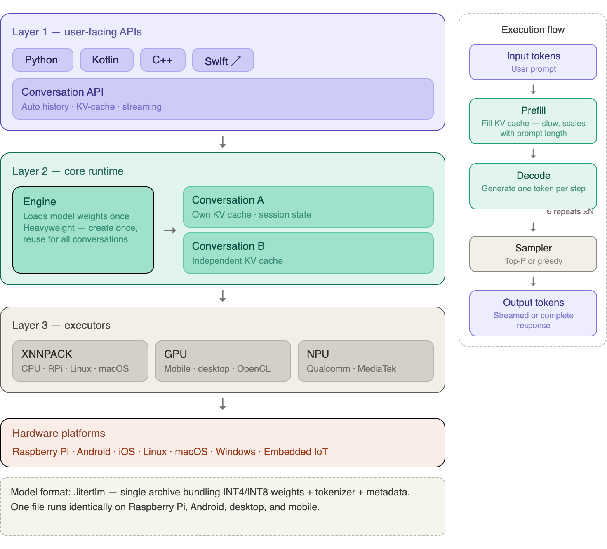
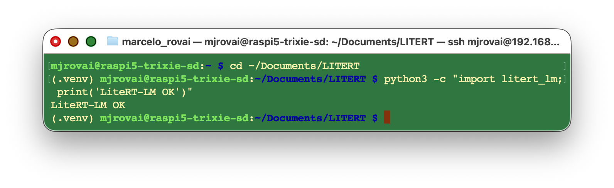
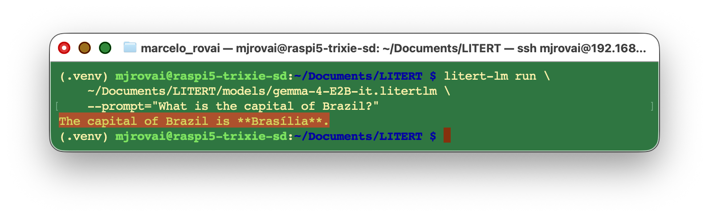
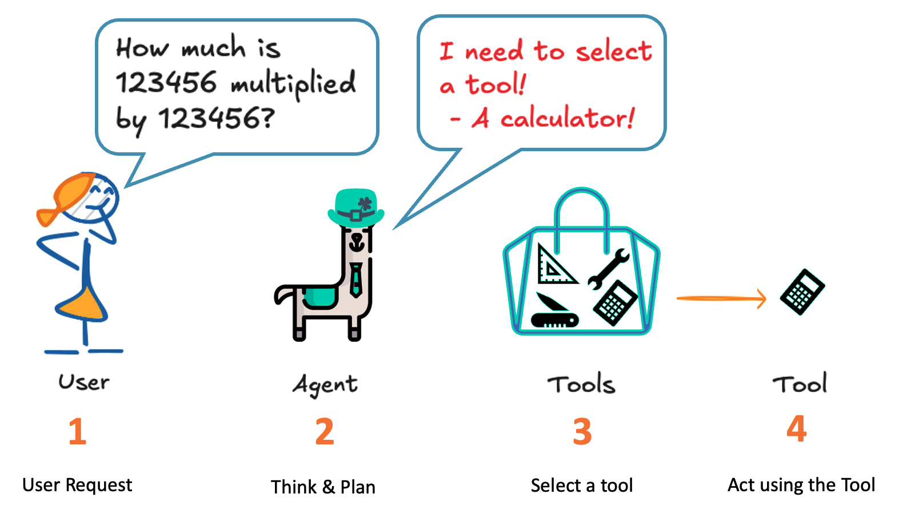
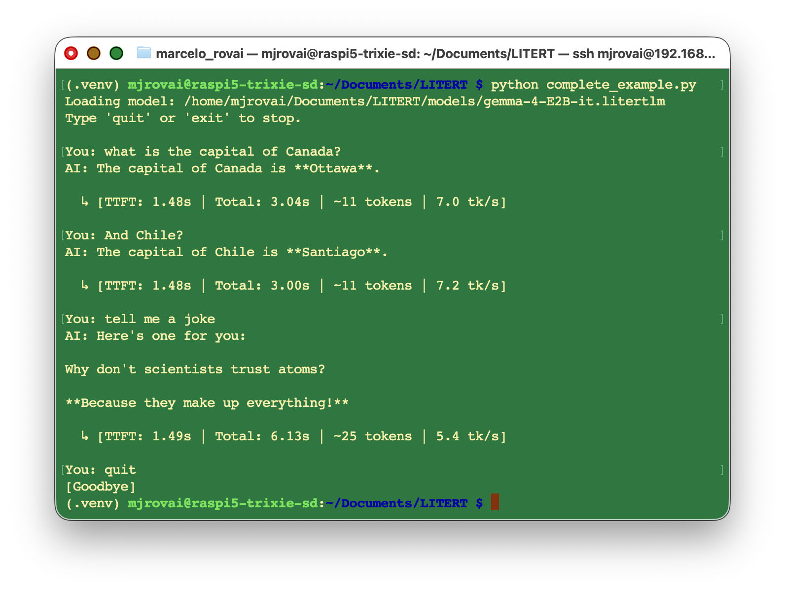
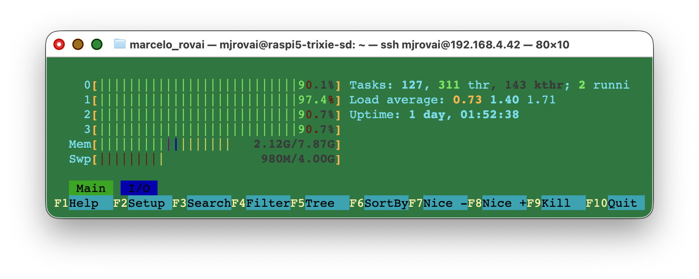
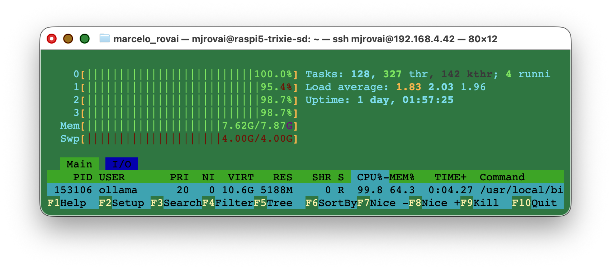

# LiteRT-LM: Production-Ready LLM Inference at the Edge

![DALL·E prompt — *A 1950s-style cartoon illustration of a Raspberry Pi 5 running a language model entirely on-device. The board glows with a warm amber halo. Around it, speech bubbles with gears inside float in mid-air, representing tool calling. A tiny robot arm extends from the board to press a physical button, hinting at IoT integration. The background shows a cozy retro-futuristic lab bench cluttered with transistors, vacuum tubes, and blinking LED panels. Soft pastel palette with bold outlines typical of 1950s editorial cartoons*.](images/jpeg/litert_lm_cover.jpg)

## Introduction

In the previous chapters, we explored [Ollama](https://ollama.com/) as our primary gateway to running Small Language Models (SLMs) on the Raspberry Pi 5. Ollama is excellent for rapid experimentation: one command downloads and serves a model, and the Python library wraps everything in a clean, familiar API. However, Ollama was designed primarily for desktop and server machines; it runs [llama.cpp](https://github.com/ggerganov/llama.cpp) under the hood, and its runtime is not purpose-built for the tight memory and latency budgets of IoT deployments.

This chapter introduces [**LiteRT-LM**](https://ai.google.dev/edge/litert-lm), Google AI Edge's production-ready, open-source inference framework for deploying Large Language Models directly on edge devices. While Ollama is great for getting started, LiteRT-LM offers a different set of tradeoffs that make it particularly well-suited for scenarios where startup latency, memory footprint, and cross-platform consistency matter — or simply when you want your Raspberry Pi to run the same model binary that powers Google's own Pixel Watch and Chromebook Plus.


By the end of this chapter, you will be able to:

- Explain the architecture of LiteRT-LM and how it differs from Ollama / llama.cpp.
- Install the `litert-lm` Python package on a Raspberry Pi 5.
- Download and run a Gemma 4 model in the `.litertlm` format from Hugging Face.
- Build a simple query function, an interactive chat loop, a basic tool-calling pipeline, and a streaming inference loop with performance metrics — all using LiteRT-LM's Python API.

> **Prerequisites:** A Raspberry Pi 5 (8 GB recommended) running Raspberry Pi OS (64-bit), set up as described in the [Setup](https://mjrovai.github.io/EdgeML_Made_Ease_ebook/raspi/setup/setup.html) chapter, and familiarity with the Ollama-based examples from the [Small Language Models](https://mjrovai.github.io/EdgeML_Made_Ease_ebook/raspi/llm/slm_intro.html) and [SLM: Basic Optimization Techniques](https://mjrovai.github.io/EdgeML_Made_Ease_ebook/raspi/llm/slm_opt_tech.html) chapters.

---

## What is LiteRT-LM?

### From TensorFlow Lite to LiteRT

Google's on-device ML story has a long history. **TensorFlow Lite (TFLite)** was released in 2017 as a stripped-down runtime for deploying neural networks on mobile and embedded devices. It popularized quantization-aware training, delegate-based hardware acceleration (GPU, DSP, Edge TPU), and the flat `.tflite` model format — all ideas that have since become standard practice across the industry.

In 2024, Google rebranded TensorFlow Lite as **LiteRT** (Lite RunTime), reflecting a broader vision: a unified on-device ML runtime that covers not just classification and detection models, but the full spectrum of modern AI workloads, including generative models. **LiteRT-LM** is the part of this ecosystem dedicated to Large Language Models.

```
TensorFlow Lite (2017)
        ↓
   LiteRT (2024)           ← unified on-device ML runtime
        ↓
  LiteRT-LM (2025)         ← LLM-specific inference framework
```

### Architecture Overview



LiteRT-LM is organized as a layered stack:

**Layer 1 — User-Facing APIs:** Language bindings (Python, Kotlin, C++, Swift) and a high-level `Conversation` API that handles the full chat loop for you.

**Layer 2 — Core Runtime:** An `Engine` object that loads model weights into RAM and holds them for the lifetime of the context manager. Loading takes several seconds; create the Engine once and reuse it for multiple conversations.

**Layer 3 — Executors:** Low-level interfaces to the actual hardware. On Raspberry Pi 5 (ARM64 CPU), the XNNPACK delegate is used—the same highly optimized CPU kernel library that accelerates TFLite models.

The execution pipeline follows a two-phase pattern familiar from any autoregressive LLM:

1. **Prefill** — the full prompt is tokenized and processed to fill the KV cache.
2. **Decode** — tokens are generated one at a time, each conditioned on the cached context.

> The important insight for Edge AI is that LiteRT-LM manages the KV cache for you. You never need to manually rebuild message history turn by turn (as you do with raw REST APIs). As long as you stay inside the same `Conversation` object, the model retains full context.
>

### The `.litertlm` Format

LiteRT-LM uses its own model packaging format: `.litertlm`. A `.litertlm` file is a single archive that bundles together:

- The quantized model weights (INT4 or INT8 by default).
- A tokenizer.
- Inference metadata (context length, sampler settings, etc.).

This is analogous to Ollama's `.gguf` format, but with one key difference: `.litertlm` files are specifically optimized for the LiteRT executor pipeline. You **cannot** use GGUF files with LiteRT-LM, and you cannot use `.litertlm` files with Ollama. Pre-converted models are hosted on the [LiteRT Community on Hugging Face](https://huggingface.co/litert-community).

### Supported Models

The table below shows some of the models available at the time of writing. Check the [LiteRT-LM overview page](https://ai.google.dev/edge/litert-lm/overview) for the latest additions.

| Model           | Parameters    | Quantization | Context  | RAM (approx.) | Best For                      |
| --------------- | ------------- | ------------ | -------- | ------------- | ----------------------------- |
| Gemma3-1B-IT    | 1B            | INT4         | 4096     | ~1 GB         | Ultra-low-memory devices      |
| **Gemma 4 E2B** | **2.3B eff.** | **INT4**     | **8192** | **~2.7 GB**   | **Raspberry Pi 5 sweet spot** |
| Gemma 4 E4B     | 4B eff.       | INT4         | 8192     | ~3.7 GB       | Higher quality, more RAM      |
| Gemma-3n-E2B    | 2B eff.       | INT4         | 4096     | ~3 GB         | Previous generation           |
| Gemma-3n-E4B    | 4B eff.       | INT4         | 4096     | ~4.2 GB       | Previous generation           |
| Phi-4-mini      | 3.9B          | INT4         | 4096     | ~2.5 GB       | Reasoning-focused tasks       |
| Qwen3-0.6B      | 0.6B          | INT4         | 4096     | ~0.5 GB       | Fastest option                |

> **Gemma 4 architecture note:** The "E" in Gemma 4 E2B stands for *Effective* parameters. Gemma 4 uses a **MatMul-free attention** design combined with **Per-Layer Embeddings (PLE)**, which achieves frontier-level quality with substantially fewer active parameters than traditional dense transformers. The E2B model benchmarks above Gemma 3 27B on several reasoning tasks despite being 12× smaller.

---

## LiteRT-LM vs Ollama: When to Use Each

Both Ollama and LiteRT-LM are excellent tools for running SLMs on Raspberry Pi. They solve the same fundamental problem but with different priorities. Understanding the tradeoffs will help you choose the right tool for each project.

| Feature                    | Ollama                      | LiteRT-LM                               |
| -------------------------- | --------------------------- | --------------------------------------- |
| **Ease of setup**          | ⭐⭐⭐⭐⭐ One-line install      | ⭐⭐⭐⭐ `pip install`                      |
| **Model variety**          | ⭐⭐⭐⭐⭐ Hundreds of models    | ⭐⭐⭐ ~20 models                          |
| **Format**                 | GGUF                        | `.litertlm`                             |
| **Backend engine**         | llama.cpp                   | LiteRT / XNNPACK                        |
| **Python API**             | Stable, mature              | In active development                   |
| **Conversation memory**    | Manual (you manage history) | Automatic (KV-cache per session)        |
| **OpenAI compatibility**   | ✅ Drop-in replacement       | ❌ Custom API                            |
| **Production provenance**  | Community-driven            | Powers Chrome, Pixel Watch, Chromebook+ |
| **Cross-platform binary**  | ❌ Separate runtimes         | ✅ Same binary, all platforms            |
| **IoT / embedded focus**   | Secondary                   | Primary design goal                     |
| **GPU acceleration (RPi)** | ❌ CPU only                  | ❌ CPU only                              |

**Choose Ollama** when you need the widest model selection, the simplest API, or OpenAI-compatible endpoints for existing code.

**Choose LiteRT-LM** when you are targeting a production IoT deployment, want a consistent runtime from prototype (Raspberry Pi) to mobile (Android/iOS), or need tighter memory control and a framework that is actively hardened for edge constraints.

> **Important benchmark note:** On the Raspberry Pi 5 with the Gemma 4 E2B model, you can expect roughly **4–8 tokens/second** at INT4 precision using the CPU backend. This is comparable to Ollama with Gemma 3 2B, confirming that both frameworks extract similar throughput from the RPi5's Cortex-A76 cores. The practical difference shows up on mobile hardware with GPU/NPU backends, where LiteRT-LM achieves massive speedups that llama.cpp-based tools cannot match.

---

## Installation on Raspberry Pi 5

### Prerequisites

Confirm that your Raspberry Pi 5 is running the 64-bit (aarch64) version of Raspberry Pi OS. LiteRT-LM requires this architecture.

```bash
uname -m
# Expected: aarch64
```

Also, confirm your Python version. LiteRT-LM's Python package targets Python 3.10–3.13:

```bash
python3 --version
```

Update the system

```bash
sudo apt update
sudo apt upgrade -y
```

### Creating a Virtual Environment

It is good practice to use a dedicated virtual environment for LiteRT-LM experiments, especially since `litert-lm` may conflict with `torch` or `tensorflow` packages when installed in the same environment.

Starting criating a working directory

```bash
mkdir -p ~/Documents/LITERT
cd ~/Documents/LITERT
```

Create the environment:

```bash
python3 -m venv .venv
source .venv/bin/activate
```

### Installing the Package

```bash
pip install --upgrade litert-lm
```

This single command pulls the pre-built wheel for `aarch64` Linux and its dependencies (including the XNNPACK-accelerated LiteRT runtime). There is no separate server to start — LiteRT-LM runs in-process, embedded inside your Python script.

> **No server, no port.** Unlike Ollama, which runs as a background daemon on port 11434, LiteRT-LM is a library. When your script exits, the model is unloaded. This is a natural fit for embedded applications where you want complete control over the application lifecycle.

Verify the installation:

```bash
python3 -c "import litert_lm; print('LiteRT-LM OK')"
```



### Installing the Hugging Face CLI (for model downloads)

Models are hosted on Hugging Face. The `huggingface_hub` CLI is the most reliable way to download `.litertlm` files.

```bash
pip install huggingface_hub
huggingface-cli login   # optional; required for gated models
```

---

## Downloading a Model

We will use **Gemma 4 E2B** (`gemma-4-E2B-it`), the sweet-spot model for Raspberry Pi 5. It runs in approximately 1.5 GB of working memory, leaving headroom for your application code.

```bash
mkdir -p ~/Documents/LITERT/models
huggingface-cli download \
    litert-community/gemma-4-E2B-it-litert-lm \
    gemma-4-E2B-it.litertlm \
    --local-dir ~/Documents/LITERT/models
```

The download is approximately 1.5 GB. Once complete:

```
~/Documents/LITERT/models
└── gemma-4-E2B-it.litertlm
```

### Quick Sanity Check with the CLI

LiteRT-LM ships with a command-line runner. Before writing any Python, confirm the model works:

```bash
litert-lm run \
    ~/Documents/LITERT/models/gemma-4-E2B-it.litertlm \
    --prompt="What is the capital of Brazil?"
```

Expected output (after a few seconds of model loading):

```
The capital of Brazil is **Brasília**.
```



> **First-run latency:** Loading a 1.5 GB model from an SD card takes 10–20 seconds. Using an NVMe SSD via the PCIe slot reduces this to 2–4 seconds. For production IoT applications, an SSD is strongly recommended.

---

## Python API

We can create Python scripts with a text editor, such as `nano`, or install a Jupyter Notebook:

```bash
pip install jupyter
jupyter notebook
```

Now let's explore the Python API systematically, building from a single query to a streaming chat loop with performance metrics. All examples assume the following preamble:

```python
import litert_lm

litert_lm.set_min_log_severity(litert_lm.LogSeverity.ERROR)  # suppress verbose logs

MODEL_PATH = "/home/mjrovai/Documents/LITERT/models/gemma-4-E2B-it.litertlm"
```

The `set_min_log_severity` call silences LiteRT-LM's internal diagnostic messages (model-loading progress, tokenizer initialization, etc.) so your terminal output stays clean. During development, you may want to remove this line to see what's happening under the hood.

### The Engine and Conversation Objects

The two core objects you will use in every LiteRT-LM script are:

- **`litert_lm.Engine(model_path)`** — a heavyweight object that loads model weights into RAM and holds them for the lifetime of the context manager. Create the Engine once and reuse it for multiple conversations.
- **`engine.create_conversation()`** — a lightweight object representing a single conversation thread. It maintains its own KV cache, so it automatically retains the full message history.

Both objects are Python context managers (use them with `with` statements), which ensures clean resource deallocation.

```
┌──────────────────────────────────────────┐
│  Engine  (model weights loaded once)     │
│  ┌────────────────────────────────────┐  │
│  │  Conversation A  (KV cache A)      │  │
│  └────────────────────────────────────┘  │
│  ┌────────────────────────────────────┐  │
│  │  Conversation B  (KV cache B)      │  │
│  └────────────────────────────────────┘  │
└──────────────────────────────────────────┘
```

A single `Engine` can host multiple concurrent `Conversation` objects, each with an independent state. This is useful for multi-user applications or for maintaining separate conversation threads for different tasks.

---

### 1. Simple Single-Turn Query

The simplest pattern: open an `Engine`, create a `Conversation`, send one message, read the response.

```python
import litert_lm

litert_lm.set_min_log_severity(litert_lm.LogSeverity.ERROR)
MODEL_PATH = "/home/mjrovai/Documents/LITERT/models/gemma-4-E2B-it.litertlm"

PROMPT = "What is the capital of Colombia?"

with litert_lm.Engine(MODEL_PATH) as engine:
    with engine.create_conversation() as conversation:
        response = conversation.send_message(PROMPT)
        answer = response["content"][0]["text"]
        print(answer)
```

**Output:**

```
The capital of Brazil is **Bogotá**.
```

The `response` object is a dictionary with a `content` list, where each item has a `type` field (`"text"`) and a `text` field containing the generated string. This structure is intentionally similar to the Anthropic and OpenAI messages API, making the pattern familiar.

#### Wrapping it as a Reusable Function

For quick experiments, a helper function is convenient:

```python
def simple_query(prompt, model=MODEL_PATH):
    with litert_lm.Engine(model) as engine:
        with engine.create_conversation() as conversation:
            response = conversation.send_message(prompt)
            return response["content"][0]["text"]
```

Let's use the function:

```python
print(simple_query("What is the capital of France?"))
```

**Output:**

```bash
The capital of France is **Paris**.
```

If we ask the following question:

```python
print(simple_query("And Peru"))
```

**Output:**

```bash
Please provide more context! "And Peru?" is a very open-ended question. To give you a helpful answer, I need to know what you are referring to.
```

> **No conversation history in `simple_query`:** Each call creates a fresh `Engine` and `Conversation`. A follow-up question like `"and Peru?"` will elicit a confused answer because the model has no memory of the previous question about a country's capital. The next section solves this.

---

### 2. Interactive Chat with Persistent History

The key advantage of LiteRT-LM's `Conversation` object is that it **automatically manages history.** As long as you stay inside the same `conversation` context, every new `send_message` call has access to the full prior exchange — no manual history list required.

```python
import litert_lm

litert_lm.set_min_log_severity(litert_lm.LogSeverity.ERROR)
MODEL_PATH = "/home/mjrovai/Documents/LITERT/models/gemma-4-E2B-it.litertlm"

with litert_lm.Engine(MODEL_PATH) as engine:
    with engine.create_conversation() as conversation:
        print("Chat started. Type 'quit' or 'exit' to stop.\n")
        while True:
            user_input = input(">>> ").strip()

            if user_input.lower() in {"exit", "quit"}:
                print("[Exiting chat]")
                break
            if not user_input:
                continue

            # Streaming: iterate over chunks as they are generated
            for chunk in conversation.send_message_async(user_input):
                print(chunk["content"][0]["text"], end="", flush=True)
            print()  # newline after the full response
```

**Example session:**

```
Chat started. Type 'quit' or 'exit' to stop.

>>> What is the capital of France?
The capital of France is **Paris**.

>>> and Peru?
The capital of Peru is **Lima**.

>>> quit
[Exiting chat]
```

Notice how `"and Peru?"` (a context-dependent follow-up) is correctly resolved to Peru's capital. The model understood the implicit reference because the KV cache preserved the prior turn. With the `simple_query` function from the previous section, the same follow-up would fail.

The key API difference here is **`send_message_async`** vs `send_message`. The async variant returns a generator that yields partial chunks as tokens are produced, enabling streaming output that makes interactions feel responsive. Each `chunk` has the same structure as the full response from `send_message`.

---

### 3. Tool Calling (Function Calling)

As we saw in the [SLM: Basic Optimization Techniques](https://mjrovai.github.io/EdgeML_Made_Ease_ebook/raspi/llm/slm_opt_tech.html) chapter, LLMs are unreliable calculators. Let's reproduce that demonstration with LiteRT-LM:

```python
PROMPT = "What is 123456 multiplied by 123456?"
print(simple_query(PROMPT))
```

**Output (typical — wrong!):**
```
...123,456² = 15,238,827,536
```

The correct answer is:

```python
print(f"{123456*123456:,}")  # → 15,241,383,936
```



LiteRT-LM supports native function-calling protocols for Gemma models. At the Python API level (still in active development), the most robust and universally compatible approach is **JSON-based prompt engineering** — the same technique we used with Ollama in the previous chapter. The idea is identical: use a system instruction to constrain the model's output to a specific JSON schema, then parse and dispatch that JSON in Python.

#### Step 1 — Define the Tool Function

```python
def multiply_numbers(a: float, b: float) -> float:
    """Multiply two numbers.

    Args:
        a: The first number.
        b: The second number.
    """
    return f'{a * b:,}'
```

#### Step 2 — Define the System Instruction

LiteRT-LM does not yet have a separate `system` role in its Python API. The standard workaround is to send the system instruction as the **first user message** before any real query. The conversation's KV cache retains this instruction for all subsequent turns.

```python
import json

SYSTEM_INSTRUCTION = """
You are a helpful assistant with access to a single tool: multiply_numbers(a, b).

When the user asks for a multiplication, DO NOT explain.
Instead, respond ONLY with a JSON object of this form:

{
  "tool": "multiply_numbers",
  "a": <number>,
  "b": <number>
}

No extra text. No Markdown. No backticks.
If the user is not asking for a multiplication, answer normally in plain text.
"""
```

#### Step 3 — The Tool-Calling Loop

```python
with litert_lm.Engine(MODEL_PATH) as engine:
    with engine.create_conversation() as conversation:
        # Prime the model with the system instruction
        conversation.send_message(SYSTEM_INSTRUCTION)

        # Send the user's actual question
        user_prompt = "What is 123456 multiplied by 123456?"
        response = conversation.send_message(user_prompt)
        text = response["content"][0]["text"]
        print("Model raw output:\n", text)

        # Parse the JSON and dispatch to the tool
        result = None
        try:
            tool_call = json.loads(text)
            if tool_call.get("tool") == "multiply_numbers":
                a = float(tool_call["a"])
                b = float(tool_call["b"])
                result = multiply_numbers(a, b)
        except Exception as e:
            print("[Could not parse tool call]", e)

        if result is not None:
            print(f"\n[Tool result] multiply_numbers({a}, {b}) = {result}")
        else:
            print("\n[No tool call detected; treating reply as plain text]")
```

**Output:**
```
Model raw output:
 {
  "tool": "multiply_numbers",
  "a": 123456,
  "b": 123456
}

[Tool result] multiply_numbers(123456.0, 123456.0) = 15,241,383,936.0
```

The pattern is clean and reusable:

1. The LLM handles **natural language understanding** — extracting intent and operands.
2. Python handles **actual computation** — always correct, always deterministic.

> **Swapping the tool:** You can replace `multiply_numbers` with any Python function — a GPIO sensor read, a file lookup, a distance calculation, a REST API call. The model doesn't care how the function is implemented internally; it only needs to emit the correct JSON. This makes the pattern reusable across all kinds of Edge AI + IoT applications.

If we run the tool calling loop again with a new query, such as **"What is the capital of Guatemala?"**, the answer will be a normal response from the model:

```bash
Model raw output:
 The capital of Guatemala is Guatemala City.

[Could not parse tool call or invalid format] Expecting value: line 1 column 1 (char 0)

[No tool call detected; treat model reply as plain text]
```
---
### 4. Streaming with Performance Metrics

For production deployments, knowing your inference speed is essential. The following code adds **Time to First Token (TTFT)**, **total latency**, and **tokens/second** measurements to the chat loop.

TTFT measures how long the user waits before any output appears — it is dominated by the prefill phase. Tokens/second measures decode throughput. Together, they give a complete picture of perceived responsiveness.

```python
import time
import re
import litert_lm

litert_lm.set_min_log_severity(litert_lm.LogSeverity.ERROR)
MODEL_PATH = "/home/mjrovai/Documents/LITERT/models/gemma-4-E2B-it.litertlm"


def rough_token_count(text: str) -> int:
    """Estimate token count using word/punctuation splitting.

    This is an approximation — a proper tokenizer would be more accurate,
    but this is sufficient for ballpark throughput measurements.
    """
    return len(re.findall(r"\w+|[^\w\s]", text, re.UNICODE))


def chunk_to_text(chunk) -> str:
    """Extract plain text from a LiteRT-LM response chunk."""
    parts = []
    if isinstance(chunk, dict):
        for item in chunk.get("content", []):
            if isinstance(item, dict) and item.get("type") == "text":
                parts.append(item.get("text", ""))
    return "".join(parts)


with litert_lm.Engine(MODEL_PATH) as engine:
    with engine.create_conversation() as conversation:
        print("Chat with metrics. Type 'quit' to exit.\n")
        while True:
            user_input = input(">>> ").strip()

            if user_input.lower() in {"exit", "quit"}:
                break
            if not user_input:
                continue

            start = time.perf_counter()
            first_token_time = None
            pieces = []

            for chunk in conversation.send_message_async(user_input):
                text = chunk_to_text(chunk)
                if text:
                    if first_token_time is None:
                        first_token_time = time.perf_counter()
                    pieces.append(text)
                    print(text, end="", flush=True)

            end = time.perf_counter()
            print()

            output = "".join(pieces)
            output_tokens = rough_token_count(output)
            total_latency = end - start
            ttft = (first_token_time - start) if first_token_time else None
            decode_time = (end - first_token_time) if first_token_time else None
            tps = (output_tokens / decode_time) if decode_time and decode_time > 0 else 0.0

            if ttft is not None:
                print(
                    f"[TTFT: {ttft:.3f}s | Total: {total_latency:.3f}s | "
                    f"OutTok(est): {output_tokens} | Tk/s(est): {tps:.2f}]"
                )
            else:
                print(f"[Total: {total_latency:.3f}s | OutTok(est): {output_tokens}]")
```

**Example session:**
```
Chat with metrics. Type 'quit' to exit.

>>>  what is the capital of Brazil?
The capital of Brazil is **Brasília**.
[TTFT: 1.524s | Total: 3.438s | OutTok(est): 11 | Tk/s(est): 5.75]

>>>  and France?
The capital of France is **Paris**.
[TTFT: 1.468s | Total: 3.156s | OutTok(est): 11 | Tk/s(est): 6.52]

>>>  y la de Bolivia?
The capital of Bolivia is **Sucre**.

However, it's important to note that **La Paz** is the administrative capital and the seat of the government, while **Sucre** is the constitutional capital. Sucre holds the constitutional status.
[TTFT: 1.427s | Total: 11.427s | OutTok(est): 54 | Tk/s(est): 5.40]
```

#### Interpreting the Metrics

| Metric            | Typical RPi 5 Value | Meaning                                                      |
| ----------------- | ------------------- | ------------------------------------------------------------ |
| **TTFT**          | 1-2 s (SSD)         | Time until first visible output. Dominated by prefill (prompt processing). |
| **Total latency** | 3–11 s              | Full wall-clock time from send to end-of-stream.             |
| **OutTok(est)**   | varies              | Estimated number of output tokens (word-level approximation). |
| **Tk/s(est)**     | 5–7                 | Decode throughput in tokens per second.                      |

> **Why is TTFT several seconds?** On the first question in a session, TTFT includes model-loading overhead. On subsequent turns, it shrinks because the `Engine` is already warm. Longer prompts increase TTFT proportionally, since prefill scales with prompt length.

> **Improving performance:** The single most impactful hardware upgrade is replacing the SD card with an NVMe SSD. This reduces model load time from ~20 s to ~2 s. Within a session, performance is CPU-bound and not affected by storage speed.

---

## Complete Example: Putting it All Together

```python
#!/usr/bin/env python3
"""
litert_lm_chat.py  —  Interactive streaming chat with Gemma 4 E2B on RPi5.

Usage:
    source ~/litert-env/bin/activate
    python3 litert_lm_chat.py
"""

import re
import time
import litert_lm

MODEL_PATH = "/home/mjrovai/Documents/LITERT/models/gemma-4-E2B-it.litertlm"
litert_lm.set_min_log_severity(litert_lm.LogSeverity.ERROR)


def rough_token_count(text: str) -> int:
    return len(re.findall(r"\w+|[^\w\s]", text, re.UNICODE))


def chunk_to_text(chunk) -> str:
    parts = []
    if isinstance(chunk, dict):
        for item in chunk.get("content", []):
            if isinstance(item, dict) and item.get("type") == "text":
                parts.append(item.get("text", ""))
    return "".join(parts)


def main():
    print(f"Loading model: {MODEL_PATH}")
    print("Type 'quit' or 'exit' to stop.\n")

    with litert_lm.Engine(MODEL_PATH) as engine:
        with engine.create_conversation() as conversation:
            while True:
                try:
                    user_input = input("You: ").strip()
                except (EOFError, KeyboardInterrupt):
                    print("\n[Interrupted]")
                    break

                if user_input.lower() in {"exit", "quit"}:
                    print("[Goodbye]")
                    break
                if not user_input:
                    continue

                print("AI: ", end="", flush=True)
                start = time.perf_counter()
                first_token_time = None
                pieces = []

                for chunk in conversation.send_message_async(user_input):
                    text = chunk_to_text(chunk)
                    if text:
                        if first_token_time is None:
                            first_token_time = time.perf_counter()
                        pieces.append(text)
                        print(text, end="", flush=True)

                end = time.perf_counter()
                print("\n")

                output = "".join(pieces)
                output_tokens = rough_token_count(output)
                total_latency = end - start
                ttft = (first_token_time - start) if first_token_time else None
                decode_time = (end - first_token_time) if first_token_time else None
                tps = (output_tokens / decode_time) if decode_time and decode_time > 0 else 0.0

                if ttft is not None:
                    print(
                        f"  ↳ [TTFT: {ttft:.2f}s | Total: {total_latency:.2f}s | "
                        f"~{output_tokens} tokens | {tps:.1f} tk/s]\n"
                    )


if __name__ == "__main__":
    main()
```



During the inference, it is possible to see that the memory consumption is low (2.1GB of RAM + ~1GB of Swap):


Runing a simple query on the Raspi, using the same model but with Ollama, we can see that memory usage is intense (7.7GB of RAM + 4GB of Swap):

Another point is the model's size. The Gemma4:e2b needs 7.2GB of RAM, and its LiteRT-LM version only 2.7GB. 

## Going Further

**Multi-modal inputs.** Gemma 4 is natively multi-modal. LiteRT-LM can accept image buffers alongside text prompts, opening the door to vision-language tasks directly on Raspberry Pi — using the same `.litertlm` file. 

> UNFORTUNATELY, at this time, the multimodality is still not working properly on the Raspberry Pi using LiteRT-LM, only with OLLAMA, but with high latency (around 4 minutes). 

**Feeding tool results back into the conversation.** The tool-calling example stops after the function is called. A richer pattern sends the function's result back as a follow-up message, allowing the model to formulate a natural-language reply that incorporates the correct answer.

**Multiple simultaneous conversations.** A single `Engine` can host multiple `Conversation` objects at the same time — useful for multi-user local assistants in, say, a classroom setting, without loading model weights twice.

**Upgrading to Gemma 4 E4B.** If your Raspberry Pi 5 has 8 GB of RAM, the E4B model (~3.7 GB working memory) offers noticeably better reasoning quality, especially for longer contexts (with higher latency). 

**Cross-platform consistency.** A `.litertlm` binary tested on a Raspberry Pi 5 will run without modification on an NVIDIA Jetson Orin Nano or a Qualcomm-based Android device — with the additional benefit of GPU/NPU acceleration on those targets. This is the key architectural advantage of LiteRT-LM: one model file, one runtime, every platform.

---

## Conclusion

LiteRT-LM occupies a distinct niche in the edge AI toolbox. It is not a replacement for Ollama — it is a complement. Ollama excels at broad model selection, simplicity, and desktop development. LiteRT-LM excels at production-quality, cross-platform deployment where the same runtime binary needs to travel from prototyping (Raspberry Pi) to production (Android phone, wearable, embedded system).

In this chapter, we covered the complete development arc: understanding LiteRT-LM's architecture (Engine → Conversation → XNNPACK executor); installing the Python package and downloading a Gemma 4 `.litertlm` model; and building four progressively more complex patterns — single query, persistent chat, tool calling, and streaming with metrics.

The most important mental model to take away is the **Engine / Conversation separation**: weights are loaded once (expensive), and conversation state is maintained automatically per session (free). This design makes LiteRT-LM well-suited for always-on IoT applications where the model is loaded at boot and conversations flow naturally for as long as the device is running.

---

## Resources

- **LiteRT-LM Official Documentation:** [ai.google.dev/edge/litert-lm](https://ai.google.dev/edge/litert-lm)
- **LiteRT-LM GitHub Repository:** [github.com/google-ai-edge/LiteRT-LM](https://github.com/google-ai-edge/LiteRT-LM)
- **LiteRT Community on Hugging Face (pre-converted models):** [huggingface.co/litert-community](https://huggingface.co/litert-community)
- **Gemma 4 E2B model:** [huggingface.co/litert-community/gemma-4-E2B-it-litert-lm](https://huggingface.co/litert-community/gemma-4-E2B-it-litert-lm)
- **LiteRT-Optimized INT8 LLM for Raspberry Pi (ICCV Workshop 2025):** [openaccess.thecvf.com](https://openaccess.thecvf.com/content/ICCV2025W/AIM/papers/Yoon_LiteRT-Optimized_INT8_LLM_for_Raspberry_Pi4_Deployment_ICCVW_2025_paper.pdf)
- **Google AI Edge Gallery (Android/iOS demo app):** [github.com/google-ai-edge/gallery](https://github.com/google-ai-edge/gallery)
- **Study Notebook for this chapter:** [`LiteRT-LM-Test.ipynb`](https://github.com/Mjrovai/EdgeML-with-Raspberry-Pi/blob/main/LiteRT-LM/LiteRT-LM-Test.ipynb))
