# From Ollama to llama.cpp: Multimodal Inference on the Edge

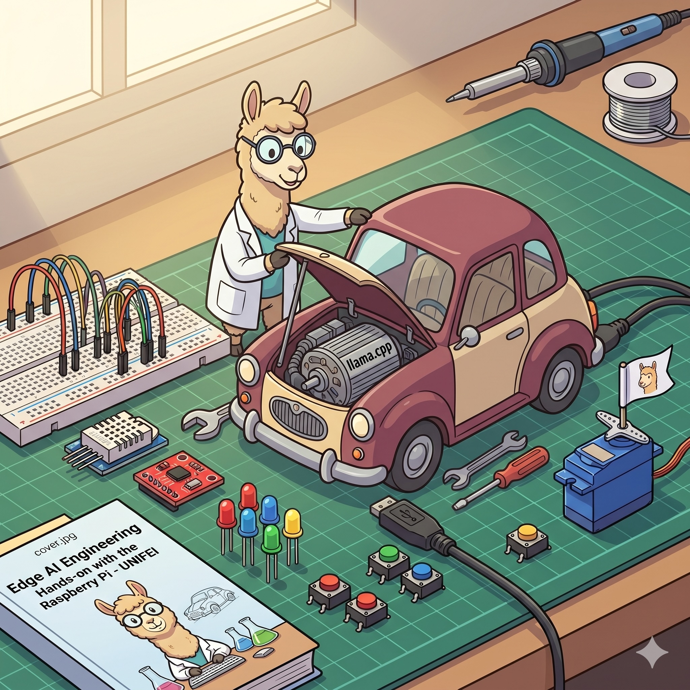

This chapter builds `llama.cpp` from source on a Raspberry Pi 5, starts `llama-server`, and sends text prompts, images, videos, and audio clips to it via a single OpenAI-compatible API. Two small mixed-modality models make this possible on the board: **Qwen 3.5 0.8B** (text, image, video) and **Gemma 4 E2B** (text, image, audio). Both fit in the Pi's RAM alongside their vision/audio projector and a growing KV cache.

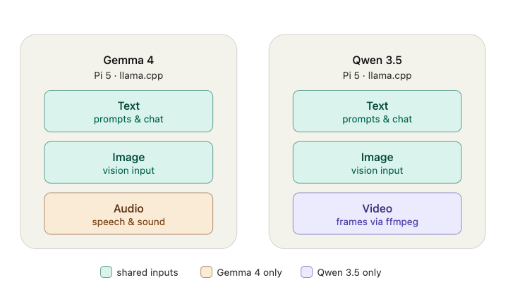

Everything runs on the CPU. The Pi 5 has no GPU that `llama.cpp` can offload to in any useful way, so the four Cortex-A76 cores do all the work.

## Why llama.cpp, after Ollama

In the [Small Language Models chapter](https://mjrovai.github.io/EdgeML_Made_Ease_ebook/raspi/llm/slm_intro.html), we ran everything through Ollama: install, `ollama run`, and a clean Python library on top of it. Ollama is the right starting point, and we said there that it runs `llama.cpp` under the hood. This chapter goes down that one layer and drives `llama.cpp` directly.

**The reason is control**. When we build from source, we pick the flags that matter on a Pi 5 — KleidiAI microkernels, native AArch64/NEON, CURL for `-hf` model pulls — and we get the four binaries Ollama hides from us, including `llama-bench` for honest tokens-per-second and `llama-mtmd-cli` for terminal multimodal tests. We also get the multimodal projector (`mmproj`) path, which is how the newest mixed-modality models reach the board. Ollama can't run Gemma 4 E2B with audio data on the Pi yet; `llama.cpp` can.

The other reason is the API. `llama-server` speaks the OpenAI Chat Completions format, so the Python we write at the end of this chapter is the same Python that talks to GPT or Claude — only the `base_url` changes.

If you only need text and the friendliest possible setup, stay with Ollama. If you want multimodal on the latest small models, measured performance, and an OpenAI-compatible endpoint you can point any client at, build `llama.cpp`.

## What you need

Hardware:

- Raspberry Pi 5 — **4 GB possible, 8 GB comfortable**. Multimodal models hold the language weights, the vision/audio projector, and a growing KV cache all at once. 4 GB will fight you.
- Active cooling. Not optional. `llama.cpp` pins all four cores at 100%, and a Pi 5 under sustained load throttles hard above ~80 °C. A passive heatsink alone will cost you tokens per second.
- An NVMe SSD, if you have one. Models load from disk on every server start, and a 2–3 GB file from a microSD card results in a noticeably slower cold start than from an NVMe drive.
- A camera and a microphone (if you do not have them, use .wav/.mp4 files to test audio and video).

Software:

- Raspberry Pi OS 64-bit (Trixie). The 64-bit build matters — the 32-bit OS won't give you the ARM features the build relies on.

## Build llama.cpp from source

Check the architecture of your device, SSD space, and available RAM first:

```bash
uname -m
free -h
df -h /home
```

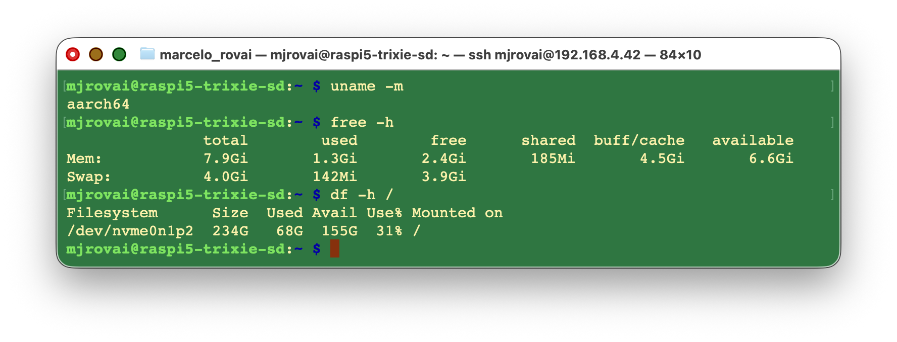

Install the build dependencies:

```bash
sudo apt update && sudo apt upgrade -y
sudo apt install -y git build-essential cmake pkg-config libcurl4-openssl-dev
```

`libcurl` is the one people forget. Without it, the `-hf` flag that pulls models straight from Hugging Face won't compile in, and you'll be downloading GGUF files by hand.

Clone and build:

```bash
git clone https://github.com/ggml-org/llama.cpp
cd llama.cpp

cmake -B build \
  -DGGML_CPU_KLEIDIAI=ON \
  -DGGML_NATIVE=ON \
  -DLLAMA_CURL=ON \
  -DCMAKE_BUILD_TYPE=Release \
  -DCMAKE_EXPORT_COMPILE_COMMANDS=ON

cmake --build build --config Release -j$(nproc)
```

What each flag does:

- `-DGGML_CPU_KLEIDIAI=ON`: a library of optimized microkernels for AI workloads, built specifically for Arm CPUs.
- `-DGGML_NATIVE=ON`: turns on the Pi's CPU-specific optimizations (AArch64/NEON), which improves tok/s.
- `-DLLAMA_CURL=ON`: enables the HTTP features in `llama-server`, including `-hf` model pulls and web tools.
- `-DCMAKE_BUILD_TYPE=Release`: compiles with maximum optimizations.
- `-DCMAKE_EXPORT_COMPILE_COMMANDS=ON`: generates `build/compile_commands.json` for clangd / VS Code.

The build takes roughly 10 to 20 minutes on a Pi 5, depending on cooling and whether you're using an SSD or an SD card. Make a coffee. When it finishes, the binaries you care about are in `build/bin/`:

- `llama-cli` — interactive text inference
- `llama-server` — the HTTP server with the OpenAI-compatible API and a built-in web UI
- `llama-bench` — the official benchmark for measuring model performance on specific hardware
- `llama-mtmd-cli` — the multimodal command-line tool, for testing from the terminal instead of over HTTP

Sanity check that the server binary runs:

```bash
./build/bin/llama-cli --version
```

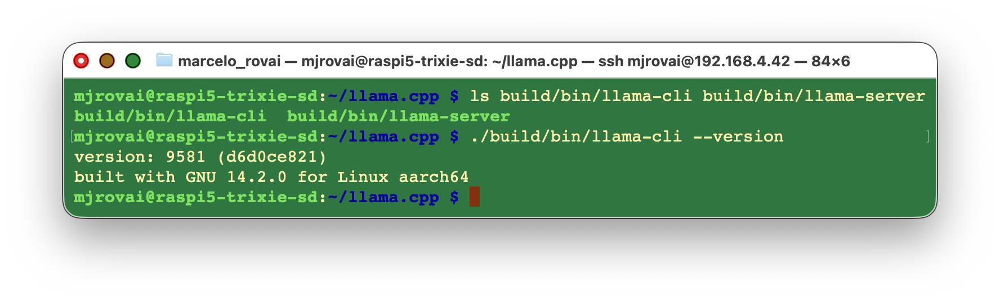

## Download the models

For text alone, almost any small GGUF works. The constraint here is the need for a **model that handles multimodal inputs**. In `llama.cpp` terms, that means a model listed under "mixed modalities" — it ships with a multimodal projector (`mmproj`) that encodes images and audio (Gemma 4) or images and video (Qwen 3.5) into the language model's embedding space.

In this tutorial, we will test the smaller multimodal model available (June, 2026), the Qwen 3.5 0.8B, and the newer [Quantization-Aware Training (QAT) model from the Gemma family](https://blog.google/innovation-and-ai/technology/developers-tools/quantization-aware-training-gemma-4/), Gemma 4 E2B.

| Model | Repo | Notes |
|---|---|---|
| Gemma 4 E2B | https://huggingface.co/prithivMLmods/gemma-4-E2B-it-qat-GGUF/tree/main | 3.2 GB (model) + 1 GB (mmproj) [image + audio] |
| Qwen 3.5 0.8B | https://huggingface.co/unsloth/Qwen3.5-0.8B-GGUF/tree/main | 800 MB (model) + 200 MB (mmproj) [image + video] |

### Quantization: Q4 vs Q8 for sub-1B models

Q4_K_M produced noticeably lower output quality for sub-1B models than Q8_0. The aggressive 4-bit compression loses too much when the model has only 800M parameters to begin with — there's less redundancy to exploit than in bigger models.

> At the sub-1B scale, Q4 is aggressive. The quantization error compounds more in smaller models because there's less redundancy in the weights to absorb the loss of precision. Q6 or Q8 helps a lot.
>
> Also, prefer `min_p` over `top_p` for sampling. Something like `min_p=0.05` with `temp=0.7` works better for small models because it adjusts the candidate pool dynamically based on the probability distribution rather than using a fixed cutoff. `top_p` at low temperatures produces a very narrow beam, and repetition becomes almost inevitable at these model sizes.

The rule of thumb:

- **Use Q8_0** for sub-1B models such as Qwen 3.5 0.8B (~800 MB). Quality is meaningfully better.
- **Use Q4_K_M** for bigger models. Google launched new **Quantization-Aware Training (QAT)** Gemma 4 models in June 2026; Gemma 4 E2B (a 5B model with 2B active) runs fast and reliably on the Pi 5 at Q4_K_M.

### Downloading with `wget`

#### Qwen 3.5

```bash
mkdir -p ~/models
cd ~/models

wget https://huggingface.co/unsloth/Qwen3.5-0.8B-GGUF/resolve/main/Qwen3.5-0.8B-Q8_0.gguf

wget https://huggingface.co/unsloth/Qwen3.5-0.8B-GGUF/resolve/main/mmproj-F16.gguf \
  -O Qwen3.5-0.8B-mmproj-F16.gguf
```

The `-O` (capital O) renames the downloaded file. Watch this — lowercase `-o` is wget's *log-file* flag, which saves the project under its original name and writes wget's log to the file you meant to create.

Expected tokens/s from `llama-bench`:

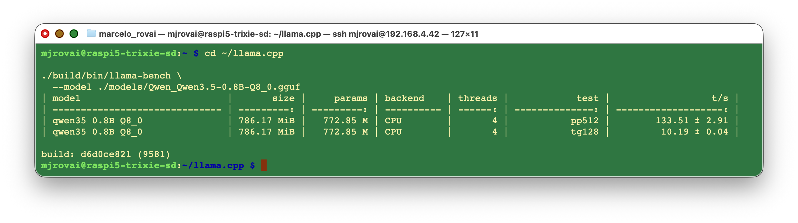

- Reading (prompt processing): ~134 tk/s
- Generation (token output): ~10 tk/s

#### Gemma 4

```bash
cd ~/models

wget https://huggingface.co/prithivMLmods/gemma-4-E2B-it-qat-GGUF/resolve/main/gemma-4-E2B-it-qat.Q4_K_M.gguf

wget https://huggingface.co/prithivMLmods/gemma-4-E2B-it-qat-GGUF/resolve/main/gemma-4-E2B-it-qat.mmproj-f16.gguf \
  -O gemma-4-E2B-it-qat-mmproj-F16.gguf
```

Expected tokens/s from `llama-bench`:

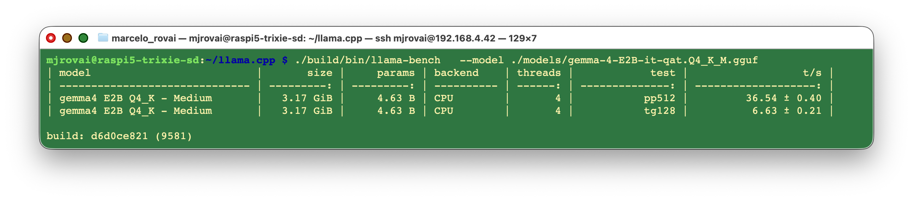

- Reading (prompt processing): ~37 tk/s
- Generation (token output): ~7 tk/s

> Because the build has `-DLLAMA_CURL=ON`, you can skip manual downloads and let the server pull model and projector together. The official repo handles both: `./build/bin/llama-server -hf ggml-org/gemma-4-E2B-it-GGUF`. The `wget` route above is the one to keep for an offline Pi.

## Qwen 3.5: start the server

On a terminal, run:

```bash
cd ~/llama.cpp
./build/bin/llama-server \
  -m       ~/models/Qwen3.5-0.8B-Q8_0.gguf \
  --mmproj ~/models/Qwen3.5-0.8B-mmproj-F16.gguf \
  --host 0.0.0.0 --port 8081 \
  -c 4096 -t 4 \
  -n 1024 \
  --jinja \
  --image-max-tokens 256
```

What the flags do:

- `--host 0.0.0.0` exposes the server to your LAN so you can hit it from a laptop or phone. Drop it to `127.0.0.1` for local-only access.
- `-c 4096` sets the total context window — the KV-cache budget in tokens, shared by text and images. A single image can consume a few hundred. Raise it to `-c 8192` if a model complains, at the cost of more RAM. For video, you'll need something like `-c 32768`.
- `-t 4` uses all four cores.
- `--jinja` turns on the model's own chat template. Skip it, and you can hit a nasty failure mode where generation never stops, because the generic fallback template doesn't register Qwen's end-of-turn token as a stop string. The model keeps going until it fills the context.

The first start downloads nothing extra if you already pulled the files; otherwise, it's slow while the GGUF lands. Once you see the server listening, open the web UI:

```
http://<your-pi-ip>:8081
```

The built-in UI has an attachment button (`+`) that accepts images and video, the fastest way to confirm the modalities work before you write a line of API code. Drag in a photo, ask a question, and watch the logs. You can also turn on reasoning mode (💡), which is off by default.

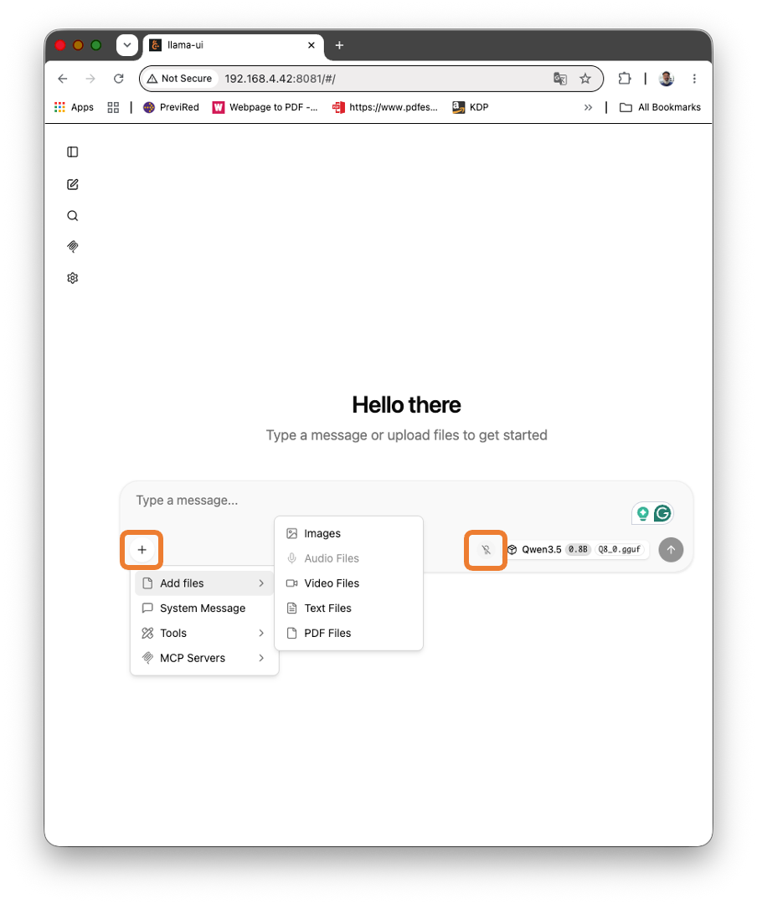

Type a text question and the model answers directly at around 10 tk/s. Turn on `Reasoning,` and the answers improve. This is a very small model, so its answers often aren't correct.

Now an image. Ask the model to describe it. Captioning is where this model shines — from start to finish in about 20 seconds, with the image itself processed in roughly 5 seconds.

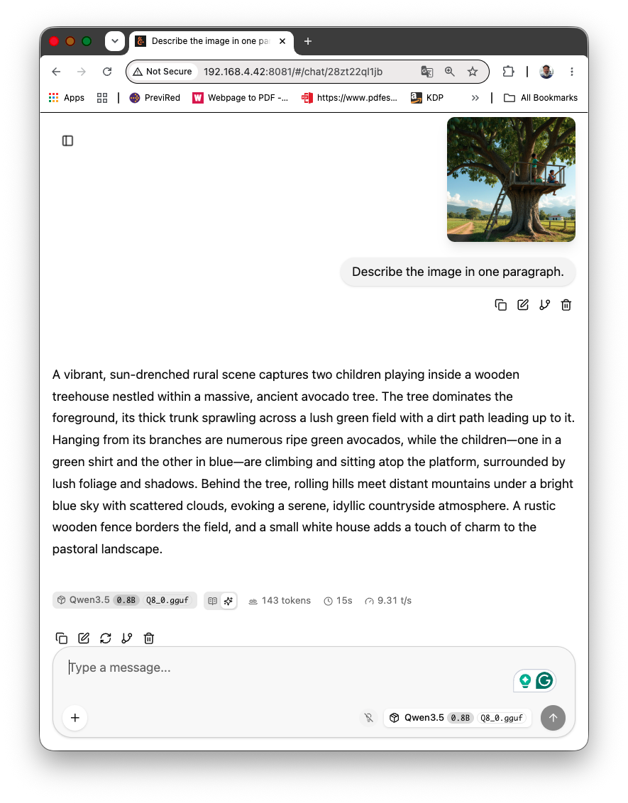

The video takes longer. The clip is split into frames (2 FPS by default) and analyzed; the audio track is dropped before the model ever sees it.

Here's a [video](https://youtu.be/zgLMYdMWFjg) from the [audio pipeline chapter](https://mjrovai.github.io/EdgeML_Made_Ease_ebook/raspi/audio_pipeline/audio_pipeline.html) of this book:

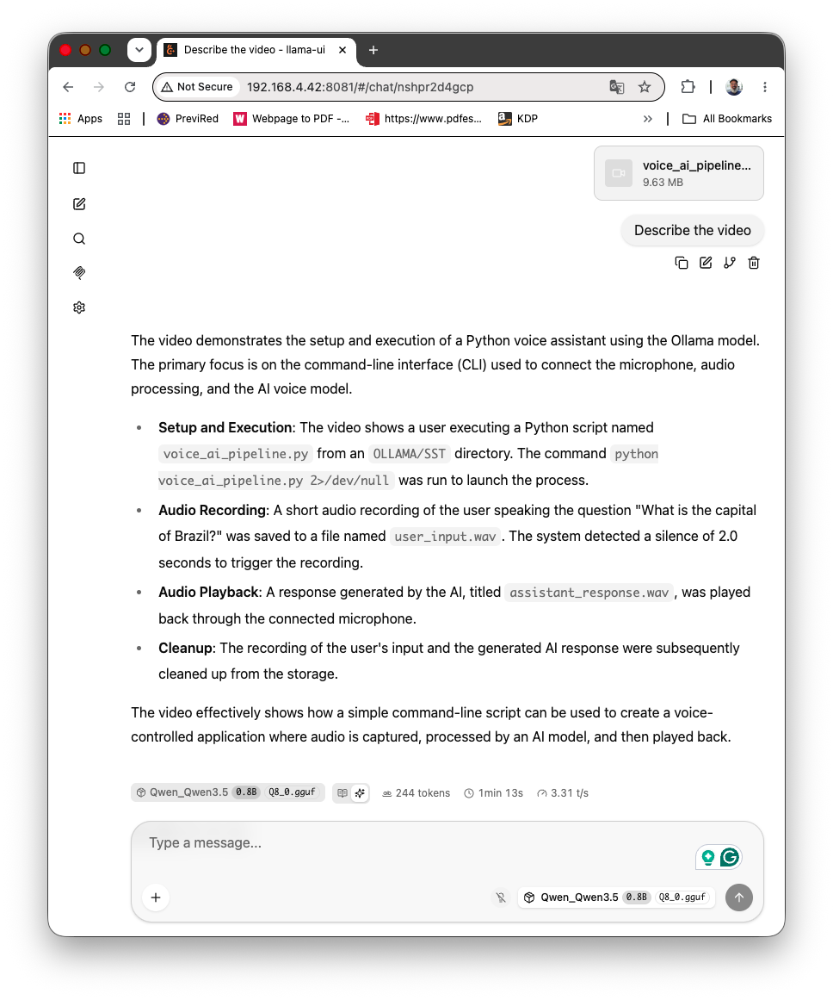

> Qwen 3.5 is fast for image and video description. Turning on reasoning improves accuracy and lengthens the answer, but it doesn't change the image-processing time. 

## Gemma 4: start the server

For sharper answers, and for audio, stop the server with `[Ctrl]+[C]` and start it again with the Gemma 4 model. The flags are the same:

```bash
cd ~/llama.cpp
./build/bin/llama-server \
  -m       ~/models/gemma-4-E2B-it-qat.Q4_K_M.gguf \
  --mmproj ~/models/gemma-4-E2B-it-qat-mmproj-F16.gguf \
  --host 0.0.0.0 --port 8081 \
  -c 4096 -t 4 \
  -n 1024 \
  --jinja \
  --image-max-tokens 256
```

Open a new browser tab or refresh the old one. The model name in the bottom-right of the chat window changes to Gemma. Click the new conversation icon (📝) and ask something. Note that the answers are more accurate and less verbose than the small Qwen 3.5 0.8B model.

### Images

Describe the same image with the same prompt as before. The result is similar:

```text
This is an outdoor photograph featuring a large, mature tree with a sprawling
canopy, situated in a grassy field under a bright, sunny sky. A wooden platform
or deck is built around the base of the tree, with a few children standing on
it, suggesting a relaxed, family-friendly setting. The field itself is green and
stretches into the distance, with a dirt path visible in the foreground. In the
background, there are rolling hills or mountains, and further back, a small
building with a red roof is visible. The overall impression is one of a peaceful,
rural, or park-like natural environment.
```

But the full pass took about 100 seconds, with the image processing alone around 83 seconds. That's the trade for Gemma's better captions.

### Audio

Use the Apollo 8 clip — astronauts Frank Borman, Jim Lovell, and William Anders reading from Genesis while orbiting the Moon on Christmas Eve 1968 — from [Greatest Speeches of the 20th Century](https://archive.org/details/Greatest_Speeches_of_the_20th_Century).

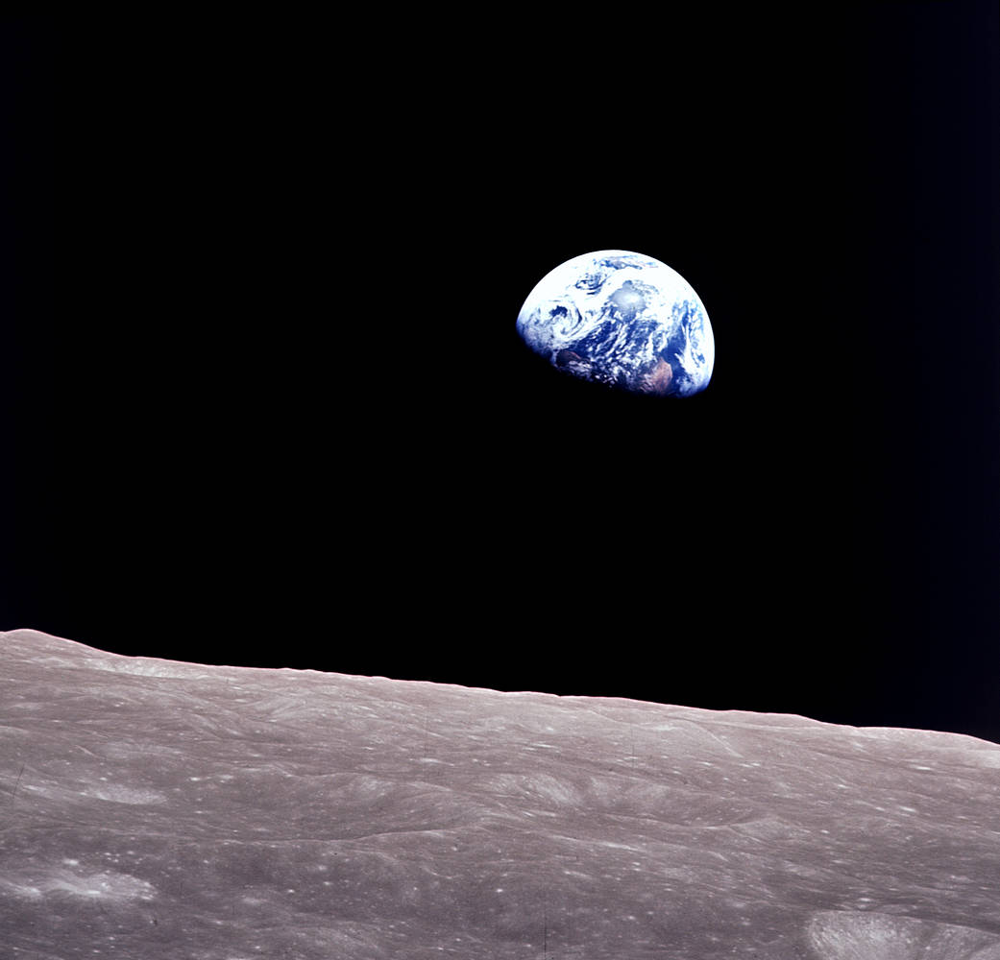

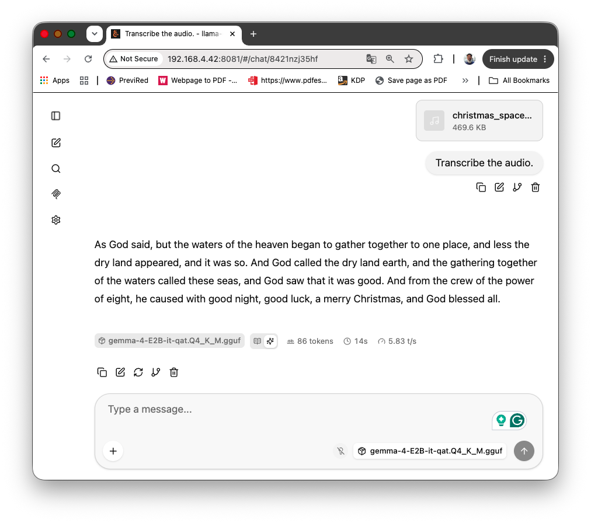

The clip quality was rough (a real transmission from space), but the Pi handled the 30-second MP3 in a little over two minutes. In a second test with my own voice in Portuguese — a 12-second WAV from a microphone — the job took 53 seconds, and the transcription was perfect.

> Audio input is still marked experimental upstream, with a warning about reduced quality. A rough transcription on a noisy clip is the pipeline talking, not your microphone.

## Using the Command Line Interface (CLI)

Besides the server, we can test the models directly on the terminal, as we did with Ollama. The `llama-cli` is the “normal” llama.cpp CLI for **text‑only** models, while `llama-mtmd-cli` is the newer **multimodal / multi‑draft** CLI that unifies image/audio models and MTMD features behind a single tool.

### `llama-cli`

- Classic command‑line frontend that exposes most llama.cpp functionality for LLMs: chat, completion, sampling options, etc.
- Designed primarily for **text input/output**; you point it at a GGUF model and run prompts or chat sessions.
- Does not, by itself, handle multimodal pre‑/post‑processing (vision, audio) or the newer libmtmd abstractions.

### `llama-mtmd-cli`

- Newer CLI built on **libmtmd**, introduced to replace the older, model‑specific multimodal CLIs like the ones tested here.
- Provides a **single unified interface** for multimodal models (text + images, and is designed to handle audio as well, so you don’t need a different binary per architecture.
- Tightly integrated with the “multi‑slot, multi‑draft” (MTMD) context machinery and speculative checkpointing / multi‑token prediction work in llama.cpp, so it can drive more advanced decoding configurations for those models.

Let's do an example. On a terminal, enter with the command: 

```bash
./build/bin/llama-mtmd-cli \
  -m       ./models/Qwen_Qwen3.5-0.8B-Q8_0.gguf \
  --mmproj ./models/mmproj-F16.gguf \
  -c 4096 -t 4 \
  -n 1024 \
  --jinja \
  --image-max-tokens 256
```

When the prompt (`>`) appears, you can enter with the image path:

`> /image /home/mjrovai/Pictures/man_cat_dog.jpg`

and after the info that the image is loaded, with your prompt:

`> Describe the image`

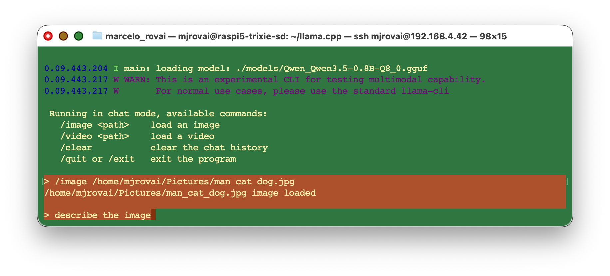

And the model will start the thinking process, and after it, we will be prompted with the answer:

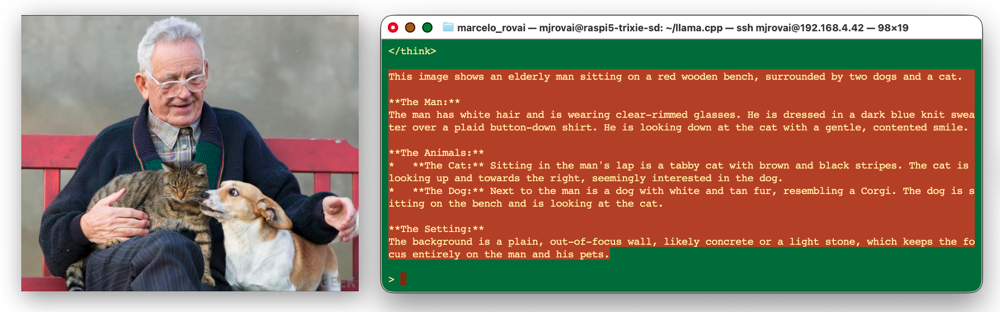

Type `/exit` to leave the CLI.

## Talking to the server from Python

So far, we've mainly used the web UI to confirm that text, images, audio, and video all work. That UI is just a client hitting `llama-server`'s HTTP API — the same API we'll now call from Python to put these models inside a project.

`llama-server` exposes the OpenAI Chat Completions format at `/v1/chat/completions`. That gives us two clean paths, the same split we saw in the Ollama chapter:

- The **`openai` client** — a drop-in library, the same one used for GPT, pointed at the Pi instead of OpenAI's servers
- **Plain `requests`** — raw HTTP when we want the server's own timing fields or zero extra dependencies

Let's run the server again with one of the models, for example, the Gemma 4:

```bash
cd ~/llama.cpp
./build/bin/llama-server \
  -m       ~/models/gemma-4-E2B-it-qat.Q4_K_M.gguf \
  --mmproj ~/models/gemma-4-E2B-it-qat-mmproj-F16.gguf \
  --host 0.0.0.0 --port 8081 \
  -c 4096 -t 4 \
  -n 2048 \
  --jinja \
  --image-max-tokens 256
```

The examples assume `http://localhost:8081`; swap in the Pi's LAN address if you're calling from a laptop.

If you want the model runing without reasoning, you can add the two tags to the above command as shown below:

```bash
./build/bin/llama-server \
  -m       ~/models/gemma-4-E2B-it-qat.Q4_K_M.gguf \
  --mmproj ~/models/gemma-4-E2B-it-qat-mmproj-F16.gguf \
  --host 0.0.0.0 --port 8081 \
  -c 4096 -t 4 \
  -n 2048 \
  --jinja \
  --image-max-tokens 256 \
  --reasoning off \
  --reasoning-budget 0
```

### Setup

Opening another terminal, we should create a virtual environment:

```bash
python3 -m venv ~/llamacpp
source ~/llamacpp/bin/activate
pip install openai requests
```

A quick check that the server is up and which model it has loaded:

```bash
curl -s http://localhost:8081/v1/models | python3 -m json.tool
```

The `id` it returns is the model name the server reports. `llama-server` ignores the `model` field we send in requests — it serves whatever was loaded at startup — so we can pass any string there.

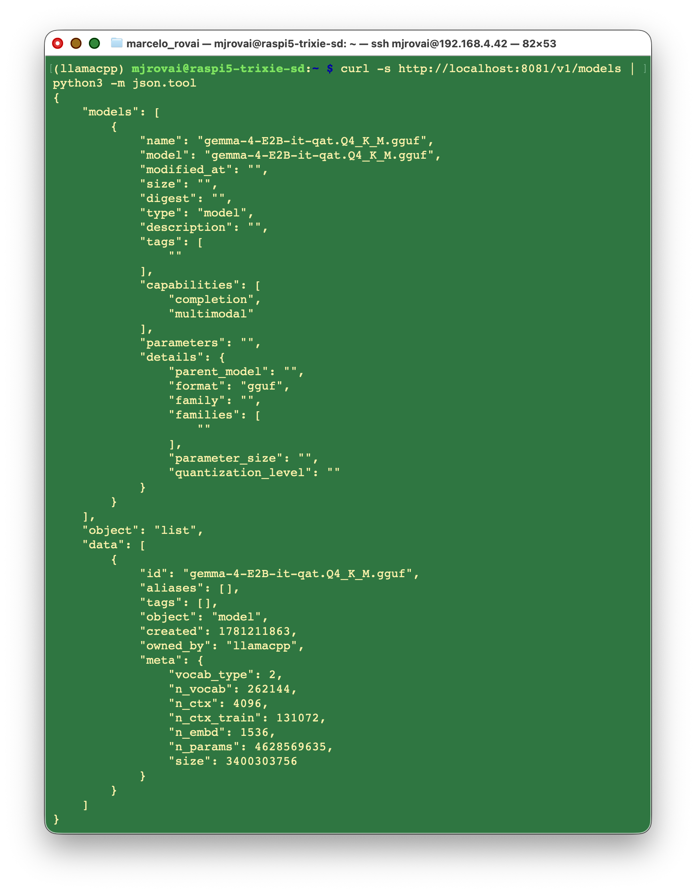

### First call: text

**1. `openai` client version**

```python
import time
from openai import OpenAI

client = OpenAI(
    base_url="http://localhost:8081/v1",
    api_key="not-needed",          # llama-server doesn't check it
)

t0 = time.perf_counter()
resp = client.chat.completions.create(
    model="Gemma4",               # ignored by llama-server, kept for readability
    messages=[{"role": "user", "content": "What is the capital of Brazil?"}],
)
dt = time.perf_counter() - t0

print(resp.choices[0].message.content)

out_tokens = resp.usage.completion_tokens
print(f"\n[INFO] {out_tokens} tokens in {dt:.2f}s "
      f"= {out_tokens / dt:.1f} tok/s")
```

`resp.usage` carries `prompt_tokens`, `completion_tokens`, and `total_tokens`. Dividing output tokens by wall-clock time gives the generation rate — should be near the value reported by llama-bench, minus a little for HTTP overhead. Note the fumm time: `20.22s`, it includes the reasoning time, which was not printed. 

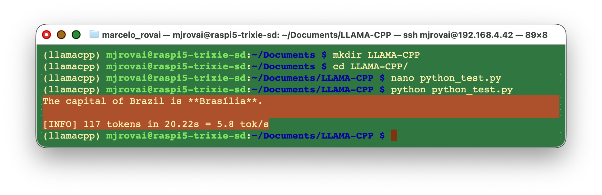

**2. Plain `requests`  version** 

For the server's *own* measurement, instead of wall-clock, drop to `requests`. `llama.cpp` adds a `timings` block that the OpenAI client schema discards:

```python
import requests

r = requests.post(
    "http://localhost:8081/v1/chat/completions",
    json={"messages": [{"role": "user", "content": "What is the capital of Brazil?"}]},
)
data = r.json()
print(data["choices"][0]["message"]["content"])
print(data["timings"]["predicted_per_second"], "tok/s (server-measured)")
```

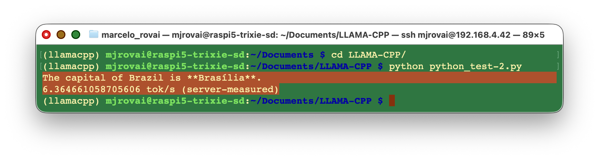

We can see different tokens per second measurements with the two above approuchs, but both numbers are correct — they're just measuring different stretches of time.

The **client version** (1) divides by wall-clock: 117 tokens ÷ 20.22 s = 5.8. That 20.22 s is everything — the HTTP round trip, JSON serialization, the server's prompt-processing (prefill) pass, *and* the token generation. On the **plain version** (2), the server's `predicted_per_second` (6.36) is the generation phase only. `llama.cpp` times the decode loop in isolation and excludes prefill and all the HTTP overhead. Same ~117 tokens on top, smaller number on the bottom, so the rate comes out higher. That gap between 5.8 and 6.36 is essentially the prompt-processing plus transport cost.

> On top of that, these were two separate requests, so they're not the same generation. With sampling on, the token count and timing vary run to run, which adds a little noise to the comparison.
>

The thing actually worth your attention is the **117 tokens**. The visible answer — "The capital of Brazil is **Brasília**." — is maybe 10 tokens. The other ~107 are a hidden `<think>` block: Gemma4 (and also the Qwen 3.5) is reasoning before it answers, the parser strips the thinking out of `message.content`, but every one of those tokens still counts in `usage.completion_tokens` and still costs decode time. That's why a one-line answer took 20 seconds. This is exactly the reasoning-mode behavior from earlier — turn it off and you'll watch both the token count and the wall-clock drop hard. 

**NOTES:** If you want a clean apples-to-apples reading, pull both numbers from the *same* request — the `requests` version already has the raw JSON, so read `data["usage"]` and `data["timings"]` together instead of comparing across two scripts. And 6.36 sitting below the ~6.63 tok/s `llama-bench` showed is normal: bench measures an idealized decode with an empty context, while real serving runs with the chat template and a populated KV cache, and if you use a SD-card Pi under sustained load is a prime throttling candidate — keep an eye on `vcgencmd measure_temp` while it generates.

In short, use the server-measured `predicted_per_second` as "generation speed," since it's the hardware-honest figure and it lines up with how `llama-bench` reports. The wall-clock rate is the better number only when you want to show *end-to-end* latency the user actually feels, so both have a place — just label which is which.

### Streaming

For anything longer than a sentence, stream the tokens so the answer appears as it's generated instead of after a long pause:

```python
import time
from openai import OpenAI

client = OpenAI(
    base_url="http://localhost:8081/v1",
    api_key="not-needed",          # llama-server doesn't check it
)

stream = client.chat.completions.create(
    model="Gemma4",
    messages=[{"role": "user", "content": "Tell me an interesting fact about Brazil. Keep it in one paragraph."}],
    stream=True,
    stream_options={"include_usage": True},   # usage arrives in the final chunk
)

for chunk in stream:
    if chunk.choices and chunk.choices[0].delta.content:
        print(chunk.choices[0].delta.content, end="", flush=True)
```

> On a 5B (with 2 efective) model running on a CPU, streaming at 6 tokens/s is the difference between an app that feels responsive and one that feels broken. Note that at the above code, will streaming only the final answer, not the reasining phase if it is enable.
>

### System prompt and sampling

A system message sets the model's role and tone. The sampling knobs are where small models need attention, and where the OpenAI client needs a small trick. For example, if you are using the Qwen 3.5 as the server:

```python
resp = client.chat.completions.create(
    model="qwen3.5",
    messages=[
        {"role": "system", "content": "You are a concise assistant. One short paragraph."},
        {"role": "user", "content": "Why is the sky blue?"},
    ],
    temperature=0.7,
    extra_body={"min_p": 0.05},     # llama.cpp param, not in the OpenAI schema
)
print(resp.choices[0].message.content)
```

`temperature` and `top_p` pass straight through. `min_p` does not — it isn't part of OpenAI's spec, so the client drops it unless we tuck it into `extra_body`. This matters because, as the quantization section noted, `min_p=0.05` with `temp=0.7` holds up far better than `top_p` on sub-1B models, where a narrow `top_p` beam slides into repetition. Anything in `extra_body` is forwarded verbatim to `llama-server`, which is also how you'd pass `repeat_penalty`, `seed`, or `n_predict`.

If Qwen starts emitting `<think>` blocks you don't want, disable reasoning at the server (`--reasoning-budget 0`) or per request with `extra_body={"chat_template_kwargs": {"enable_thinking": False}}`.

### Images

The OpenAI format carries an image as an `image_url` content part. `llama-server` accepts both a remote URL and a base64 data URI; on an offline Pi, base64 is the one to use:

```python
import base64
import time
from openai import OpenAI

client = OpenAI(
    base_url="http://localhost:8081/v1",
    api_key="not-needed",          # llama-server doesn't check it
)

IMG_PATH = "/home/mjrovai/Pictures/man_cat_dog.jpg"

def to_data_uri(path, mime="image/jpeg"):
    with open(path, "rb") as f:
        b64 = base64.b64encode(f.read()).decode()
    return f"data:{mime};base64,{b64}"

resp = client.chat.completions.create(
    model="Gemma4",
    messages=[{
        "role": "user",
        "content": [
            {"type": "text", "text": "Describe this image."},
            {"type": "image_url", "image_url": {"url": to_data_uri(IMG_PATH)}},
        ],
    }],
)
print(resp.choices[0].message.content)
```

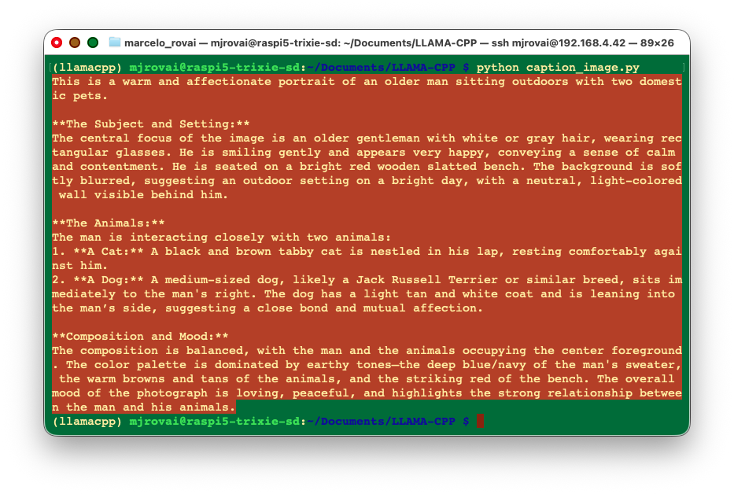

This is the same captioning we did through the CLI and the Qwen model.  The model never sees a file path, only the bytes we hand it, so the script runs identically whether the image came from disk or a camera.

To caption a live frame, reuse the `capture_image()` helper from the Ollama chapter (Picamera2, 520×520 still) and feed its output straight into `to_data_uri()`.

**Testing with reasoning disabled:**

If we disable reasoning, the model will perform worse. Running the same image, we now note that the model sees 3 cats instead of one cat and one dog. 

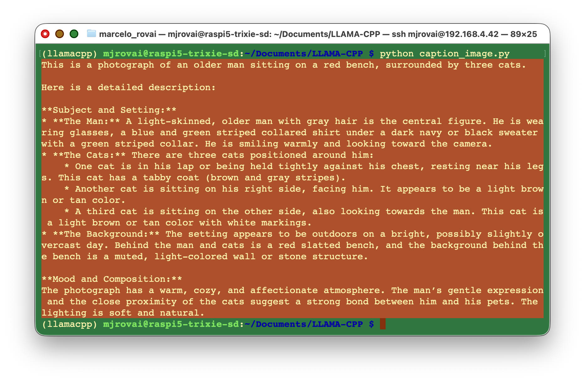

**NOTE:** This image is 980 x 800 pixels and was processed in 181,299 ms (around 3 minutes). Large images are split into multiple crops (pan-and-scan), and each crop is encoded separately — so a full-res photo can easily take two or three times longer to process than a downsized version. For most scenes, 768 pixels is a fine balance, and small images barely lose anything at 512.

Let's create a new script (using plan request now) for testing with a smaller version of the same image:

```python
import base64, io, time, requests
from PIL import Image

def encode_image(path, max_side=896, quality=85):
    img = Image.open(path).convert("RGB")
    w, h = img.size
    scale = max_side / max(w, h)
    if scale < 1:                          # shrink only, never upscale
        img = img.resize((int(w * scale), int(h * scale)))
    buf = io.BytesIO()
    img.save(buf, format="JPEG", quality=quality)
    b64 = base64.b64encode(buf.getvalue()).decode()
    return f"data:image/jpeg;base64,{b64}", img.size
  
IMG_PATH = "/home/mjrovai/Pictures/man_cat_dog.jpg"
MAX_SIZE = 512

uri, size = encode_image(IMG_PATH, max_side=MAX_SIZE)
print(f"sending image at {size[0]}x{size[1]}")

t0 = time.perf_counter()
r = requests.post(
    "http://localhost:8081/v1/chat/completions",
    json={"messages": [{
        "role": "user",
        "content": [
            {"type": "text", "text": "Describe this image."},
            {"type": "image_url", "image_url": {"url": uri}},
        ],
    }]},
    timeout=600,                           # don't give up during the long encode
)
dt = time.perf_counter() - t0
d = r.json()
t = d["timings"]

print(d["choices"][0]["message"]["content"])
print(f"\nimage+prompt : {t['prompt_n']:4d} tok in {t['prompt_ms']/1000:6.1f}s")
print(f"generation   : {t['predicted_n']:4d} tok in {t['predicted_ms']/1000:6.1f}s = {t['predicted_per_second']:.1f} tok/s")
print(f"wall         : {dt:.1f}s total")
```

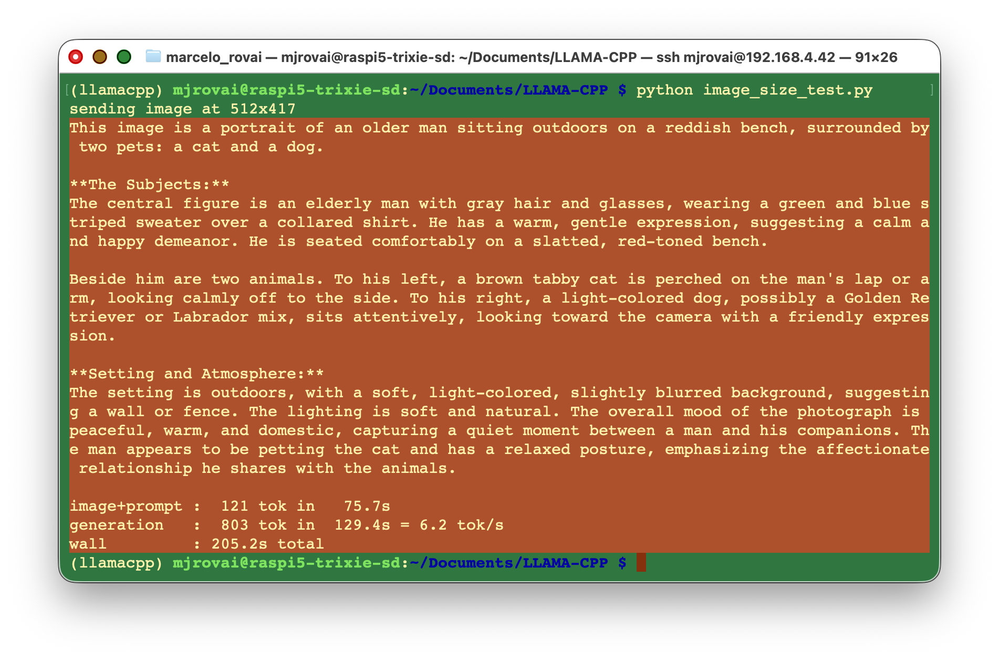

Note that the same image, but now 512x417, was processed in around 75s. Half of the time, it took with the original size. 

If you want to push further, lowering `--image-max-tokens` on the server (try 128 instead of 256) caps how many tokens the image is compressed into, which speeds both encoding and the attention over those tokens, at some loss of fine detail. 

### Audio (Gemma 4)

Audio rides in an `input_audio` part: raw base64 (no `data:` prefix here, unlike images) plus a `format` field. This works only when the **Gemma 4** server is running — Qwen 3.5 in our setup handles images and videos, not audio.

```python
import base64
import time
from openai import OpenAI

client = OpenAI(
    base_url="http://localhost:8081/v1",
    api_key="not-needed",          # llama-server doesn't check it
)

SOUND_PATH = "christmas_space_30s.mp3"

def b64_audio(path):
    with open(path, "rb") as f:
        return base64.b64encode(f.read()).decode()

resp = client.chat.completions.create(
    model="gemma-4",
    messages=[{
        "role": "user",
        "content": [
            {"type": "text", "text": "Transcribe this clip."},
            {"type": "input_audio",
             "input_audio": {"data": b64_audio(SOUND_PATH), "format": "mp3"}},
        ],
    }],
)
print(resp.choices[0].message.content)
```

Let's try the Apollo VIII 68 Christmas 's message again:

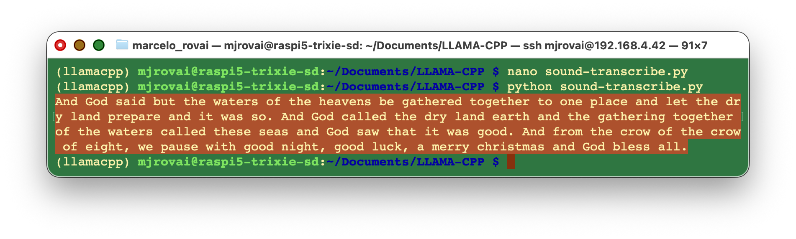

Note that `format` takes `wav` or `mp3`. The numbers match the UI run: a 12-second WAV transcribed in about 53 seconds, a 30-second MP3 in a little over two minutes. 

### One small reusable client

Wrapping all of this into a helper keeps project code readable — the equivalent of the `simple_query()` and `image_description()` functions from the Ollama chapter:

```python
class EdgeChat:
    def __init__(self, host="http://localhost:8081/v1"):
        self.client = OpenAI(base_url=host, api_key="not-needed")

    def ask(self, text, image=None, audio=None, **opts):
        content = [{"type": "text", "text": text}]
        if image:
            content.append({"type": "image_url",
                            "image_url": {"url": to_data_uri(image)}})
        if audio:
            content.append({"type": "input_audio",
                            "input_audio": {"data": b64_audio(audio), "format": "wav"}})
        t0 = time.perf_counter()
        resp = self.client.chat.completions.create(
            model="local",
            messages=[{"role": "user", "content": content}],
            **opts,
        )
        dt = time.perf_counter() - t0
        return resp.choices[0].message.content, dt

# usage
bot = EdgeChat()
answer, secs = bot.ask("What's in this picture?", image="tree.jpg",
                       temperature=0.7, extra_body={"min_p": 0.05})
print(answer, f"\n[{secs:.1f}s]")
```

### Which path to use

The `openai` client is the default: it handles request shaping and parsing, streams cleanly, and lets you swap the Pi for any other OpenAI-compatible endpoint by changing one line. Reach for `requests` when you want the server's `timings` block, need a non-OpenAI route like `/props` or `/health`, or want to keep the dependency list to a single library. Both make the identical HTTP call underneath, so there's no speed difference — only ergonomics.

---

## Going further

The interesting projects come from combining these models with the rest of the board. The same Python client that captions a photo can take a frame from Picamera2, ask Gemma or the Qwen whether a tire or a bucket in the yard is holding standing water, and trigger a GPIO alert, for example. 

Pairing models also pays off. A fast object detector like YOLO can count and locate objects in a frame, then hand a short structured summary to the SLM for reasoning or a natural-language report. The detector does what it's good at, the language model does what it's good at, and neither waits on the other longer than it has to.

The limit is latency. Text and image captioning are usable in the seconds range; Qwen's image passes in seconds, but the model is not that good for general tasks. Gemma's image passes at ~83 seconds, and audio at two-plus minutes is batch-grade, not interactive. Design around that — queue the slow jobs, stream the fast ones, and keep the user looking at something while the Pi works.

For example, in this video, Xavier Plantaz, Partner Solutions Engineer at Google, brings two [Open Duck Mini v2 robots,](https://robotics.growbotics.ai/projects/hardware/open-duck-mini-v2) built by Antoine Pirrone, on-device with Gemma 4. One runs **Gemma 4 E2B on LiteRT on a Raspberry Pi 5**. The other runs Gemma 4 E2B on a Jetson Orin Nano. 

https://youtu.be/pLwB_63yUBY?si=0gogR8K5J3SHjMWd

## Conclusion

A Raspberry Pi 5 with `llama.cpp` built from source runs inference on text, images, videos, and audio on the CPU, served behind a single OpenAI-compatible API. Qwen 3.5 0.8B is the fast generalist for text and quick captions; Gemma 4 E2B is the more accurate model and the one that hears. Building from source instead of reaching for Ollama buys three things that matter at the edge: the Arm-tuned build flags, the multimodal projector path to the newest models, and an endpoint your existing OpenAI code already knows how to call.

The Python here is deliberately plain — `pip install openai`, change the `base_url`, and the Pi answers like any frontier model would, only locally, privately, and offline.

## Resources

- [llama.cpp on GitHub](https://github.com/ggml-org/llama.cpp)
- [llama.cpp multimodal documentation](https://github.com/ggml-org/llama.cpp/blob/master/docs/multimodal.md)
- [llama-server README](https://github.com/ggml-org/llama.cpp/blob/master/tools/server/README.md)
- [Small Language Models (Ollama) chapter](https://mjrovai.github.io/EdgeML_Made_Ease_ebook/raspi/llm/slm_intro.html)
- [Audio and Vision AI Pipeline chapter](https://mjrovai.github.io/EdgeML_Made_Ease_ebook/raspi/audio_pipeline/audio_pipeline.html)
- [Qwen 3.5 0.8B GGUF (unsloth)](https://huggingface.co/unsloth/Qwen3.5-0.8B-GGUF)
- [Gemma 4 E2B GGUF (prithivMLmods, QAT)](https://huggingface.co/prithivMLmods/gemma-4-E2B-it-qat-GGUF)
- [Gemma 4 E2B GGUF (ggml-org, for `-hf`)](https://huggingface.co/ggml-org/gemma-4-E2B-it-GGUF)
- [Greatest Speeches of the 20th Century (Apollo 8 clip)](https://archive.org/details/Greatest_Speeches_of_the_20th_Century)

---

Written and edited by Prof. Marcelo Rovai (UNIFEI University)
