# Small Language Models on the Orange Pi Zero 3W

**Headless Setup, llama.cpp, Chat, and Image Captioning**


The Orange Pi Zero 3W is a stick-sized board built around the Allwinner A733, an eight-core chip that mixes two fast Cortex-A76 cores with six efficient Cortex-A55 cores. On paper, it is a Raspberry Pi Zero-sized board with Raspberry Pi 5-class cores, which makes it an interesting candidate for running small language models at the edge.

> A PDF version of this tutorial is available: [Orange-Pi-Zero-3W-SLM-Tutorial.pdf](Orange-Pi-Zero-3W-SLM-Tutorial.pdf).

This chapter takes the board from a fresh image file to a working `llama-server` answering chat questions and captioning photos over the network. The setup is **headless**: the board is reached only through SSH, and we never plug in a monitor. Along the way, we cover the two first-boot traps we fell into, and we explain why this chip's mixed cores change how many threads `llama.cpp` should use.

## The board

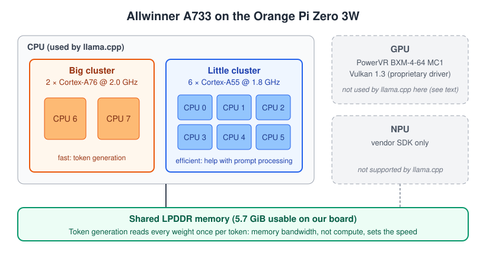

| Item | Orange Pi Zero 3W (as tested) |
|---|---|
| SoC | Allwinner A733 |
| CPU | 2 × Cortex-A76 @ 2.0 GHz + 6 × Cortex-A55 @ 1.8 GHz |
| GPU | Imagination PowerVR BXM-4-64 MC1 (Vulkan 1.3, proprietary driver) |
| NPU | Yes (vendor SDK only; not used by `llama.cpp`) |
| RAM | 6 GB LPDDR5 at 4,800 MT/s (5.7 GiB usable); also sold with 1, 2, 4, 8, or 12 GB |
| Storage | microSD (32 GB SanDisk in our tests) |
| Connectivity | Wi-Fi, 2 × USB-C (one for power), mini-HDMI |
| OS image | `Orangepizero3w_1.0.2_debian_trixie_desktop_xfce_linux6.6.98` (kernel 6.6.98) |
| Price (Amazon US, September 2026) | $84.99 (6 GB), $73.99 (4 GB), heatsink and fan included |

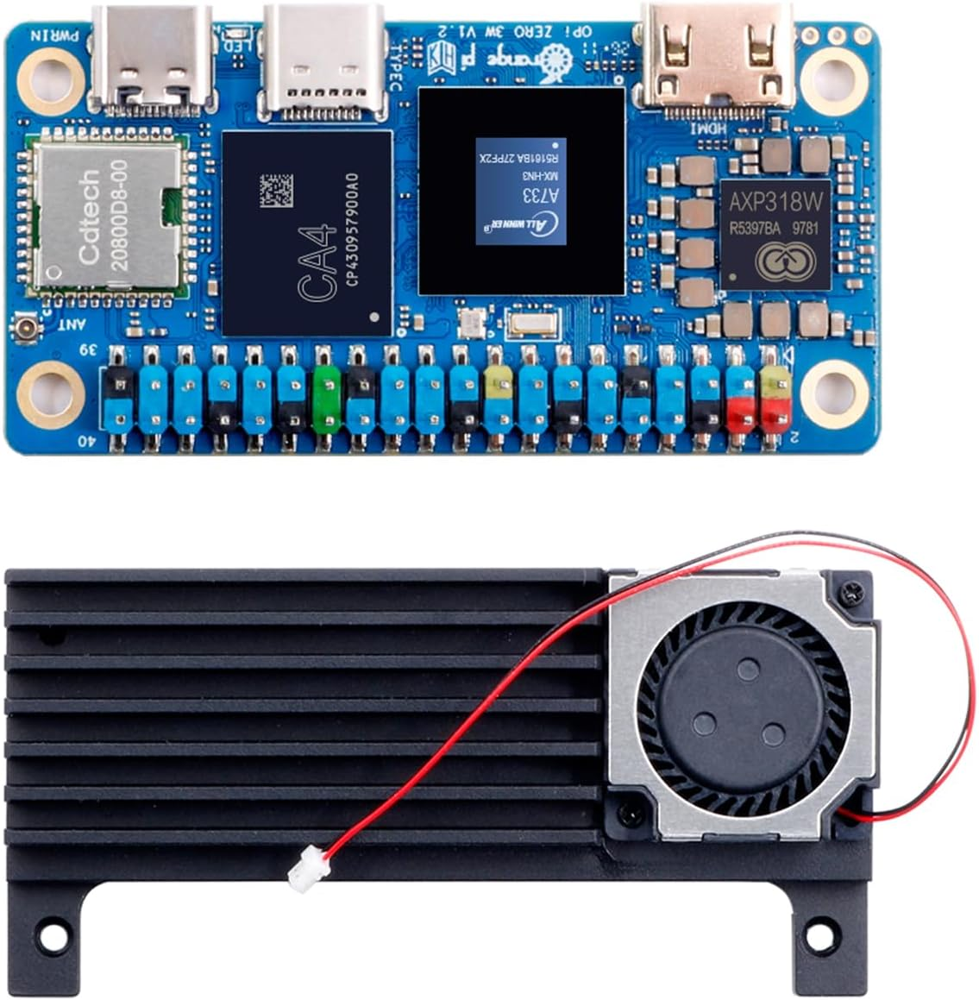

Two parts of the chip matter for language models, and two do not:

- **The CPU does all the work.** `llama.cpp` runs entirely on the eight CPU cores.
- **Memory bandwidth sets the speed.** Generating a token means reading every model weight once. The cores share the same LPDDR memory, so adding cores does not make generation faster once the memory bus is saturated.
- **The GPU is not used.** The board ships with a working Vulkan driver, but three of its properties work against `llama.cpp`'s Vulkan backend: a subgroup size of 1, only 16 KB of shared memory per workgroup, and a 128 MB limit on a single storage buffer. Since token generation is limited by memory bandwidth, and the GPU shares the same memory, there is little speed to gain there anyway.
- **The NPU is not used.** It needs Allwinner's own SDK, which `llama.cpp` does not support.

## What you need

- Orange Pi Zero 3W.
- **A heatsink with a fan.** Under a sustained `llama.cpp` load, our board ran at 80–86 °C *with* its fan at full speed. The first thermal trip point is 90 °C, so there is little headroom. Do not run this board bare. The board ships with an aluminum heatsink and a cooling fan, so the 6 GB version costs $84.99 ready to run. For comparison, a Raspberry Pi 5 8 GB with its Active Cooler cost $211 on Amazon US at the same time.
- A 5 V / 3 A USB-C power supply, connected to the **power** USB-C port, not the OTG one.
- A microSD card, 32 GB or larger.
- A computer on the same network, running macOS, Linux, or Windows. Most steps are the same on all three; where they differ, each one has its own instructions.

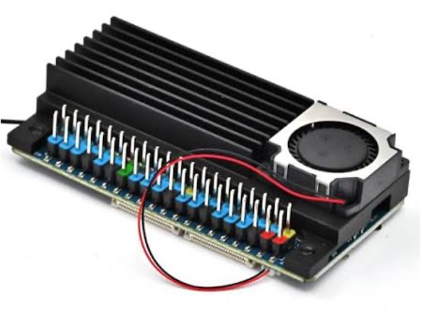

## Flash the image

Download the Debian image from the [Orange Pi Zero 3W support page](http://www.orangepi.org/html/hardWare/computerAndMicrocontrollers/service-and-support/Orange-Pi-Zero-3W.html). We used `Orangepizero3w_1.0.2_debian_trixie_desktop_xfce_linux6.6.98`. Check the download against the `.sha` file that comes with it:

```bash
# macOS
shasum -a 256 Orangepizero3w_1.0.2_debian_trixie_desktop_xfce_linux6.6.98.img
# Linux
sha256sum Orangepizero3w_1.0.2_debian_trixie_desktop_xfce_linux6.6.98.img

cat Orangepizero3w_1.0.2_debian_trixie_desktop_xfce_linux6.6.98.img.sha
```

On Windows, in PowerShell:

```powershell
Get-FileHash -Algorithm SHA256 .\Orangepizero3w_1.0.2_debian_trixie_desktop_xfce_linux6.6.98.img
Get-Content .\Orangepizero3w_1.0.2_debian_trixie_desktop_xfce_linux6.6.98.img.sha
```

The two hashes must match (PowerShell prints its hash in uppercase; the letters are the same). Then write the image with [balenaEtcher](https://etcher.balena.io/) (macOS, Linux, and Windows), which writes the raw image and verifies it afterward. Copying the `.img` file onto the card as a regular file does not work.

## A headless setup

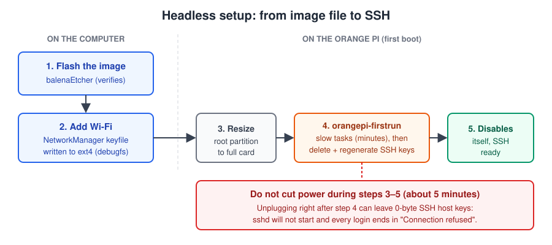

Our board never produced an HDMI signal, either directly on mini-HDMI or through a USB-C hub. The red LED blinked in a *two quick flashes, pause* pattern, which matches the Linux "heartbeat" LED trigger. The kernel was running, and only the video output was missing, as we confirmed once we could log in. If you see the same thing, do not reflash. The system is booting fine, and you can reach it over the network instead.

### Add Wi-Fi before the first boot

The image uses NetworkManager, which reads connection files from `/etc/NetworkManager/system-connections/`. If we drop a connection file there before the first boot, the board joins our network on its own.

The catch is that the root partition is **ext4**. Linux reads and writes it directly, but macOS and Windows cannot, so each system needs a different route. First, create the connection file (on macOS or Linux, or inside WSL on Windows). Replace the network name and password:

```bash
cat > wifi-ssh.nmconnection <<'EOF'
[connection]
id=MyNetwork
uuid=4b0e4d6c-2f1a-4f7e-9d1e-6c0a3b5e8f21
type=wifi
autoconnect=true

[wifi]
mode=infrastructure
ssid=MyNetwork

[wifi-security]
key-mgmt=wpa-psk
psk=MyPassword

[ipv4]
method=auto

[ipv6]
method=auto
EOF
```

Any UUID works; `uuidgen` makes a new one. Create the file with a Unix editor or the command above: a file saved with Windows line endings (CRLF) can end up with a stray carriage return inside the password.

Now write the file to the card and give it the owner and permissions NetworkManager expects. NetworkManager ignores connection files that are not owned by root with mode `600`.

#### macOS

macOS cannot write ext4, but the `debugfs` tool from `e2fsprogs` can write files into an ext4 partition without mounting it:

```bash
brew install e2fsprogs
diskutil list    # find the card, e.g. /dev/disk4 with a Linux partition disk4s1
```

```bash
D=$(brew --prefix e2fsprogs)/sbin
diskutil unmountDisk /dev/disk4

sudo $D/e2fsck -p /dev/disk4s1
sudo $D/debugfs -w /dev/disk4s1 <<'EOF'

cd /etc/NetworkManager/system-connections

write wifi-ssh.nmconnection wifi-ssh.nmconnection
sif wifi-ssh.nmconnection mode 0100600
sif wifi-ssh.nmconnection uid 0
sif wifi-ssh.nmconnection gid 0
EOF

rm wifi-ssh.nmconnection
diskutil eject /dev/disk4
```

> Double-check the disk identifier with `diskutil list` before running these commands. Writing to the wrong disk destroys its data.

The script [`scripts/setup-wifi.sh`](scripts/setup-wifi.sh) does all of the above in one step. It asks for the network name and password without echoing the password, checks the filesystem, writes the file with the right owner and mode, shows the result with the password masked, and ejects the card. As a safety check, it refuses to write unless the partition is labeled `opi_root`, the label of the Orange Pi root partition:

```bash
brew install e2fsprogs
./scripts/setup-wifi.sh /dev/disk4s1     # your partition, from diskutil list
```

#### Linux

Linux mounts ext4 directly. Many desktops mount the card automatically when you insert it, usually at `/media/$USER/opi_root` (`opi_root` is the partition label). If yours does not, find the partition with `lsblk` (for example `/dev/sdb1`, or `/dev/mmcblk0p1` on a built-in card reader) and mount it:

```bash
lsblk
sudo mkdir -p /mnt/opi
sudo mount /dev/sdb1 /mnt/opi       # use your partition; skip if already auto-mounted
```

Then copy the file and fix its owner and permissions. Replace `/mnt/opi` with `/media/$USER/opi_root` if the card was mounted automatically:

```bash
C=/mnt/opi/etc/NetworkManager/system-connections
sudo cp wifi-ssh.nmconnection $C/
sudo chown root:root $C/wifi-ssh.nmconnection
sudo chmod 600 $C/wifi-ssh.nmconnection
sudo umount /mnt/opi
rm wifi-ssh.nmconnection
```

#### Windows

Windows cannot write ext4. There are two practical routes. We did not test them on this board, so treat them as starting points:

- **WSL 2 with a USB card reader.** Install [usbipd-win](https://github.com/dorssel/usbipd-win), which passes a USB device through to WSL, and then follow the Linux steps inside your WSL distribution. In an administrator PowerShell:

  ```powershell
  winget install usbipd
  usbipd list                    # note the BUSID of the card reader, e.g. 2-3
  usbipd bind --busid 2-3
  usbipd attach --wsl --busid 2-3
  ```

  Inside WSL, the card then shows up in `lsblk`. Built-in laptop card slots are often PCIe devices rather than USB, and they cannot be passed through this way, so use an external USB card reader. When you are done, release the reader with `usbipd detach --busid 2-3`.

- **Serial console.** Skip the file and configure Wi-Fi on the board itself. Connect a 3.3 V USB-to-TTL adapter to the board's debug UART pins (GND, TX, RX), open [PuTTY](https://www.putty.org/) on the adapter's COM port at 115200 baud, power the board, and log in as `orangepi` / `orangepi`. Then run `sudo nmtui` and pick your network. This route works from any operating system, and it also shows the boot messages, which helps with any first-boot problem.

### The first boot: wait for it

Insert the card, power the board, and **leave it alone for about five minutes**. On the first boot, the system resizes the root partition to fill the card, and then runs `orangepi-firstrun`. That script does several slow tasks, deletes the image's SSH host keys, generates new ones, and disables itself only at the very end.

This is where our first attempt went wrong. We power-cycled the board while testing HDMI, and we ended up with six **0-byte** host keys. The most likely cause is that one of those cuts landed right after the new SSH keys were created, but before their data reached the card. The SSH server refuses to start with empty keys, so every login attempt ended in `Connection refused`, even though the board was on the network. Worse, because the script had not reached its last line, it started over on every boot.

### Find the board and log in

The board registers itself as `orangepizero3w`. Find its IP address in your router's client list, then log in. The default user is `orangepi`, and so is the password. Replace the address with your board's:

```bash
ssh orangepi@192.168.1.50
```

The same command works in the macOS and Linux terminals, and on Windows 10 and 11 in PowerShell or Windows Terminal, which include an OpenSSH client.

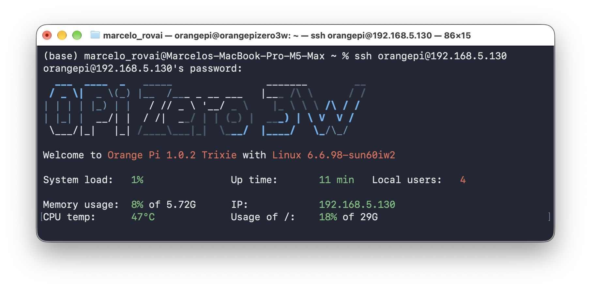

The user is `orangepi`, not the hostname. Trying `ssh orangepizero3w@192.168.1.50` fails with `Permission denied`.

Change both default passwords right away, because the image allows root login over SSH:

```bash
passwd
sudo passwd root
```

Confirm that the first-boot script finished. The answer must be `disabled`:

```bash
systemctl is-enabled orangepi-firstrun
```

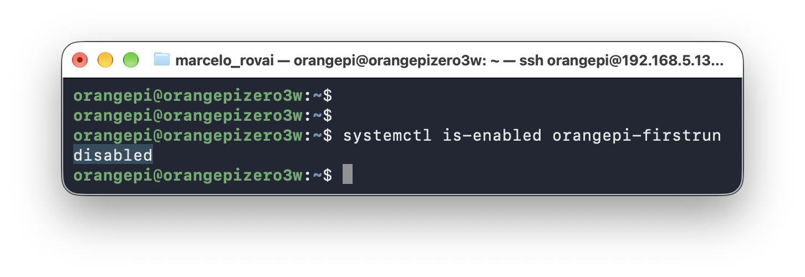

From now on, always shut down with `sudo poweroff` and wait for the LED to go off before removing power.

> **If you get `Connection refused`.** First, check that the board is really on the network, for example in the router's client list. If it is, look at the SSH host keys: put the card back in the computer and list them with `sudo $D/debugfs -R "ls -l /etc/ssh" /dev/disk4s1` on macOS, or with `ls -l /mnt/opi/etc/ssh` on Linux (or in WSL). Keys with size `0` are the problem. Delete them with `debugfs -w` (`rm /etc/ssh/ssh_host_rsa_key`, and so on) on macOS, or with `sudo rm` on Linux. On the next boot, `sshd` generates new ones.
>
> On macOS, [`scripts/fix-ssh.sh`](scripts/fix-ssh.sh) automates this. It saves a diagnostic report (`opi-diagnostics.txt`) listing the host keys and any other empty files in `/etc`, deletes the empty keys, and adds a systemd drop-in so that `sshd` regenerates any missing or empty key before it starts. It has the same `opi_root` safety check: `./scripts/fix-ssh.sh /dev/disk4s1`.

### Update the system

```bash
sudo apt update && sudo apt full-upgrade -y
```

On our image, the upgrade stopped with this error:

```
trying to overwrite '/usr/lib/xorg/modules/drivers/modesetting_drv.so',
which is also in package xserver-xorg-img-bxm-1.21.1-2.deb (1.0.1)
```

Orange Pi ships its own build of the X11 display driver for the PowerVR GPU, and Debian's `xserver-xorg-core` update tries to overwrite it. `dpkg` refuses, and it is right to. Hold the Debian package at its current version, then finish the upgrade:

```bash
sudo apt-mark hold xserver-xorg-core
sudo apt --fix-broken install
sudo apt full-upgrade -y
sudo dpkg --audit    # no output means no broken packages
```

## Build llama.cpp

The image does not include `cmake`. Install the build tools:

```bash
sudo apt install -y git build-essential cmake
```

Clone and build. We only need three binaries, and building only those saves time:

```bash
cd ~
git clone --depth 1 https://github.com/ggml-org/llama.cpp.git
cd llama.cpp
cmake -B build -DCMAKE_BUILD_TYPE=Release -DLLAMA_CURL=OFF
cmake --build build -j8 --target llama-cli llama-bench llama-server
```

The build took about 10 minutes on the board. We tested commit `136887b`. With `-DLLAMA_CURL=OFF`, `llama.cpp` cannot pull models from Hugging Face by itself, so we download them with `wget`. That also works on a board with no internet access later.

## Download the models

We use Unsloth's Qwen3.5 GGUFs from the `-MTP-` repositories. These files also carry the multi-token prediction heads, which are covered in the article [Running Small Language Models on a Raspberry Pi 5](https://mjrovai.com/articles/slm-on-raspberry-pi-mtp/). They work as normal models when MTP is off. Each model has its own vision projector (`mmproj`), which we need for captioning.

```bash
mkdir -p ~/models/Qwen3.5-0.8B-MTP-GGUF ~/models/Qwen3.5-2B-MTP-GGUF
U=https://huggingface.co/unsloth

cd ~/models/Qwen3.5-0.8B-MTP-GGUF
wget -c $U/Qwen3.5-0.8B-MTP-GGUF/resolve/main/Qwen3.5-0.8B-UD-Q8_K_XL.gguf
wget -c $U/Qwen3.5-0.8B-MTP-GGUF/resolve/main/mmproj-F16.gguf

cd ~/models/Qwen3.5-2B-MTP-GGUF
wget -c $U/Qwen3.5-2B-MTP-GGUF/resolve/main/Qwen3.5-2B-UD-Q4_K_XL.gguf
wget -c $U/Qwen3.5-2B-MTP-GGUF/resolve/main/mmproj-F16.gguf
```

| File | Size |
|---|---:|
| `Qwen3.5-0.8B-UD-Q8_K_XL.gguf` | 1.2 GB |
| `Qwen3.5-0.8B` `mmproj-F16.gguf` | 195 MiB |
| `Qwen3.5-2B-UD-Q4_K_XL.gguf` | 1.4 GB |
| `Qwen3.5-2B` `mmproj-F16.gguf` | 637 MiB |

## Two phases, two thread counts

Before starting the server, we need to decide how many threads to give it. On a chip with identical cores, such as the Raspberry Pi 5's four A76s, this is a simple sweep. On the A733, the answer depends on what the model is doing.

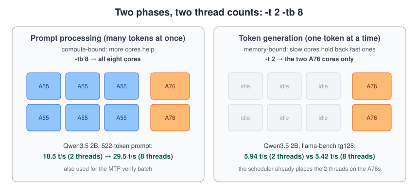

`llama.cpp` runs a model in two phases, and each has its own thread setting:

- **Prompt processing** (`-tb`, "threads batch") handles many tokens at once. It is limited by compute, so every core helps, including the slower A55s.
- **Token generation** (`-t`) produces one token at a time. It is limited by memory bandwidth. Worse, `llama.cpp`'s threads wait for each other at every layer, so as soon as an A55 joins, the two A76s end up waiting for it.

A `llama-bench` sweep on the board shows both effects:

```bash
cd ~/llama.cpp/build/bin
./llama-bench -m ~/models/Qwen3.5-2B-MTP-GGUF/Qwen3.5-2B-UD-Q4_K_XL.gguf -t 2,4,8 -p 512 -n 128
```

| Threads | 0.8B Q8 pp512 | 0.8B Q8 tg128 | 2B Q4_K_XL pp512 | 2B Q4_K_XL tg128 |
|---|---:|---:|---:|---:|
| 2 (A76 only) | 47.5 | **7.55** | 18.4 | **5.94** |
| 4 | 53.7 | 7.03 | 23.7 | 5.49 |
| 6 (A55 only) | 25.3 | 6.19 | 12.5 | 4.27 |
| 8 | **65.8** | 6.34 | **30.2** | 5.42 |

(Tokens/s. `pp512` measures prompt processing and `tg128` measures generation. The 2-thread and 6-thread rows were pinned with `taskset -c 6,7` and `taskset -c 0-5`.)

So the best setting is **`-t 2 -tb 8`**. It needs no `taskset` or CPU masks: the Linux scheduler already places the two busy generation threads on the A76 cores. We compared five placements, including strict per-core pinning. Plain `-t 2 -tb 8` tied for the best and was the simplest. It keeps generation at full speed and raises prompt processing by 35% (0.8B) to 60% (2B) compared with `-t 2` alone.

## First test: chat

Start the server with the 2B model:

```bash
~/llama.cpp/build/bin/llama-server \
  -m ~/models/Qwen3.5-2B-MTP-GGUF/Qwen3.5-2B-UD-Q4_K_XL.gguf \
  -t 2 -tb 8 \
  -c 4096 \
  --reasoning off \
  --host 0.0.0.0 --port 8081 \
  --alias qwen3.5-2b
```

- `-t 2 -tb 8` is the thread split from the previous section.
- `--reasoning off` disables Qwen3.5's thinking mode. On a board that generates about 6 tokens per second, a long hidden reasoning block can take a minute before the answer starts. Turn it on when the answer quality matters more than the wait.
- `--host 0.0.0.0` makes the server reachable from other machines on the network.
- `--port 8081` is any free port. If another program already uses it, `llama-server` fails to start; pick another port and use it in the commands below.

Send a question with `curl`. On the board itself, the server is at `localhost`. From another computer, use the board's IP address instead:

```bash
BOARD=localhost      # or the board's IP, e.g. 192.168.1.50
curl -s http://$BOARD:8081/v1/chat/completions \
  -H 'Content-Type: application/json' \
  -d '{"model":"qwen3.5-2b",
       "messages":[{"role":"user","content":"In two sentences, what is TinyML?"}],
       "max_tokens":120}' | python3 -m json.tool
```

On Windows, quoting JSON inside PowerShell is awkward, so run this command on the board over SSH, or use the Python example below.

The answer returns a `timings` object. `predicted_per_second` is the generation speed, and `prompt_per_second` is the prompt-processing speed.

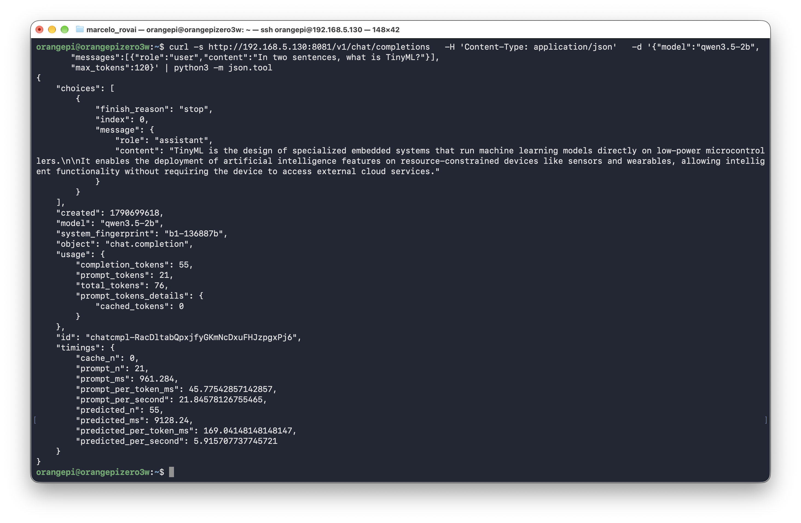

The same server also serves the `llama.cpp` web UI. Open `http://192.168.1.50:8081` (with your board's IP) in a browser on any computer on the network:

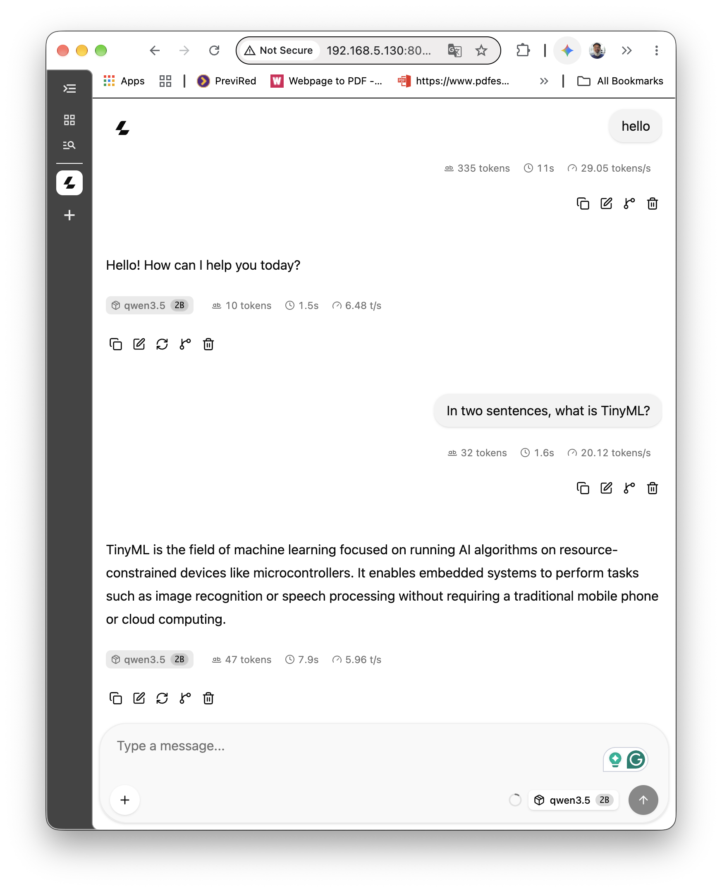

Because `llama-server` speaks the OpenAI Chat Completions format, any OpenAI client works. The script can run on the board itself or on any computer on the network. First, install the `openai` library where the script will run.

On the board (Debian Trixie), the distribution package is the simplest route:

```bash
sudo apt install -y python3-openai
```

On a macOS or Linux computer, use a virtual environment:

```bash
python3 -m venv ~/llm-env
source ~/llm-env/bin/activate
pip install openai
```

On Windows, in PowerShell:

```powershell
py -m venv llm-env
.\llm-env\Scripts\Activate.ps1
pip install openai
```

Then create a script, for example `py-chat.py` (with `nano py-chat.py` on the board). Use `localhost` when the script runs on the board, or the board's IP from another computer:

```python
from openai import OpenAI

client = OpenAI(base_url="http://localhost:8081/v1", api_key="none")
r = client.chat.completions.create(
    model="qwen3.5-2b",
    messages=[{"role": "user", "content": "In two sentences, what is TinyML?"}],
    max_tokens=120,
)
print(r.choices[0].message.content)
```

`llama-server` does not check the API key, but the client requires one, so any string works. Run it with `python3 py-chat.py` (on Windows, `python py-chat.py`):

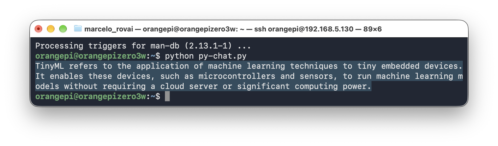

## Second test: image captioning

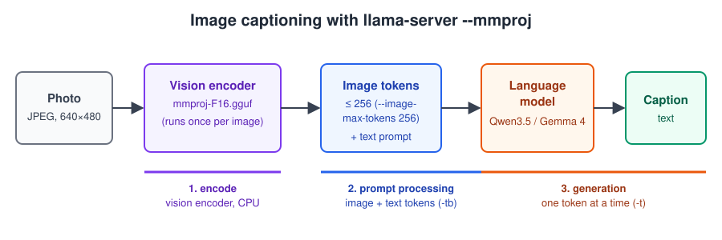

Captioning adds a stage before the language model. The **vision encoder** (the `mmproj` file) turns the photo into image tokens. The language model then reads those tokens together with the text prompt, and generates the caption. The encoder runs once per image, and on a CPU it is the most expensive single step.

Restart the server with the projector:

```bash
~/llama.cpp/build/bin/llama-server \
  -m      ~/models/Qwen3.5-2B-MTP-GGUF/Qwen3.5-2B-UD-Q4_K_XL.gguf \
  --mmproj ~/models/Qwen3.5-2B-MTP-GGUF/mmproj-F16.gguf \
  -t 2 -tb 8 \
  -c 4096 --jinja \
  --image-max-tokens 256 \
  --reasoning off \
  --host 0.0.0.0 --port 8081 \
  --alias qwen3.5-2b
```

Stop the text-only server first (`Ctrl+C` in its terminal), because both use the same port.

`--image-max-tokens 256` caps how many tokens a single image can use. Fewer image tokens mean less prompt processing, which matters on this board.

The easiest way to try it is the web UI's attachment button. 

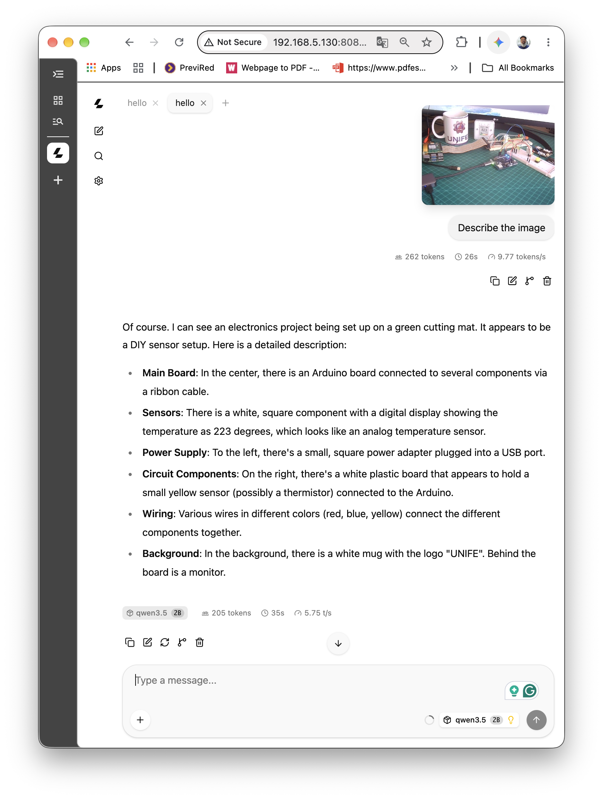

From a script, send the image as base64 in an OpenAI-style message. Replace `photo.jpg` with your image file:

```bash
python3 - <<'EOF'
import base64, json, urllib.request
img = base64.b64encode(open("photo.jpg", "rb").read()).decode()
body = {"model": "qwen3.5-2b", "max_tokens": 128, "temperature": 0,
        "messages": [{"role": "user", "content": [
            {"type": "image_url", "image_url": {"url": f"data:image/jpeg;base64,{img}"}},
            {"type": "text", "text": "Describe this image in one paragraph."}]}]}
req = urllib.request.Request("http://localhost:8081/v1/chat/completions",
                             json.dumps(body).encode(), {"Content-Type": "application/json"})
r = json.load(urllib.request.urlopen(req))
print(r["choices"][0]["message"]["content"])
print(r["timings"])
EOF
```


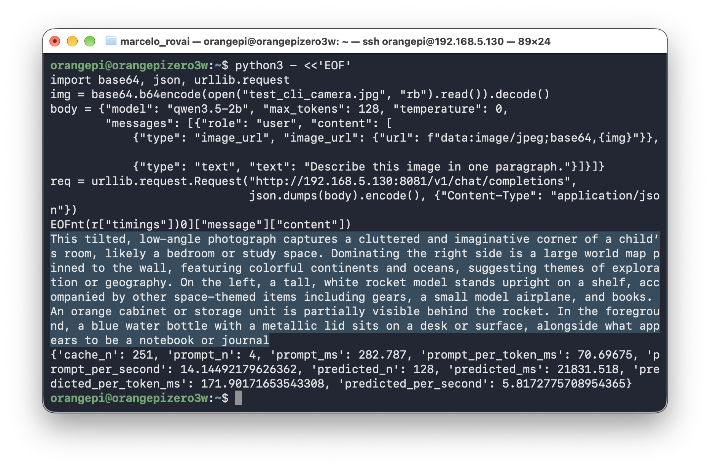

Look at the `timings` in the screenshot: `cache_n: 251` and `prompt_n: 4`. This was the second run of the same request, and the server reused the 251 image and prompt tokens it had already processed, so the prompt took only 0.3 s. The first run of a new image pays the full encoder cost. To measure a cold run every time, as in the table below, add `"cache_prompt": False` to the request body.

### Other Models

Besides the Qwen3.5 0.8B and 2B models, the Orange Pi also works well with other models, such as:

- `unsloth/Qwen3.5-4B-MTP-GGUF`: `Qwen3.5-4B-UD-Q4_K_XL.gguf` and `mmproj-F16.gguf` from the same Unsloth repository
- `unsloth/gemma-4-E2B-it-qat-GGUF`: `gemma-4-E2B-it-qat-UD-Q4_K_XL.gguf` plus the draft model `mtp-gemma-4-E2B-it.gguf` and `mmproj-F16.gguf` from the same Unsloth repository.

Our measurements on the test photo, with `-t 2 -tb 8`, `max_tokens` 128, and 3 runs per model. "Image + prompt" is `timings.prompt_ms`, which includes the vision encoder:

| Model | Image + prompt | Generation | Total |
|---|---:|---:|---:|
| Qwen3.5 0.8B Q8 | 9.8 s | 7.3 t/s | **22 s** |
| Gemma 4 E2B QAT | 16.0 s | 7.0 t/s | 34 s |
| Qwen3.5 2B Q4_K_XL | 26.4 s | 5.8 t/s | 48 s |
| Qwen3.5 4B Q4_K_XL | 40.6 s | 2.7 t/s | 89 s |

The vision encoder is the largest part of the "image + prompt" time: 60–78% for the 0.8B, 2B, and Gemma models. It uses the `-t` threads, so `-t 8` makes the image stage 20–25% faster, but it slows generation down. The total time is nearly the same either way (45 s instead of 48 s for the 2B model).

For comparison, the same captions take 19–74 s on a Raspberry Pi 5 and 102–284 s on an Arduino UNO Q (0.8B and 2B only). The [three-board comparison](https://mjrovai.com/articles/slm-edge-boards-compared/) has the full numbers.

## Performance at a glance

All numbers are with `llama-server`, the prompt "Explain photosynthesis in 300 words.", 256 generated tokens, and 3 runs per setting:

| Model | Size | Plain decode | With MTP (n=3) |
|---|---:|---:|---:|
| Qwen3.5 0.8B UD-Q8_K_XL | 1.2 GB | 7.4 t/s | no gain |
| Qwen3.5 2B UD-Q4_K_XL | 1.4 GB | 6.0 t/s | no gain |
| Gemma 4 E2B QAT UD-Q4_K_XL | 2.4 GB | 7.0 t/s | **8.7 t/s** |
| Qwen3.5 4B UD-Q4_K_XL | 2.8 GB | 2.7 t/s | **3.5 t/s** |

Two conclusions for this board:

- **For interactive use, Gemma 4 E2B with MTP (8.7 tokens/s) and Qwen3.5 2B (6 tokens/s) are the practical choices.** Qwen3.5 4B fits comfortably in memory, but at 2.7 to 3.5 tokens/s it is better suited to short answers and background jobs.
- **MTP pays off only at a draft depth of 3.** At n=3, the verify step checks a batch of four tokens. Every other depth was slower than plain decoding on this board, and the [MTP article](https://mjrovai.com/articles/slm-on-raspberry-pi-mtp/) explains why.

How do these numbers compare with a Raspberry Pi 5 and an Arduino UNO Q running the same models? The companion article [Three Boards, One Question: Where Should a Small Language Model Run?](https://mjrovai.com/articles/slm-edge-boards-compared/) compares the three boards side by side, from chat and captions to memory, MTP, and agents, and recommends where to use each one.

### How much memory each model needs

Measured with `--load-mode none` (no mmap), so every byte is counted once:

| Configuration | Peak memory |
|---|---:|
| Qwen3.5 0.8B, text / vision | 1.30 / 1.59 GiB |
| Qwen3.5 2B, text / vision | 1.84 / 2.58 GiB |
| Gemma 4 E2B, text + MTP / vision | 3.04 / 3.86 GiB |
| Qwen3.5 4B, text + MTP / vision | 4.01 / 4.44 GiB |

Everything in this chapter fits in the 6 GB board. A 4 GB board, with about 3 GiB free, would handle the 0.8B and 2B models, including vision, but not Gemma 4 E2B or Qwen3.5 4B.

### Long prompts and agents

An agent's system prompt with tool definitions quickly reaches thousands of tokens. On this board, a prompt with 24 tools (about 4,000 tokens) took 2.6 minutes to process with Qwen3.5 2B. The good news is that `llama-server` caches it: the next turns processed only the 40–80 new tokens and answered in about 12 seconds. For agents, keep the server running, so the long prompt is processed only once, and keep tool descriptions short.

Generation also slows down as the context fills. Qwen3.5 2B drops from 5.9 t/s with an empty context to 4.5 t/s at 4K tokens and 2.6 t/s at 16K. Its hybrid architecture keeps most layers free of a growing KV cache, which is why it holds up far better than a model with full attention in every layer. 

### Price and value

How does the Orange Pi Zero 3W compare with the other two popular boards we tested with the same models and the same `llama.cpp` build? Amazon US prices, checked in September 2026, including the cooling each board needs:

| Board | Board price | Cooling | Total | Qwen3.5 2B generation | 2B caption | Runs |
|---|---:|---:|---:|---:|---:|---|
| Raspberry Pi 5 8 GB | $200.00 | $10.95 (Active Cooler) | $210.95 | 6.7 t/s | 39 s | everything in this chapter |
| Raspberry Pi 5 4 GB | $126.49 | $10.95 (Active Cooler) | $137.44 | 6.7 t/s* | 39 s* | up to 2B, including vision |
| **Orange Pi Zero 3W 6 GB** | **$84.99** | included | **$84.99** | **5.9 t/s** | **45 s** | everything in this chapter |
| Orange Pi Zero 3W 4 GB | $73.99 | included | $73.99 | 5.9 t/s* | 45 s* | up to 2B, including vision |
| Arduino UNO Q 4 GB | $79.00 | none needed | $79.00 | 2.5 t/s | 284 s | up to 2B, including vision |

\* Not tested. The speed is assumed to equal the larger-memory version, since the SoC and memory type are the same.

The Orange Pi Zero 3W delivers about 89% of the Raspberry Pi 5's generation speed at 40% of the price of the 8 GB Pi 5 with its cooler. For which board to choose for which job, see the [three-board comparison](https://mjrovai.com/articles/slm-edge-boards-compared/).

## Conclusion

The Orange Pi Zero 3W runs small language models well once three things are known: it can be set up entirely headless, its first boot must not be interrupted, and its mixed cores need different thread counts for prompt processing and generation. With `-t 2 -tb 8`, a 2B model chats at about 6 tokens per second and describes photos, all from a board the size of a stick of gum.

## Scripts

The [`scripts`](scripts/) folder has the two macOS helpers used in the headless setup, both tested against this image:

- [`setup-wifi.sh`](scripts/setup-wifi.sh): writes the Wi-Fi connection to the card before the first boot.
- [`fix-ssh.sh`](scripts/fix-ssh.sh): diagnoses and fixes the empty-SSH-host-key problem.

Both need Homebrew's `e2fsprogs` and your password for `sudo`, and both take the card's root partition as their only argument.

## Benchmark data

The raw data behind every table in this tutorial and in the three-board article (one JSON line per run, including the generated captions), the scripts that produced it, and a summary in [RESULTS.md](benchmarks/RESULTS.md) are in the [`benchmarks`](benchmarks/) folder.

## Resources

- [Orange Pi Zero 3W support page](http://www.orangepi.org/html/hardWare/computerAndMicrocontrollers/service-and-support/Orange-Pi-Zero-3W.html)
- [llama.cpp](https://github.com/ggml-org/llama.cpp)
- [unsloth/Qwen3.5-0.8B-MTP-GGUF](https://huggingface.co/unsloth/Qwen3.5-0.8B-MTP-GGUF) and [unsloth/Qwen3.5-2B-MTP-GGUF](https://huggingface.co/unsloth/Qwen3.5-2B-MTP-GGUF)
- [Running Small Language Models on a Raspberry Pi 5](https://mjrovai.com/articles/slm-on-raspberry-pi-mtp/)
- [Three Boards, One Question: Where Should a Small Language Model Run?](https://mjrovai.com/articles/slm-edge-boards-compared/)
- [unsloth/Qwen3.5-4B-MTP-GGUF](https://huggingface.co/unsloth/Qwen3.5-4B-MTP-GGUF) and [unsloth/gemma-4-E2B-it-qat-GGUF](https://huggingface.co/unsloth/gemma-4-E2B-it-qat-GGUF)

---

*The benchmarks, diagrams, and first draft of this chapter were generated by Claude Opus 5.5 (Anthropic) under the author's direction.*
