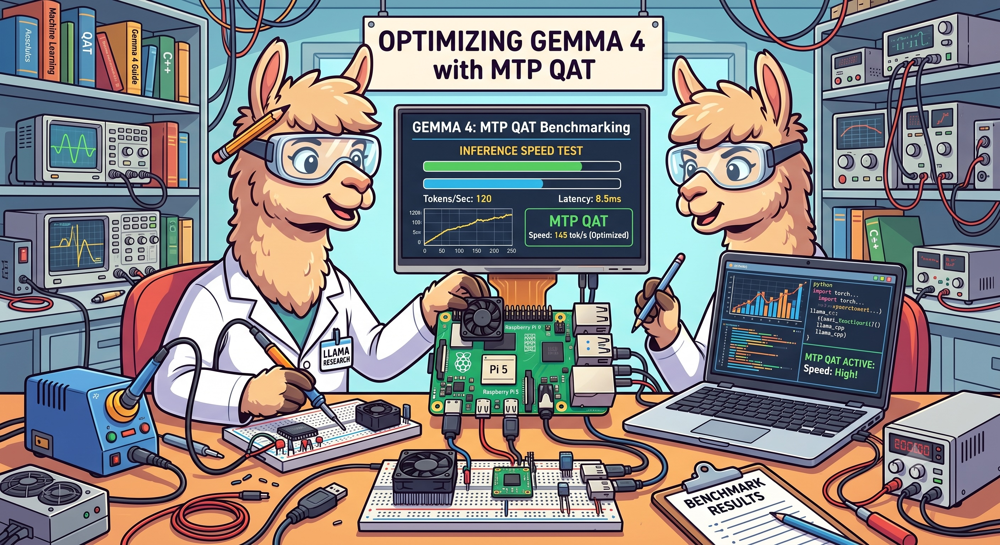
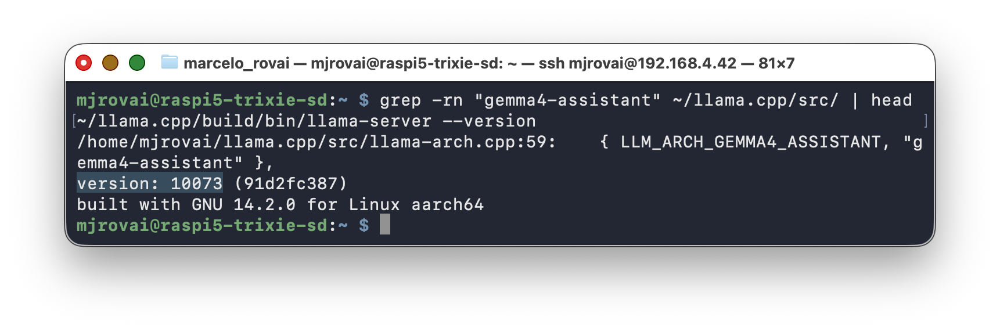
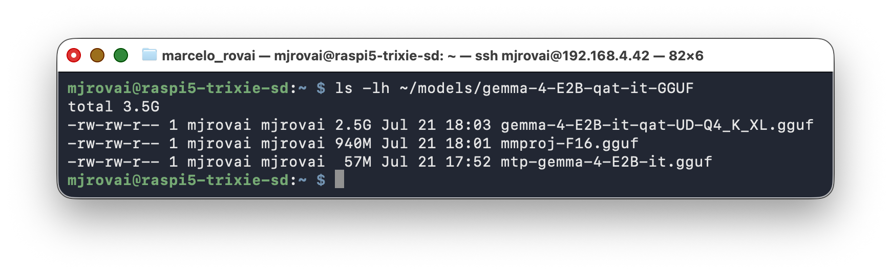
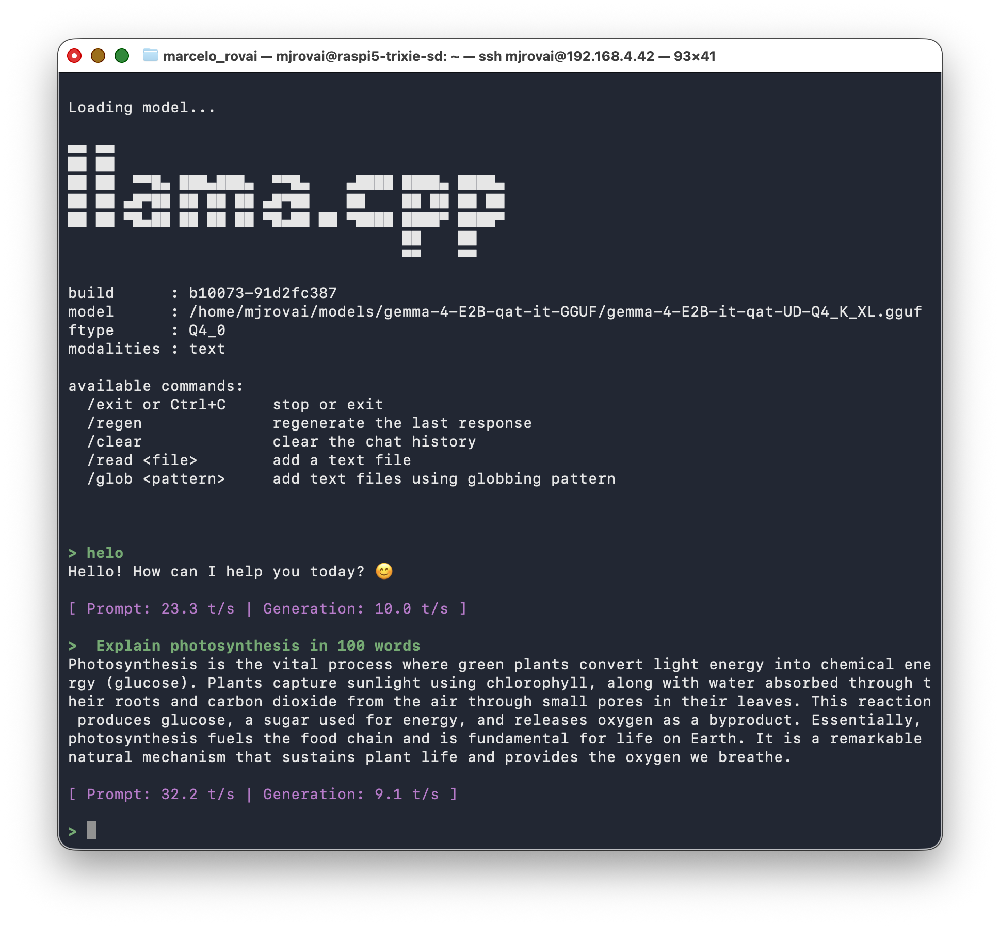
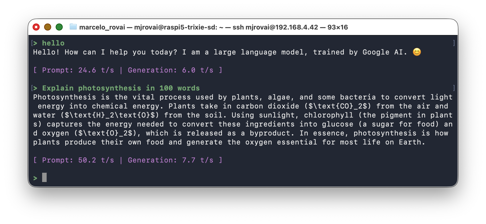
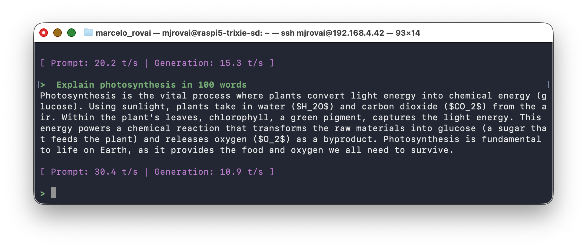
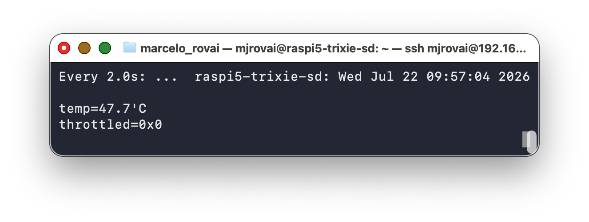
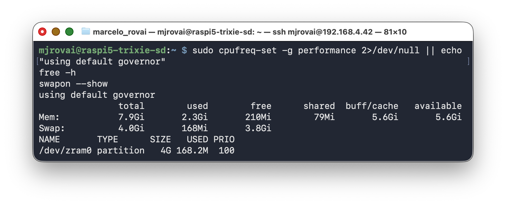
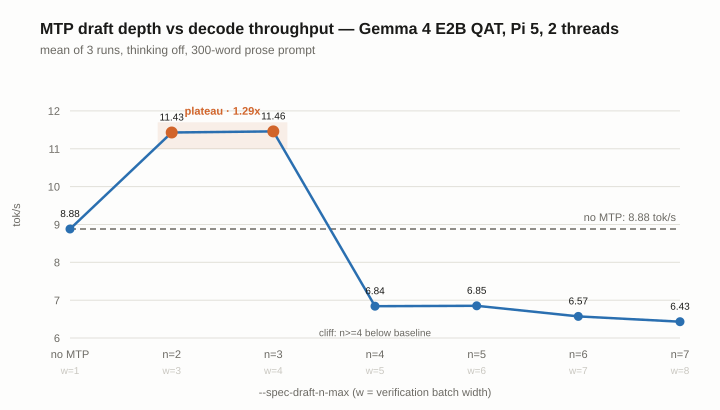
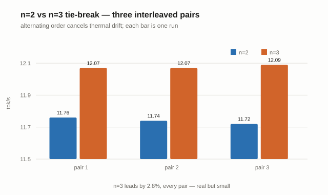

# Squeezing Speculative Decoding onto a Raspberry Pi 5: Gemma 4 E2B QAP with MTP



## Introduction

Speculative decoding used to be a two-model balancing act: run a small "draft" model to guess several tokens ahead, then let the large model verify them in a single pass, keeping whatever it agrees with. The catch was always sourcing a draft model whose distribution matched the target closely enough to be worth the trouble.

Multi-token prediction (MTP) removes the guesswork. Instead of a separate sibling, Google ships a small purpose-trained head *alongside* Gemma 4 — trained on the same data, aligned to the same distribution. It proposes the next few tokens, the base model verifies them in one pass, and whatever survives is kept. On a GPU, this reliably buys 1.4× to 2× on decode. The interesting question is what happens when you take it somewhere that has no GPU at all.

This chapter runs Gemma 4 **E2B** — the ~2B-effective small variant — with MTP on a **Raspberry Pi 5**: four Cortex-A76 cores, LPDDR4X memory at roughly 17 GB/s, and no practical acceleration for local inference. The short answer is that MTP still helps, about **1.3–1.4×** at the right setting. The longer and more useful answer is that "the right setting" is a narrow one, that the obvious knobs point the wrong way (more draft depth is worse; more threads is worse), and that nearly every surprising result traces back to a single fact about this board — it is starved for memory bandwidth, not compute.

Along the way, this is also a lesson in *how to measure*. A Pi throttles, its throughput drifts, its chat UI quietly lies to you, and a single run of a speculative decoder is noisier than you'd expect. The methods here — thermal controls, shuffled sweeps, three-way triangulation of every headline number — matter as much as the numbers they produce, and transfer to any edge-inference benchmarking you do next.

**Hardware:** Raspberry Pi 5 (8 GB), active cooler, Raspberry Pi OS Trixie 64-bit, NVMe boot, llama.cpp build 10073 (`91d2fc387`).

> Every number below is measured on the hardware described, with three runs per configuration unless noted. Re-measure on yours: results shift with the model, the thread count, and the llama.cpp build.

---

## 1. Why E2B

Today (July 2026), the Gemma4 and the Qwen3.5 are the best models to run on laptops and edge devices. If you have a Mac or a PC with a small GPU, you can run the Gemma 4 12B or the Qwen3.5 9B. Until June, 2026, the Qwen3.5 9B was the best model for agent use and tool-calling, with the Gemma 4 12 B good for general tasks and writing. But the [Gemma 4 was recently refreshed](https://explainx.ai/blog/gemma-4-updates-flash-attention-tool-calling-july-2026?utm_source=share&utm_medium=social&utm_campaign=user_share) with updated weights and templates based on community feedback, improving long-prompt prefill speed, tool-calling consistency, and vision/OCR quality without introducing a new major version name.  In the broader 2026 timeline, Google first released Gemma 4 on March 31, added MTP variants on April 16, and introduced the 12B Unified model on June 3. 

> Gemma 4 12B is a strong choice for local multimodal and agentic AI on laptops, offering near-26B reasoning (Gemma 4 26B A4B - AAII index: 26) in a form that can run on 16 GB Apple Silicon Macs or PCs with about 16 GB of GPU VRAM.

But returning to the Raspberry Pi, the 12B QAT model or the Qwen3.5 9B technically loads on a 16 GB Pi and decodes at a speed that makes you close the terminal. And on an 8GB Raspberry Pi, the Gemma 4 E4B would not work, and the Qwen3.5 4B would be very slow (around 3 tk/s), since it does not have the MTP option as the Gemma 4 and the Qwen 3.6.  

So, E2B is Gemma 4's small variant, built with per-layer embeddings and MatFormer-style nesting so the effective parameter count during inference is around 2B while the file on disk is larger. [Unsloth's memory table](https://unsloth.ai/docs/models/mtp) puts the 4-bit E2B at about 5 GB total, **including the MTP head** — which fits an 8 GB Pi with room for the OS, and fits a 16 GB Pi comfortably enough to run other things alongside it.

E2B scores 9 on the Artificial Analysis index (AAII) against the 12B's 22. It is not a small 12B. It's a model for tasks with narrow scope — classify this sensor reading, fill this JSON schema, answer from this retrieved paragraph. <u>Ask it to reason across a long chain, and it will produce something confident and wrong.</u>

Here are some models from the [Artificial Analysis Leaderboard](https://artificialanalysis.ai/leaderboards/models?size=tiny%2Csmall&weights=open&reasoning=reasoningArtificial):

| Model                  | Creator | Total params | Active params | Context | AAII |
| ---------------------- | ------- | ------------ | ------------- | ------- | ---- |
| Gemma 4 12B            | Google  | 12B          | 12B           | 256k    | 22  |
| Qwen3.5 9B             | Alibaba | 9B           | 9B            | 262k    | 21   |
| Qwen3.5 4B             | Alibaba | 4B           | 4B            | 262k    | 20  |
| Gemma 4 E4B            | Google  | ~8B (E4B)    | ~4B eff.      | 128k    | 12   |
| Gemma 4 E2B            | Google  | ~5B (E2B)    | ~2B eff.      | 128k    | 9   |
| Qwen3.5 2B             | Alibaba | 2B           | 2B            | 262k    | 8    |
| Qwen3.5 0.8B           | Alibaba | 0.8B         | 0.8B          | 262k    | 5    |

---

## 2. Build llama.cpp on the Pi

If you alheady have llama.cpp installed, you only need to update it:

```bash
cd ~/llama.cpp
git pull
cmake -B build -DCMAKE_BUILD_TYPE=Release -DGGML_NATIVE=ON
cmake --build build -j4
```

Otherwise:

```bash
sudo apt update
sudo apt install -y build-essential cmake git libcurl4-openssl-dev
git clone https://github.com/ggml-org/llama.cpp
cd llama.cpp
cmake -B build -DCMAKE_BUILD_TYPE=Release -DGGML_NATIVE=ON
cmake --build build -j4
```

No `-DGGML_CUDA` and no Metal. The Pi 5's VideoCore VII has a Vulkan backend in llama.cpp, but for LLM decode it has been slower than the CPU path in every report I've seen — CPU-only is the right default here, and `--n-gpu-layers 0` is not a limitation you're working around.

`-DGGML_NATIVE=ON` lets the compiler target the A76 directly, picking up NEON, dotprod, and fp16 arithmetic. The A76 has no SVE and no SME, so the M-series log lines about `SME = 1` won't appear.

Build takes roughly 15–25 minutes on a Pi 5. Use `-j4`, not `-j$(nproc)` with anything higher — four cores and 8 GB will start swapping during the heavier translation units.

Verify the MTP architecture landed, same check as on the Mac:

```bash
grep -rn "gemma4-assistant" ~/llama.cpp/src/ | head
~/llama.cpp/build/bin/llama-server --version
```

A hit in `llama-arch.cpp` and a build number near 10073 means you're current enough.



> Empty grep means your checkout predates MTP support. Pull and rebuild — and budget the 20 minutes again.

---

## 3. Fetch the model

Three files: the base model (2.62 GB), the MTP head (59.2 MB), and the multimodal projector (986 MB) if you want vision. The **QAT variant** is quantization-aware trained, so Q4 costs less accuracy than post-training quantization would.

The main advantage of  `unsloth/gemma-4-E2B-it-qat-GGUF:UD-Q4_K_XL` is that it gives you much lower memory use with near-original accuracy, making Gemma 4 E2B practical on very small local devices.  Unsloth says the E2B QAT version can run in about 3 GB of RAM, and its  UD-Q4_K_XL  format is specifically preferred over plain  Q4_0  because the **dynamic quantization** preserves accuracy better while even reducing size in some cases.

> On a Raspberry Pi, UD-Q4_K_XL keeps Gemma 4 small enough to fit, QAT helps preserve accuracy at 4-bit, and MTP can add extra throughput when the draft depth matches the limits of the CPU and memory subsystem.

```bash
pip install -U "huggingface_hub[cli]" --break-system-packages

hf download unsloth/gemma-4-E2B-it-qat-GGUF \
    --local-dir ~/models/gemma-4-E2B-qat-it-GGUF \
    --include "*mmproj-F16*" \
    --include "mtp-*" \
    --include "*UD-Q4_K_XL*"
```

List what you actually got:

```bash
ls -lh ~/models/gemma-4-E2B-qat-it-GGUF
```



You need at least two files: the base GGUF and the `mtp-` prefixed one. If the MTP file isn't there, check whether it's nested in a subfolder — Unsloth notes they've moved the Gemma 4 MTP file inside the GGUF package rather than shipping it separately, which is what makes it automatic in their own Studio app.

---

## 4. First run

### a. Base (no MTP)

Let's run simple inferences with `llama-cli`

```bash
MODELS=~/models/gemma-4-E2B-qat-it-GGUF

~/llama.cpp/build/bin/llama-cli \
  --model       $MODELS/gemma-4-E2B-it-qat-UD-Q4_K_XL.gguf \
  --threads 2 \
  --ctx-size 8192 \
  --parallel 1 \
  --temp 1.0 --top-p 0.95 --top-k 64 \
  --reasoning off \
  --reasoning-budget 0
```

**Main commands:**

`--threads 2`, not 4. This is counter-intuitive — the Pi 5 has four cores — but section 7a shows that decode saturates the memory bus at two threads, and adding the other two makes it *slower*. On a bandwidth-bound workload, core count is not the right number.

`--ctx-size 8192`. Gemma 4's sliding-window attention keeps the KV cache small — 40 of 48 layers cap at 1536 cells regardless of context — but "small" is relative to big machines as a Mac or a PC. Start at 8192, confirm it runs, then push up and watch `free -h`. 



I first ran a simple hello, followed by a simple query. In the 2nd query, prompt processing was 10.0 tk/s and **generation was 9.1 tk/s**.

Let's change the number of threads to 4 and run it again:



Both prompt processing (6.0 tk/s) and generation (7.7 tk/s) were reduced!

### b. With MTP

```bash
MODELS=~/models/gemma-4-E2B-qat-it-GGUF

~/llama.cpp/build/bin/llama-cli \
  --model       $MODELS/gemma-4-E2B-it-qat-UD-Q4_K_XL.gguf \
  --model-draft $MODELS/mtp-gemma-4-E2B-it.gguf \
  --spec-type draft-mtp \
  --spec-draft-n-max 3 \
  --threads 2 \
  --ctx-size 8192 \
  --parallel 1 \
  --temp 1.0 --top-p 0.95 --top-k 64 \
  --reasoning off \
  --reasoning-budget 0
```

Here we use the draft model with `--spec-draft-n-max 3` (n=3), which section 8 shows is the fastest setting on this hardware.



With only one measurement, we can confirm the MTP benefit, but note that the speed went from 9.1tk/s to 10.9 tk/s. We will study this better later. 

#### Using WebUI

We can also use the WebUI with the llama-server 

```bash
MODELS=~/models/gemma-4-E2B-qat-it-GGUF

~/llama.cpp/build/bin/llama-server \
  --model       $MODELS/gemma-4-E2B-it-qat-UD-Q4_K_XL.gguf \
  --model-draft $MODELS/mtp-gemma-4-E2B-it.gguf \
  --spec-type draft-mtp \
  --spec-draft-n-max 3 \
  --n-gpu-layers 0 \
  --threads 2 \
  --ctx-size 8192 \
  --parallel 1 \
  --temp 1.0 --top-p 0.95 --top-k 64 \
  --tools all \
  --host 0.0.0.0 \
  --port 8080 \
  --alias Gemma-4-E2B-qat-mtp-n3
```

`--host 0.0.0.0` so you can reach the WebUI from your laptop. The Pi has no monitor in most setups, and llama-server's own startup warning is worth heeding once tools are enabled: don't expose it beyond a trusted LAN.

`--tools all` enables **function calling**; without it the `tools` array in a request is silently dropped. 

`--alias` shows up as a badge in the WebUI under every response, which turns out to matter more than it sounds: when you're comparing six configurations, screenshots that self-label save you from mixing up figures three weeks later.

Then open `http://<pi-address>:8080` from your laptop.


> Note: On `Settings`, turn on `Show message generation statistics`


Again, I ran first a simple hello, followed by a simple query. In the 2nd query, the speed here was 29.14 tk/s for prompt processing and 8.84 tk/s for generation. <u>Note that t is lower than what we got with the CLI!</u>

**IMPORTANT**: The WebUI request isn't the same workload as the CLI or in the benchmark. The WebUI may be adding a system prompt, running at different sampling, or — the big one — carrying conversation history from earlier turns in that chat, which changes prompt length and can suppress acceptance. 

The benchmark on section 8 is the trustworthy number, not the WebUI. 

---

## 5. Thermals, which are a real variable here

A Pi 5 under sustained inference load will hit the throttle point without active cooling, and it does it quietly — throughput just decays over a couple of minutes with no error to catch. If you benchmark without watching temperature, you will produce numbers that depend on how long ago you started.

Run this in a second SSH session while benchmarking:

```bash
watch -n 2 'vcgencmd measure_temp; vcgencmd get_throttled; cat /proc/cpuinfo | grep MHz | head -1'
```

`get_throttled` returning anything other than `0x0` means the numbers you're collecting are invalid. Let it cool and start over.



Also worth doing before any measurement run:

```bash
sudo cpufreq-set -g performance 2>/dev/null || echo "using default governor"
free -h
swapon --show
```



If swap is active and being touched during inference, your throughput measurement is really a measurement of storage latency. Note that Raspberry Pi OS defaults to zram — compressed RAM, not disk — so the cost is CPU cycles spent compressing, competing with your inference threads. Either way, E2B at Q4 should fit in RAM on an 8 GB Pi. Check rather than assume, and if you see swap being touched, that's the finding rather than a problem to work around quietly.

### A note on SD cards vs SSD

llama.cpp mmaps the model, so weights land in page cache and stay there. Storage speed affects **load time**, not decode throughput: a 4 GB model off NVMe takes a few seconds, off an A2 SD card a minute or more. Same tok/s afterward.

That holds as long as the weights stay cached. On an 8 GB Pi with a ~4–5 GB model, page cache has room — until something else claims memory. Open a browser during a benchmark and the kernel starts evicting cached weight pages, which then get re-read mid-inference. On NVMe you barely notice. On an SD card, throughput collapses in a way that looks like random slowness rather than an I/O problem.

So: run headless, close everything, and if you're on a card, watch `free -h` during the sweep. The `buff/cache` figure dropping mid-run is the tell.

---

## 6. Wrapper script

Typing that command every time is how configurations drift and benchmarks stop comparing. Using `nano`, for example, save as `~/bin/gemma4e2b`:

```bash
mkdir -p ~/bin
nano ~/bin/gemma4e2b
```

past below code and save it.

```bash
#!/usr/bin/env bash
set -euo pipefail

LLAMA=~/llama.cpp/build/bin/llama-server
MODELS=~/models/gemma-4-E2B-qat-it-GGUF
BASE=$MODELS/gemma-4-E2B-it-qat-UD-Q4_K_XL.gguf
DRAFT=$MODELS/mtp-gemma-4-E2B-it.gguf

NMAX=3          # measured optimum on Pi 5 — see section 8
CTX=8192
THREADS=2       # 2 beats 4 on this bandwidth-bound workload — see section 7a
PORT=8080
USE_MTP=1
VERBOSE=2

usage() {
  cat <<'EOF'
gemma4e2b [options]
  -n N     draft depth (default 3)
  -c N     context size (default 8192)
  -t N     threads (default 2)
  -p N     port (default 8080)
  -b       baseline: no MTP draft model
  -v       verbose level 4
  -h       this help
EOF
  exit 0
}

while getopts "n:c:t:p:bvh" opt; do
  case $opt in
    n) NMAX=$OPTARG ;;
    c) CTX=$OPTARG ;;
    t) THREADS=$OPTARG ;;
    p) PORT=$OPTARG ;;
    b) USE_MTP=0 ;;
    v) VERBOSE=4 ;;
    h|*) usage ;;
  esac
done

for f in "$LLAMA" "$BASE"; do
  [ -e "$f" ] || { echo "missing: $f" >&2; exit 1; }
done

if ss -ltn "sport = :$PORT" | grep -q LISTEN; then
  echo "port $PORT in use — run: fuser -k $PORT/tcp" >&2
  exit 1
fi

THROTTLED=$(vcgencmd get_throttled 2>/dev/null || echo "throttled=0x0")
[ "$THROTTLED" = "throttled=0x0" ] || echo "warning: $THROTTLED — benchmark numbers will be unreliable" >&2

ARGS=(
  --model "$BASE"
  --n-gpu-layers 0
  --threads "$THREADS"
  --ctx-size "$CTX"
  --parallel 1
  --temp 1.0 --top-p 0.95 --top-k 64
  --tools all
  --host 0.0.0.0
  --port "$PORT"
  --log-verbosity "$VERBOSE"
)

if [ "$USE_MTP" -eq 1 ]; then
  [ -e "$DRAFT" ] || { echo "missing draft: $DRAFT" >&2; exit 1; }
  ARGS+=(--model-draft "$DRAFT" --spec-type draft-mtp --spec-draft-n-max "$NMAX")
  ALIAS="Gemma-4-E2B-qat-mtp-n$NMAX"
else
  ALIAS="Gemma-4-E2B-qat-base"
fi
ARGS+=(--alias "$ALIAS")

echo "→ $ALIAS  ctx=$CTX  threads=$THREADS  port=$PORT"
exec "$LLAMA" "${ARGS[@]}"
```

```bash
chmod +x ~/bin/gemma4e2b
echo '' >> ~/.bashrc
echo 'export PATH="$HOME/bin:$PATH"' >> ~/.bashrc
source ~/.bashrc
```

Port checking uses `ss`. And it reads `get_throttled` at startup and warns — cheap insurance against collecting a whole sweep of thermally degraded numbers.

`USE_MTP` is a switch, not a depth. Setting it to 2 disables MTP rather than setting depth 2; that's `NMAX`, or `-n`.

Usage:

```bash
gemma4e2b              # MTP at n=3, 2 threads
gemma4e2b -b           # baseline
gemma4e2b -n 4 -v      # depth 4, verbose enough to show acceptance rates
gemma4e2b -p 8081      # second instance alongside the first
```

Verbosity 1 prints nothing after startup — no request lines at all, which makes a working server look hung. Level 2 shows traffic. Level 4 shows per-token draft acceptance and is unusable for anything but measurement.

> From now one, you should only type the command `gemma4e2b` to have the server up. 

---

## 7. The measurement

Two sweeps, because on a Pi the thread count is as interesting as the draft depth.

### 7a. Thread scaling, MTP off

Establish the baseline shape first:

```bash
sudo apt install -y tmux jq
```

```bash
for t in 1 2 3 4; do
  gemma4e2b -b -t $t > /tmp/e2b-t$t.log 2>&1 &
  PID=$!
  for i in $(seq 120); do curl -sf http://localhost:8080/health >/dev/null && break; sleep 1; done
  curl -s http://localhost:8080/v1/chat/completions -H "Content-Type: application/json" \
    -d '{"messages":[{"role":"user","content":"Explain photosynthesis in 300 words."}],"seed":42}' \
  | jq -r --arg t "$t" '"threads=" + $t + "  " + (.timings.predicted_per_second|tostring) + " tok/s  " + (.usage.completion_tokens|tostring) + " tokens"'
  kill "$PID" 2>/dev/null; wait "$PID" 2>/dev/null
  sleep 30
done
```

The `sleep 30` between runs is thermal, not technical. Thirty seconds of idle is usually enough to shed the heat from a 350-token generation on an actively cooled Pi; check `measure_temp` if you're unsure.

Load times are much longer than on the Mac, so the health poll goes to 120 seconds.

If necessary, kill the stray background job before and after you run the above script.

```bash
fuser -k 8080/tcp
```

The result is a surprise: peak is at **2 threads, not 4**, and 4 is the slowest of the four.

| threads | tok/s | temp (cold-first run) |
| ------- | ----- | --------------------- |
| 1       | 7.84  | 53.2 °C |
| **2**   | **8.62** | 55.4 °C |
| 3       | 8.42  | 53.8 °C |
| 4       | 7.14  | 48.8 °C |

This is not thermal. The second column comes from a re-run in the order 4, 1, 3, 2 — so 4 threads ran *first*, at the coldest point (48.8 °C), and was still the slowest. The ranking is if anything inverted from temperature: the fastest config ran hottest, because it ran last. Two independent sweeps agree to within 0.05 tok/s at n=2.

The mechanism is memory bandwidth. Decode reads the whole model per token, and the Pi 5's ~17 GB/s LPDDR4X bus is the bottleneck, not the cores. Two A76 cores already saturate it; cores 3 and 4 add no usable bandwidth, only contention for the bus and the shared L3 cache. This is the same starvation that shapes the MTP results below — everything in this chapter traces back to the Pi being bandwidth-bound, not compute-bound.

So the correct default is `--threads 2`. If you took the near-linear thread-scaling behavior from other CPU inference benchmarks on faith, this is the counter-example: it holds only until you hit the memory wall, which on a Pi 5 is at two threads.

### 7b. Draft depth, MTP on

Now the draft-depth sweep, at the corrected two threads. Save as `~/bin/e2b-sweep`:

```bash
#!/usr/bin/env bash
MODELS=~/models/gemma-4-E2B-qat-it-GGUF
BASE=$MODELS/gemma-4-E2B-it-qat-UD-Q4_K_XL.gguf
DRAFT=$MODELS/mtp-gemma-4-E2B-it.gguf
LLAMA=~/llama.cpp/build/bin/llama-server
PROMPT='Explain photosynthesis in 300 words.'
THREADS=2

for n in 0 3 2 4 6 5 7; do          # shuffled order decouples depth from rising temp
  LOG=/tmp/e2b-n$n.log
  ARGS=(--model "$BASE" --n-gpu-layers 0 --threads $THREADS --ctx-size 8192
        --parallel 1 --temp 1.0 --top-p 0.95 --top-k 64
        --port 8080 --log-verbosity 4)
  [ "$n" -gt 0 ] && ARGS+=(--model-draft "$DRAFT" --spec-type draft-mtp --spec-draft-n-max "$n")

  "$LLAMA" "${ARGS[@]}" > "$LOG" 2>&1 &
  PID=$!
  for i in $(seq 120); do curl -sf http://localhost:8080/health >/dev/null && break; sleep 1; done

  for seed in 43 44 45; do
    curl -s http://localhost:8080/v1/chat/completions -H "Content-Type: application/json" \
      -d "{\"messages\":[{\"role\":\"user\",\"content\":\"$PROMPT\"}],\"chat_template_kwargs\":{\"enable_thinking\":false},\"seed\":$seed}" > /dev/null
    sleep 20
  done

  kill "$PID" 2>/dev/null; wait "$PID" 2>/dev/null
  sleep 45
done
```

Everything lands in the per-config logs; parse them afterward rather than trying to scrape `curl` output live, which is fragile (the field positions in llama-server's timing lines shift, and an over-clever `jq`/`awk` one-liner silently produces `per` where a number should go). Save the parser as `~/bin/e2b-parse`:

```bash
#!/usr/bin/env bash
printf "%-3s %-4s %7s %7s %7s %8s %8s\n" n run tok/s tokens passes accept meanlen
for f in $(ls /tmp/e2b-n*.log | sort -V); do
  n=$(basename "$f" .log | sed 's/e2b-n//')
  awk -v n="$n" '
    /eval time =/ && !/prompt eval/ {
      if (match($0, /[0-9.]+ tokens per second/)) { tps=substr($0,RSTART,RLENGTH); sub(/ .*/,"",tps) }
      if (match($0, /\/ +[0-9]+ tokens \(/))     { tok=substr($0,RSTART,RLENGTH); gsub(/[^0-9]/,"",tok) }
    }
    /graphs reused/ { cur=$NF; d=cur-prev; prev=cur }
    /draft acceptance/ {
      if (match($0, /acceptance = [0-9.]+/)) { acc=substr($0,RSTART,RLENGTH); sub(/.*= */,"",acc) }
      if (match($0, /mean len = *[0-9.]+/))  { ml=substr($0,RSTART,RLENGTH);  sub(/.*= */,"",ml) }
      have=1
    }
    /stop processing/ {
      run++
      printf "%-3s %-4s %7s %7s %7s %8s %8s\n", n, run, tps, tok, d, (have?acc:"-"), (have?ml:"1.00")
      have=0
    }
  ' "$f"
done
```

```bash
chmod +x ~/bin/e2b-sweep ~/bin/e2b-parse
tmux new -s sweep
~/bin/e2b-sweep && ~/bin/e2b-parse | tee ~/e2b-results.txt
```

Sweep `n` from 0 to 7 — `n=0` is the no-MTP baseline. Depth alone doesn't predict cost on ARM, so stopping at 4 would miss what happens at the top of the range. Budget an hour, run it in `tmux` so a dropped SSH connection doesn't kill it, and keep the order shuffled: running configurations in ascending `n` confounds draft depth with rising temperature, and this is exactly the trap the thread sweep in 7a nearly fell into.


---

## 8. Results

Three runs per configuration, two threads, thinking disabled, 300-word prose prompt, seeds 43/44/45. Draft depth `n` produces a verification batch of `n+1` tokens — the drafts plus the base model's own next token. Numbers are the mean of the three runs.

| n | batch width | tok/s | vs baseline | acceptance | mean len |
|---|---|---|---|---|---|
| 0 (no MTP) | 1 | 8.88 | — | — | 1.00 |
| **2** | 3 | **11.43** | **1.29×** | 0.48 | 1.95 |
| **3** | 4 | **11.46** | **1.29×** | 0.37 | 2.10 |
| 4 | 5 | 6.84 | 0.77× | 0.31 | 2.22 |
| 5 | 6 | 6.85 | 0.77× | 0.26 | 2.30 |
| 6 | 7 | 6.57 | 0.74× | 0.22 | 2.30 |
| 7 | 8 | 6.43 | 0.72× | 0.19 | 2.29 |

{#fig-depth}

**The shape is a plateau and a cliff.** n=2 and n=3 sit together at the top, about 1.29× over baseline. Then n=4 drops off a ledge — 40% slower than n=3, and below baseline — and stays down for the rest of the range. The single most useful practical result is the negative one: **any draft depth of 4 or more is worse than not using MTP at all.** More speculation is not better; past a threshold it is actively harmful.

### n=2 versus n=3

In the sweep the two are a statistical tie: 11.43 and 11.46, a difference far smaller than the ~5% run-to-run spread you get on a Pi. To settle it, I ran a tie-break — n=2 and n=3 alternating, three pairs each, so any thermal drift cancels:

| | n=2 | n=3 |
|---|---|---|
| run 1 | 11.76 | 12.07 |
| run 2 | 11.74 | 12.07 |
| run 3 | 11.72 | 12.09 |

{#fig-tiebreak}

Here n=3 is reproducibly ahead — by 2.8%, with each configuration's own spread under 0.03 tok/s. So n=3 is the genuine optimum, but only just, and the honest way to state it to a student is: **use n=2 or n=3; n=3 is a few percent faster if you want the last drop.**

### Reading `acc per pos`

With `--log-verbosity 4`, llama.cpp prints the per-position acceptance breakdown. From an n=3 request:

```
draft acceptance = 0.37 (…), mean len = 2.10
     acc per pos = (0.68, 0.49, 0.24)
```

Position 1 is accepted ~68% of the time, position 2 ~49%, position 3 ~24%, and the mean accepted length is just the sum plus one: 1 + 0.68 + 0.49 + 0.24 ≈ 2.4. (The 2.10 above is a lower-temperature run; the identity holds whatever the values.)

{#fig-accpos}

That identity is the clearest teaching artifact in this whole exercise. Each extra draft position contributes its own acceptance rate to the mean; those rates decay fast — here each is roughly half the last — while the batch width, and therefore the cost, grows linearly. Add positions and you are paying linearly for geometrically shrinking returns. That, not any kernel subtlety, is the first-order reason the curve falls off a cliff after n=3: position 4 and beyond simply don't earn their cost.

### Vision

Same server with `--mmproj mmproj-F16.gguf` added, one image (a discarded tire holding standing water) plus a short prompt, at n=3:

| phase | tokens | time | rate |
|---|---|---|---|
| prompt (incl. 169 image tokens) | 297 | 19.5 s | 15.2 t/s |
| decode | 152 | 16.2 s | 9.4 t/s |

Decode acceptance was 0.47 on the image against 0.37 on prose. **Image-grounded description drafts better than free prose** — the output is formulaic ("The image shows a…"), which is exactly what a small draft head predicts well.

Two things worth knowing before planning a vision workload on a Pi. Image encoding was 6.6 s of the 19.5 s prompt phase — about a third; the rest was ordinary text prompt processing. Vision prompt cost on this hardware is mostly *text*, driven by how much conversation context you carry, not by pixels. And MTP does nothing for the prompt phase: it accelerated only the 16-second decode half. A single tok/s figure for a vision request hides which half you sped up, so report the two phases separately.

The log also settled a small mystery. The model's reply referred back to an earlier topic that wasn't in the visible chat, which looked at first like a small-model confabulation. The log showed `restored context checkpoint` — there really was prior context in that session, and E2B was recalling it correctly. A good reminder to read the server log before blaming the model.

### Confirming the result three ways — and a trap to avoid first

Before trusting any of these numbers, one warning. If you test MTP through the WebUI by sending a prompt, then reading the tok/s badge, you may see no difference between base and n=3 — both around 8 tok/s. That is not the model. The WebUI carries conversation history and template scaffolding, and every follow-up turn sends the accumulated context back with the new prompt. A longer, messier prompt changes what the draft head is continuing from and suppresses acceptance, and short WebUI answers are dominated by startup effects the benchmark avoids. **The chat window is a demo surface, not a benchmark.** Measure from the API or the CLI, on a fresh prompt with no prior turns.

Once you do, the result reproduces across three independent code paths:

| method | MTP n=3 generation | notes |
|---|---|---|
| sweep script (mean of 21 runs) | 11.46 tok/s | the section 8 table |
| raw API, fresh prompt (mean of 3) | 11.50 tok/s | `curl` straight to `/v1/chat/completions` |
| `llama-cli` | 11.9 tok/s | separate binary, no server at all |

Against a base of 8.58 tok/s measured the same clean way, that is **1.34×**. The sweep harness, a hand-issued curl, and a completely separate binary that shares only llama.cpp's inference core all land within a few percent. When a number survives that triangulation it is not a configuration artifact.

The API check, both configs, three seeds each:

```bash
# base
fuser -k 8080/tcp; sleep 15; gemma4e2b -b -t 2 >/tmp/b.log 2>&1 &
until curl -sf localhost:8080/health >/dev/null; do sleep 1; done
for s in 42 43 44; do
  curl -s localhost:8080/v1/chat/completions -H "Content-Type: application/json" \
    -d "{\"messages\":[{\"role\":\"user\",\"content\":\"Explain photosynthesis in 300 words.\"}],\"seed\":$s}" \
    | jq -r '.timings.predicted_per_second'
done
fuser -k 8080/tcp; sleep 15

# mtp n=3
gemma4e2b -n 3 -t 2 >/tmp/m.log 2>&1 &
until curl -sf localhost:8080/health >/dev/null; do sleep 1; done
for s in 42 43 44; do
  curl -s localhost:8080/v1/chat/completions -H "Content-Type: application/json" \
    -d "{\"messages\":[{\"role\":\"user\",\"content\":\"Explain photosynthesis in 300 words.\"}],\"seed\":$s}" \
    | jq -r '.timings.predicted_per_second'
done
fuser -k 8080/tcp
```

The `llama-cli` version is the simplest to carry a test, because it has no conversation state to get in the way — one prompt in, one generation out, timings printed:

```bash
~/llama.cpp/build/bin/llama-cli \
  -m ~/models/gemma-4-E2B-qat-it-GGUF/gemma-4-E2B-it-qat-UD-Q4_K_XL.gguf \
  --model-draft ~/models/gemma-4-E2B-qat-it-GGUF/mtp-gemma-4-E2B-it.gguf \
  --spec-type draft-mtp --spec-draft-n-max 3 \
  --n-gpu-layers 0 --threads 2 --ctx-size 8192 \
  --temp 1.0 --top-p 0.95 --top-k 64 \
  --reasoning off \
  --reasoning-budget 0 \
  -p "Explain photosynthesis in 300 words." -no-cnv
```

`-no-cnv` runs it single-shot instead of dropping into interactive chat, keeping it a clean benchmark.

One property the clean data exposes that the WebUI hid: **MTP throughput is much noisier than base.** Across the three API seeds, base held 8.50–8.62 (spread 0.12) while MTP swung 10.84–12.05 (spread 1.21) — ten times wider. This is inherent: speculative throughput depends on how predictable each particular generation is, so it varies with the text in a way plain decode does not. The practical consequence is that a single MTP measurement is far less trustworthy than a single base one, which is exactly why the sweep repeats every MTP row three times and why one WebUI comparison can point either direction. Trust the mean, not any one run.

### On the numbers themselves

Two honest caveats you should carry forward. Every Pi throughput figure here has a real confidence band of about ±5% — the sweep and the tie-break disagreed by that much at the same n=3, purely from different prompts and samples — so don't over-read differences smaller than that. Re-measure when you change the model, the thread count, or the llama.cpp build.


---

## 9. What this is actually for

At 9 to 12 tok/s, this is still not a chat model. Nobody will sit at a Pi 5 waiting for an essay to stream out below reading speed.

What it is for is the shape of workload in a sensor-triggered agent: a reading arrives, the model gets a short prompt, and it emits a tool call or a short structured verdict. Forty tokens of JSON at 11 tok/s is under four seconds, which is fine when the alternative is a round trip to a cloud API over a connection that may not exist.

The tire image above is the case in point. E2B correctly identified pooled water in a discarded tire with organic debris floating in it — a textbook *Aedes aegypti* breeding site — running offline on an 8 GB board. That is the demo, and it took 36 seconds.

Which also means the prose benchmark above measures the wrong thing for the real use case. The number that matters for an agent loop is time-to-complete-tool-call: a 200-token prompt producing 40 tokens of JSON. Structured output should draft even better than image description did — acceptance at n=3 may be well above the 0.47 the image reached — so the MTP gain on a real agent workload could exceed the 1.36x measured here on prose. Whether the n=2/n=3 plateau holds or shifts for short structured output is worth measuring directly rather than assuming.

---
## 10. What to take away

Five things survive from all the measuring, in rough order of how likely they are to save you time:

**MTP works on a Pi, at one specific setting.** **Roughly 1.3–1.4× on decode** at `--spec-draft-n-max 3`, two threads, QAT weights. Use n=3; n=2 is within a few percent if you prefer the round number. Everything from n=4 up is *slower than not using MTP at all* — the draft head's acceptance decays geometrically with position while the cost grows linearly, so deep drafts pay for tokens that get thrown away.

**Two threads beat four.** Decode saturates the Pi's memory bus at two cores; the other two only add contention. This is the single most counter-intuitive result in the chapter, and it generalizes: on any bandwidth-bound workload, core count is not the number to maximize. If a benchmark elsewhere tells you threads scale linearly, it was compute-bound and yours isn't.

**Everything is the memory wall.** The thread result, the draft-depth cliff, the modest size of the MTP gain compared to a GPU — all of it is the same ~17 GB/s bus being the bottleneck. Once you see the Pi as bandwidth-bound rather than compute-bound, the rest stops being surprising.

**The chat window is not a benchmark.** The WebUI carries conversation history and template scaffolding that lengthen the prompt and suppress draft acceptance, which is exactly why it showed no MTP benefit when the CLI and API showed 1.3×. Measure from `llama-cli` or a fresh API call, never from a browser tab with prior turns. And because speculative throughput is inherently noisy — it varies with how predictable each generation is — trust the mean of several runs, not any single number.

**This isn't a chat model, and that's fine.** At 9–12 tok/s nobody wants to watch an essay stream out. But a sensor-triggered agent that emits forty tokens of JSON in under four seconds, offline, on an 8 GB board that costs less than a textbook — that's a real deployment. The tire-and-standing-water demo, where E2B correctly flagged an *Aedes aegypti* breeding site with no network, is the shape of workload this hardware is actually for. Benchmark the tool-call path, not the essay, when you build the real thing.

The honest edge of all this: one item is still open. Token counts vary across draft depth for a fixed seed, which shouldn't happen if MTP is truly lossless — it may just be RNG-stream divergence at `--temp 1.0`, or it may be a real sampling bug in the CPU path. The `--temp 0` md5 check in section 8 settles it, and it's the first thing to run before you cite these numbers anywhere load-bearing.

## How this chapter was made

The measurements in this chapter came out of a live back-and-forth with **Claude Opus 4.8** over a single working session. I ran every command on my own hardware — the Raspberry Pi 5 — and pasted the raw terminal output back into the conversation; Claude read the logs, proposed the next test, wrote the benchmark and parser scripts, caught its own errors, and drafted the prose.

I'm keeping a candid note here because the process is part of the lesson. Claude got things wrong in ways worth seeing. It proposed a clean kernel-alignment mechanism from a single noisy sweep, made a falsifiable prediction from it, and then — when a better dataset on QAT weights came in — had to retract the mechanism and demote it to a flagged hypothesis. It also told me early that CPU threads scale near-linearly to core count, which turned out to be wrong for this bandwidth-bound workload; the two-thread result contradicted its own advice. Each of those corrections is in the text above rather than edited out, because a tutorial that shows only the tidy path teaches less than one that shows a wrong guess meeting a measurement.

What the model was reliably good at: turning a pasted log into the right next experiment, spotting when a completion was too short to trust, insisting on repeats and thermal controls before believing a number, and refusing — most of the time — to state a result the data didn't support. When I pushed back that MTP looked no faster than baseline in the browser, it didn't fold to the objection or defend its earlier numbers; it identified the WebUI as the likely confound and proposed the clean API test that resolved it, which then matched the CLI to within a few percent. The judgment stayed mine. The hardware, the runs, and the final call on every claim are the author's; treat the numbers as measured on the specific setup described, and re-measure on yours.

---

## Appendix: differences from Mac and the Pi at a glance

| | M5 Max | Pi 5 |
|---|---|---|
| Model | 12B QAT Q4_K_XL | E2B Q4_K_XL |
| Offload | `--n-gpu-layers 99` (Metal) | `--n-gpu-layers 0` (CPU) |
| Threads | default | `--threads 2` (2 beats 4; bandwidth-bound) |
| Context | 131072 | 8192 to start |
| Build flag | `-DGGML_METAL=ON` | `-DGGML_NATIVE=ON` |
| Port check | `lsof` | `ss` |
| Thermal management | none needed | active cooler, `get_throttled` |
| Optimal draft depth | n=2 | n=3 (n=2 nearly ties) |
| Baseline throughput | 64.5 tok/s | 8.88 tok/s |
| Best MTP throughput | 94.6 tok/s (1.47×) | 12.07 tok/s (1.36×) |
| Bottleneck | memory bandwidth | compute |

## Resources

**Models**

- [Gemma 4 E2B QAT GGUF (Unsloth)](https://huggingface.co/unsloth/gemma-4-E2B-it-qat-GGUF) — the base model, MTP head, and mmproj used throughout this chapter
- [Unsloth MTP documentation](https://unsloth.ai/docs/models/mtp) — memory tables, per-model MTP notes, and the draft-depth guidance this chapter tests against
- [Artificial Analysis leaderboard](https://artificialanalysis.ai/leaderboards/models) — the AAII scores in the section 1 comparison table

**Tools**

- [llama.cpp](https://github.com/ggml-org/llama.cpp) — the inference engine; build 10073 or newer is required for the `gemma4-assistant` MTP architecture
- [llama.cpp speculative decoding notes](https://github.com/ggml-org/llama.cpp/tree/master/examples/speculative) — background on the `--spec-type` and `--spec-draft-n-max` flags

**Background reading**

- [Gemma 4 July 2026 refresh](https://explainx.ai/blog/gemma-4-updates-flash-attention-tool-calling-july-2026) — the weight and template update referenced in section 1
- Leviathan et al., *Fast Inference from Transformers via Speculative Decoding* (2023) — the original method MTP builds on; search the title on arXiv
- Google DeepMind's Gemma 4 model card — architecture details for E2B's per-layer embeddings and MatFormer nesting

**Companion material**

- Benchmark and parser scripts from this chapter: `gemma4e2b` (wrapper), `e2b-sweep`, `e2b-parse` — reproduced in full in sections 6 and 7

**Reproducing the headline number**

The fastest way to confirm MTP is working on your own Pi, with no server or browser in the path:

```bash
~/llama.cpp/build/bin/llama-cli \
  -m ~/models/gemma-4-E2B-qat-it-GGUF/gemma-4-E2B-it-qat-UD-Q4_K_XL.gguf \
  --model-draft ~/models/gemma-4-E2B-qat-it-GGUF/mtp-gemma-4-E2B-it.gguf \
  --spec-type draft-mtp --spec-draft-n-max 3 \
  --n-gpu-layers 0 --threads 2 --ctx-size 8192 \
  --temp 1.0 --top-p 0.95 --top-k 64 \
  -p "Explain photosynthesis in 300 words." -no-cnv
```

Compare the generation tok/s against the same command with the two `--model-draft`/`--spec-type` lines removed. On a Pi 5 you should see roughly 1.3× — and if you don't, section 8's confirmation subsection is where to start debugging.
